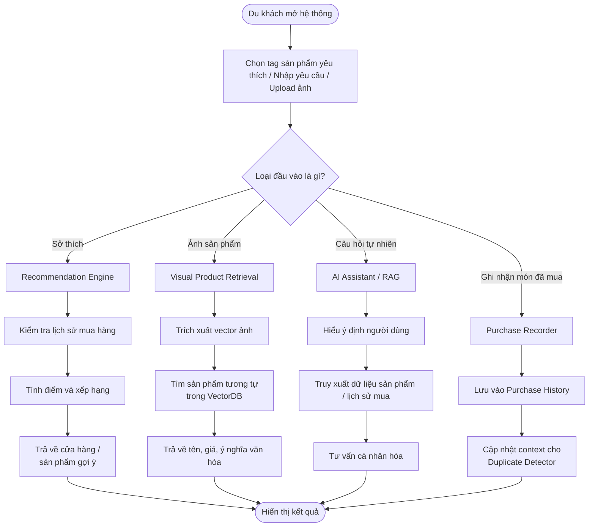
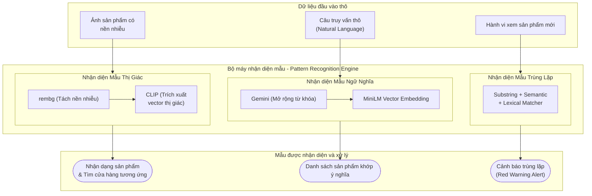
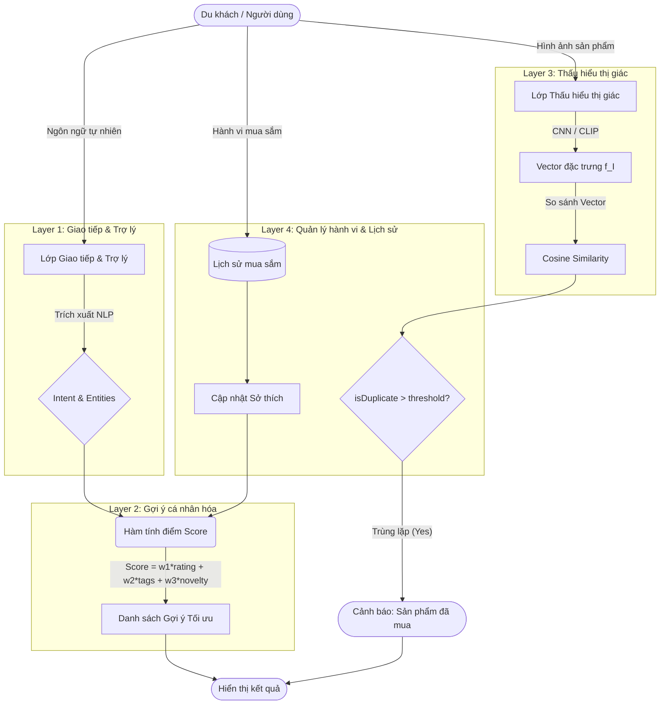
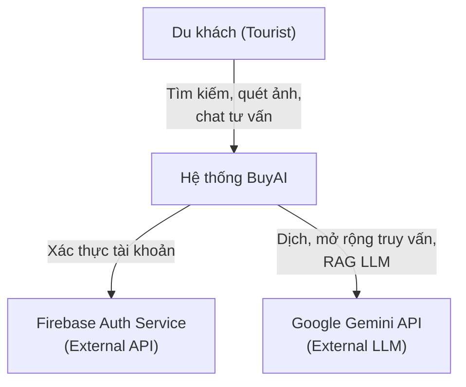
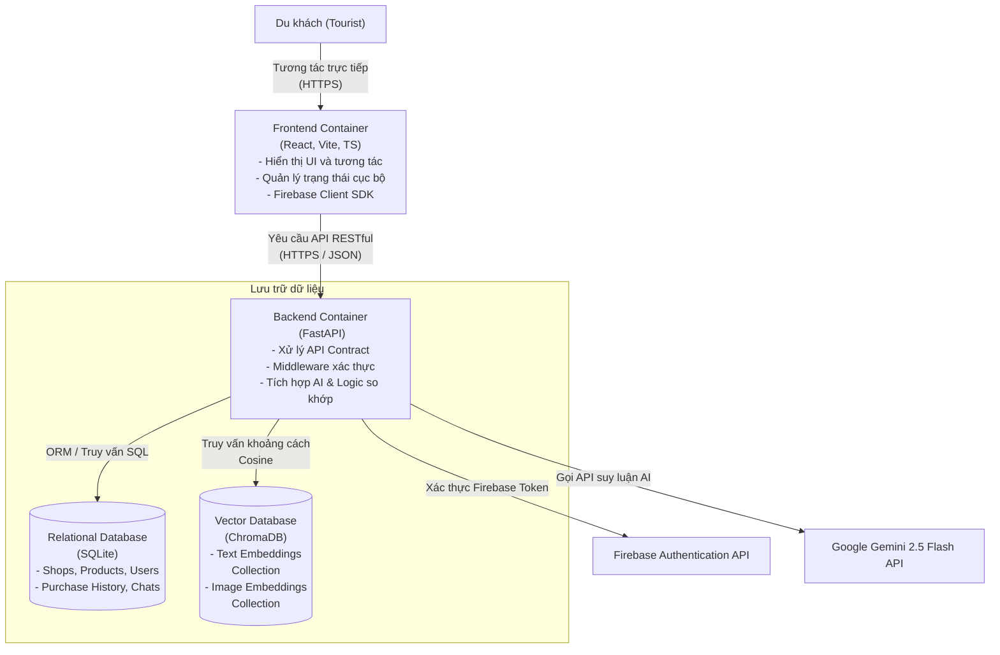
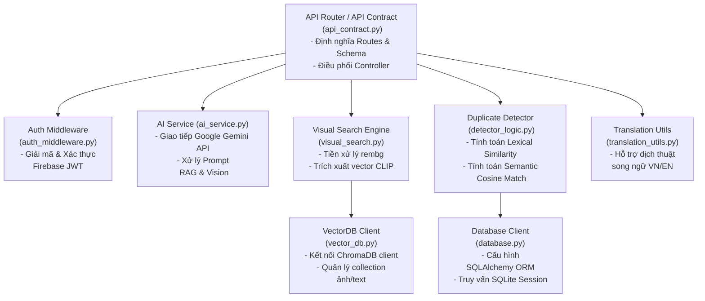
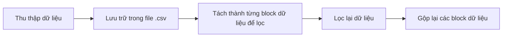
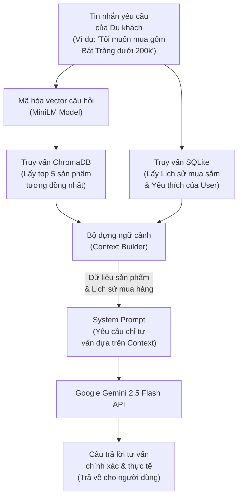

# BÁO CÁO ĐỒ ÁN CUỐI KỲ - KHÓA HỌC TƯ DUY MÁY TÍNH (COMPUTATIONAL THINKING)

---

## TRANG BÌA (Cover Page)
**Tên Đồ án:** BuyAI - Hệ Thống Hỗ Trợ Mua Sắm Thông Minh Cho Khách Du Lịch  
**Học kỳ:** HKII - Năm học 2025-2026  
**Mã môn học:** CSC10014  
**Tên môn học:** Tư duy Máy tính (Computational Thinking)  
**Mã lớp:** CQ2024/6  
**Mã nhóm:** Group06  
**Thành viên nhóm:**
1. 24120332 - Đinh Công Khang
2. 24120215 - Nguyễn Ngọc Phúc
3. 24120245 - Trần Lê Đức Việt
4. 24120344 - Hoàng Trần Minh Khoa
5. 24120090 - Đặng Hồng Minh
**Giảng viên hướng dẫn & TAs:**
- Instructors: Hồ Tuấn Thanh, Mai Anh Tuấn
- TA: Phạm Nguyễn Sơn Tùng
**Thời gian cập nhật mới nhất:** 20/06/2026

---

## MỤC LỤC (Table of Contents)
1. [Thành viên nhóm](#1-thành-viên-nhóm)
2. [Ý tưởng (Idea)](#2-ý-tưởng-idea)
3. [Phân tích và Chia nhỏ bài toán (Problem Analysis & Decomposition)](#3-phân-tích-và-chia-nhỏ-bài-toán-problem-analysis--decomposition)
4. [Biểu diễn bài toán (Representation)](#4-biểu-diễn-bài-toán-representation)
5. [Tổng quan hệ thống (System Overview)](#5-tổng-quan-hệ-thống-system-overview)
6. [Nhận diện mẫu (Pattern Recognition)](#6-nhận-diện-mẫu-pattern-recognition)
7. [Trừu tượng hóa (Abstraction)](#7-trừu-tượng-hóa-abstraction)
8. [Thiết kế hệ thống và Thuật toán (System / Algorithm Design)](#8-thiết-kế-hệ-thống-và-thuật-toán-system--algorithm-design)
9. [Hiện thực hóa (Implementation)](#9-hiện-thực-hóa-implementation)
10. [Mô phỏng và Thực nghiệm (Simulation)](#10-mô-phỏng-và-thực-nghiệm-simulation)
11. [Kiểm thử (Testing)](#11-kiểm-thử-testing)
12. [Đánh giá giải pháp (Evaluation)](#12-đánh-giá-giải-pháp-evaluation)
13. [Demo sản phẩm](#13-demo-sản-phẩm)
14. [Triển khai (Deployment)](#14-triển-khai-deployment)
15. [Nhật ký công việc (Logbook)](#15-nhật-ký-công-việc-logbook)
16. [Tuyên bố sử dụng AI](#16-tuyên-bố-sử-dụng-ai)
17. [Kết luận và Hướng phát triển](#17-kết-luận-và-hướng-phát-triển)

---

## 1. THÀNH VIÊN NHÓM
| MSSV | Họ và tên | Email | Vai trò / Trách nhiệm |
| :--- | :--- | :--- | :--- |
| 24120332 | Đinh Công Khang | 24120332@student.hcmus.edu.vn | Nhóm trưởng, Backend Developer, AI Integration |
| 24120215 | Nguyễn Ngọc Phúc | 24120215@student.hcmus.edu.vn | Recommendation Engine, Data Normalization |
| 24120245 | Trần Lê Đức Việt | 24120245@student.hcmus.edu.vn | Visual Product Retrieval, Image Processing |
| 24120344 | Hoàng Trần Minh Khoa | 24120344@student.hcmus.edu.vn | Simulation & Testing, QA/QC |
| 24120090 | Đặng Hồng Minh | 24120090@student.hcmus.edu.vn | Abstraction Design, Documentation |

---

## 2. Ý TƯỞNG (Idea)
### [24120332 - Đinh Công Khang] 2.1 Tuyên bố bài toán (Problem Statement)
- Vấn đề hiện hữu: Khách du lịch khi đến các địa phương thường gặp khó khăn trong việc tìm kiếm và phân biệt các sản phẩm đặc sản, đồ thủ công mỹ nghệ thật sự chất lượng. Sự khác biệt về ngôn ngữ, thiếu thông tin về nguồn gốc, giá cả và ý nghĩa văn hóa của sản phẩm khiến họ dễ mua phải hàng kém chất lượng hoặc không phù hợp.
- Hệ quả: Quyết định mua sắm thường mang tính thụ động, dẫn đến tâm lý "không biết mua gì làm quà" và ảnh hưởng đến trải nghiệm tổng thể của chuyến đi.
- Mục tiêu hệ thống: Tối ưu hóa quy trình tìm kiếm, tư vấn chi tiêu thông qua các công nghệ AI (Computer Vision, NLP, Semantic Search, Visual Search) để tạo ra trải nghiệm mua sắm liền mạch và cá nhân hóa.
### [24120332 - Đinh Công Khang] 2.2 Tầm nhìn sản phẩm (Product Vision)
BuyAI hướng tới việc trở thành một trợ lý mua sắm cá nhân thông minh, sử dụng sức mạnh của Trí tuệ nhân tạo (AI) để kết nối khách du lịch với các giá trị văn hóa địa phương thông qua sản phẩm. Hệ thống không chỉ giúp tìm kiếm mà còn giúp người dùng hiểu sâu hơn về những gì họ đang mua.

### [24120332 - Đinh Công Khang] 2.3 Đối tượng người dùng mục tiêu (Target Users)
- Khách du lịch trong và ngoài nước.
- Những người yêu thích tìm hiểu văn hóa qua các sản phẩm thủ công, đặc sản.
- Người mua sắm muốn tìm kiếm sản phẩm bằng hình ảnh một cách nhanh chóng.

---

## 3. PHÂN TÍCH VÀ CHIA NHỎ BÀI TOÁN (Problem Analysis & Decomposition)
### [24120215 - Nguyễn Ngọc Phúc] 3.1 Phân tích bài toán (Problem analysis)
### 3.1.1 The Elements of a Well-defined Problem
**Input / Initial states** : 
Các thẻ sở thích của người dùng. 
- Ảnh chụp sản phẩm. 
- Văn bản, câu hỏi, sở thích,...

**Output / Goal states** : 
   - Danh sách điểm mua sắm. 
   - Thông tin chi tiết sản phẩm (tên, ý nghĩa, giá). 

**Operators (Tiến trình chuyển đổi)** : Hệ thống nhận diện hình ảnh, trích xuất đặc trưng văn bản/hình ảnh, thuật toán tính toán độ tương đồng (recommendation). 

**Evaluation function** : 
- Độ chính xác của nhận diện sản phẩm. 
- Độ hài lòng của danh sách gợi ý.

**Constraints** : Giới hạn về thời gian xử lý API (độ trễ), phong phú dữ liệu, định dạng dữ liệu hình ảnh đầu vào. 

**Technically executable** : Khả thi khi áp dụng các model AI/ML hiện tại (Computer Vision, NLP, Optimization algorithms).

### 3.1.2. Áp dụng Problem Analysis Tools 

### Tool 01: Clarification Questions (Template) 

- **Goal** : 
   - _Bài toán cần giải quyết là gì?_ Hỗ trợ tối ưu hóa tìm kiếm, tư vấn chi tiêu mua sắm cho du khách. 
   - _Tại sao quan trọng?_ Khách du lịch gặp rào cản thiếu thông tin minh bạch, bất đồng ngôn ngữ và khó kiểm soát ngân sách, dẫn đến quyết định mua sắm thụ động. 
- **Users / Target Audience** : Khách du lịch trong và ngoài nước. Sự khó khăn chính của họ là không biết mua gì làm quà và không rõ nguồn gốc sản phẩm. 
- **Inputs - Outputs** : Dữ liệu người dùng (hình ảnh, text) được chuyển hóa thành các đề xuất mang tính điều hướng trực quan. 
- **Constraints** : Giới hạn quota API AI chatbot, thiết bị người dùng phải kết nối mạng. 
- **Assumptions & Risks** : 
   - _Giả định:_ Các cửa hàng địa phương đã được số hóa thông tin trên hệ thống. _Rủi ro:_ Ảnh chụp quá mờ khiến thuật toán nhận diện sai. 
- **Success Criteria** : Trải nghiệm mua sắm của du khách trở nên liền mạch, chủ động, giải quyết được rào cản tâm lý "không biết mua gì làm quà". 

### Tool 02: Stakeholder Mapping

Dựa vào mức độ ảnh hưởng (Influence) và mức độ quan tâm (Interest): 

|**Stakeholder**|**Role**|**Needs**|**Level of influence**|**Level of interest**|
|---|---|---|---|---|
|**Du khách (Tourist)**|Main user|Trải nghiệm mua sắm nhanh chóng, được gợi ý đúng nhu cầu, không bị hớ giá|Low|High|
|**Chủ cửa hàng địa phương**|Cung cấp sản phẩm|Tăng doanh thu, tiếp cận đúng khách du lịch|Medium|High|

### Tool 03: Requirements Elicitation

### Functional Requirements (Yêu cầu chức năng) : 
- Hệ thống phải quét và nhận diện được đặc trưng của sản phẩm qua ảnh chụp. 
- Chatbot phải nhận input văn bản/thông số và xuất ra danh sách quà tặng. 

### Non-functional Requirements (Yêu cầu phi chức năng) : 

- Tốc độ phản hồi (Performance): Nhận diện ảnh và trả kết quả dưới 2 giây. 
- Độ chính xác: Dữ liệu sản phẩm, cửa hàng phải chính xác, minh bạch. 

### Tool 04: Constraint Specification

|**Type**|**Example**|
|---|---|
|**Technical constraint**|Cần sử dụng các API nhận diện hình ảnh, NLP, Search.|
|**Performance constraint**|Thuật toán gợi ý khoảng cách phải tính toán nhanh để hiển thị trực quan lập tức. API Latency $p95 < 800ms$.|
|**Resource constraint**| Quota giới hạn của các dịch vụ Cloud API (nhận diện ảnh, chatbot).|

### Tool 05.1: Use Case

### Use Case: Nhận diện và Truy xuất thông tin sản phẩm (Visual Product Retrieval)

**Actor:** Du khách. 

**Precondition:** Du khách đang mở ứng dụng và truy cập internet.

**Main flow:** 

   1. Du khách tải lên ảnh một món đồ thủ công/đặc sản. 

   2. Hệ thống tải ảnh lên server, chạy thuật toán trích xuất đặc trưng ảnh. 

   3. Hệ thống so khớp ảnh với cơ sở dữ liệu sản phẩm địa phương. 

   4. Hệ thống trả về thông tin (tên, ý nghĩa văn hóa, giá tham khảo). 

- **Alternative flow:** Nếu hệ thống không nhận diện được (ảnh mờ, không có trong DB) $\rightarrow$ Hệ thống gợi ý chụp lại ở góc độ khác hoặc hỏi Chatbot tư vấn. 

- **Postcondition:** Du khách nhận được thông tin của sản phẩm và cửa hàng. 

### Tool 05.2: Epic & User Story

- **Epic 1 - Smart Shopping Assistant** : "Với tư cách là một du khách, tôi muốn có một trợ lý ảo tư vấn chọn quà tặng phù hợp với ngân sách và độ tuổi người nhận, để tôi có thể giải quyết rào cản tâm lý không biết mua gì." 

- **User Story 1.1** : "Là du khách, tôi muốn được đề xuất những món quà nằm trong khả năng chi trả của mình." 

- **Epic 2 - Duplicate Detector** : "Với tư cách là du khách, tôi muốn hệ thống tự động phát hiện những sản phẩm bị trùng lặp trong những lần ghi nhận mua sắm trước đó."

### [24120215 - Nguyễn Ngọc Phúc] 3.2 Phân rã bài toán (Decomposition)
Tuân thủ nguyên tắc không phân rã theo tính năng UI (Poor Decomposition), chúng ta sẽ phân rã bài toán thành các Module thuật toán và xử lý dữ liệu tính toán cốt lõi (Computational Components): 

### Module 1: Input Representation & Data Normalization (Biểu diễn & Chuẩn hóa Dữ liệu) 
- **Feature Extraction (Vision):** Chuyển đổi dữ liệu ảnh (sản phẩm) thành các vector đặc trưng số học (thông qua Image Embedding / CLIP model). 
- **Data Normalization:** Chuẩn hóa các thang đo (ví dụ: ngân sách $100k - 5M$) về phạm vi $[0, 1]$ để đảm bảo khi tính toán Recommendation, không có một tiêu chí nào áp đảo kết quả. 

### Module 2: AI Hybrid Search & Query Expansion (Công cụ Tìm kiếm lai và Mở rộng truy vấn) 
- **AI Query Expansion:** Sử dụng Google Gemini API để phân tích câu truy vấn của người dùng, sinh ra 5-8 từ khóa mở rộng song ngữ (Anh-Việt) để nắm bắt các từ đồng nghĩa và tối ưu hóa kết quả tìm kiếm đa ngôn ngữ. Phép toán cốt lõi: Gọi API LLM xử lý ngôn ngữ tự nhiên.
- **Hybrid Matching & Ranking:** Kết hợp kết quả tìm kiếm ngữ nghĩa (Semantic Search - truy vấn khoảng cách Cosine trên ChromaDB) và tìm kiếm từ khóa (Keyword Search - truy vấn SQL `LIKE` trên SQLite). Xếp hạng kết quả bằng cách hiển thị các sản phẩm của Semantic Search lên trước (giữ nguyên độ liên quan ngữ nghĩa từ ChromaDB), tiếp theo là các kết quả Keyword Search bổ sung và loại bỏ trùng lặp. Phép toán cốt lõi: Hợp nhất danh sách và loại bỏ trùng lặp với độ phức tạp thời gian là $O(N_s + N_k)$ trong đó $N_s$ và $N_k$ lần lượt là số lượng sản phẩm từ tìm kiếm ngữ nghĩa và tìm kiếm từ khóa.

### Module 3: Duplicate Buying Detection & Warn Engine (Hệ thống Phát hiện và Cảnh báo Trùng lặp) 
- **Lexical-Semantic Hybrid Match:** Khi người dùng xem hoặc mua sản phẩm, hệ thống tính toán mức độ trùng lặp với lịch sử mua sắm (`PurchaseHistory`). Thuật toán so khớp kết hợp 3 phương pháp: So khớp chuỗi con (Substring matching) của tên sản phẩm; Độ tương đồng ngữ nghĩa (Semantic similarity) sử dụng Cosine Similarity giữa vector đặc trưng của sản phẩm mới và các sản phẩm cũ thông qua mô hình `paraphrase-multilingual-MiniLM-L12-v2` ($Similarity(A, B) = \frac{A \cdot B}{\|A\| \|B\|}$); và Độ tương đồng chuỗi ký tự (Lexical similarity) bằng thuật toán `difflib.SequenceMatcher`.
- **Rule-based Alert Trigger:** Kích hoạt cảnh báo trên giao diện nếu độ tương đồng lớn nhất $Score_{max} = \max(Score_{Substring}, Score_{Semantic}, Score_{Lexical})$ lớn hơn hoặc bằng ngưỡng $\theta = 0.85$. Điều kiện logic: `IF (Score_max >= 0.85) THEN Trigger_Warning(product_id)`. Độ phức tạp thời gian là $O(H)$ với $H$ là số lượng sản phẩm trong lịch sử mua sắm của người dùng.

### Module 4: Visual Product Retrieval & Image Preprocessing (Tìm kiếm Sản phẩm bằng Hình ảnh và Tiền xử lý) 
- **Background Removal & Preprocessing:** Tiền xử lý ảnh tải lên bằng thư viện `rembg` (Remove Background) để loại bỏ nhiễu nền, tách vật thể sản phẩm chính và dán lên một nền trắng đồng nhất (RGBA -> RGB), giúp chuẩn hóa dữ liệu đầu vào và tăng độ chính xác của vector đặc trưng của CLIP.
- **Visual Embedding Matching:** Trích xuất vector đặc trưng 512 chiều từ hình ảnh thông qua mô hình CLIP (`openai/clip-vit-base-patch32`), chuẩn hóa vector ($L_2$ Norm: $v = \frac{v}{\|v\|_2}$), và thực hiện truy vấn lân cận gần nhất (Nearest Neighbor) trong ChromaDB bằng khoảng cách Cosine. Trả về danh sách $k$ sản phẩm tương tự nhất về mặt thị giác. Độ phức tạp tính toán là $O(D \cdot N)$ với $D = 512$ và $N$ là tổng số lượng ảnh mẫu trong Vector DB.

### Xử lý Edge Cases (Trường hợp ngoại lệ) 
- *Trường hợp 1:* Không tìm thấy sản phẩm nào khớp với từ khóa tìm kiếm của du khách (Zero-search results). $\rightarrow$ Chiến lược dự phòng (Fallback): Sử dụng Gemini API phân tích từ khóa thô để dịch thuật, sửa lỗi chính tả hoặc đề xuất danh mục sản phẩm thay thế phổ biến khác của địa phương (ví dụ: "đặc sản ẩm thực", "quà lưu niệm").
- *Trường hợp 2:* Ảnh sản phẩm người dùng chụp bị mờ hoặc góc khuất khiến mô hình CLIP không thể trích xuất vector đặc trưng chính xác (hoặc khoảng cách tương đồng thấp). $\rightarrow$ Chiến lược dự phòng (Fallback): Chuyển luồng sang phân tích thuộc tính ảnh (`scan-product` qua Gemini Vision) để nhận dạng nhãn hiệu, màu sắc, loại sản phẩm bằng ngôn ngữ tự nhiên, sau đó thực hiện tìm kiếm bằng văn bản (Text-based Semantic Search).
- *Trường hợp 3:* Bộ mã hóa hoặc API của mô hình hình ảnh CLIP bị lỗi tải hoặc không hoạt động. $\rightarrow$ Chiến lược dự phòng (Fallback): Trả về kết quả tìm kiếm tạm thời rỗng kèm thông báo lỗi thân thiện, đồng thời định tuyến tự động các yêu cầu tìm kiếm tiếp theo của người dùng qua chức năng tìm kiếm văn bản (Text/Semantic Search).

---

## 4. BIỂU DIỄN BÀI TOÁN (Representation)
### [24120245 - Trần Lê Đức Việt] 4.1 Biểu diễn tổng quát
Bài toán được chuyển từ ngữ cảnh thực tế sang mô hình tính toán thông qua việc định nghĩa các thực thể và quan hệ:

| Thành phần ngoài đời thực | Biểu diễn trong hệ thống | Mục đích |
|---|---|---|
| Du khách | `User` / hồ sơ người dùng | Lưu sở thích, lịch sử mua sắm, vị trí hiện tại |
| Cửa hàng / gian hàng | `Shop` | Lưu vị trí, đánh giá, danh sách sản phẩm |
| Sản phẩm địa phương | `Product` | Lưu tên, loại sản phẩm, giá, ý nghĩa văn hóa |
| Ảnh chụp sản phẩm | `Image` → `Embedding Vector` | Dùng để tìm sản phẩm tương tự |
| Ghi nhận mua sắm | `PurchaseRecorder` | Dùng để cảnh báo mua trùng |
| Yêu cầu bằng ngôn ngữ tự nhiên | `UserQuery` | Dùng cho AI Assistant / RAG |

### [24120245 - Trần Lê Đức Việt] 4.2 Biểu diễn Dữ liệu (Data Representation)
Hệ thống sử dụng các cấu trúc dữ liệu sau:
*   **Danh sách sản phẩm:** `List<Product>` dùng để lưu trữ danh sách sản phẩm gợi ý.
*   **Tra cứu nhanh theo mã:** `HashMap<ID, Object>` hỗ trợ tìm kiếm tức thời thông tin sản phẩm/cửa hàng.
*   **Đặc trưng hình ảnh:** `Vector<float>` biểu diễn embedding của ảnh (CLIP).
*   **Lịch sử mua hàng:** `Set<ProductID>` hoặc `List<PurchaseLog>` dùng để kiểm tra sản phẩm đã mua để phát hiện trùng lặp.

### [24120245 - Trần Lê Đức Việt] 4.3 Biểu diễn Quy trình (Process Representation)

#### 4.3.1 Luồng tổng quát của hệ thống

### [24120245 - Trần Lê Đức Việt] 4.4 Biểu diễn Toán học
*   **Hàm tính điểm gợi ý:** $score = w_1 \cdot rating + w_2 \cdot tag\_match + w_3 \cdot novelty - w_4 \cdot distance\_penalty$.
*   **Độ tương tự Cosine:** $cosine\_similarity(A, B) = \frac{A \cdot B}{||A|| \cdot ||B||}$.
*   **Mô hình phát hiện mua trùng:** $duplicate\_score(user, product) = \max_{p \in History} similarity(product, p)$.

---

## 5. TỔNG QUAN HỆ THỐNG (System Overview)

### [24120332 - Đinh Công Khang] 5.1 Các bên liên quan chính (Main Stakeholders)
*   **Du khách (Tourists / Consumers):** Đối tượng thụ hưởng trực tiếp của hệ thống. Họ cần một công cụ thông minh giúp vượt qua rào cản ngôn ngữ, tìm kiếm đặc sản địa phương chính xác, xem thông tin văn hóa/giá cả minh bạch, quản lý chi tiêu và tránh việc mua trùng lặp các món quà lưu niệm đã mua trước đó.
*   **Chủ cửa hàng địa phương (Local Merchants / Shop Owners):** Các đơn vị cung cấp sản phẩm và điểm bán. Họ mong muốn tiếp cận khách du lịch hiệu quả hơn, quảng bá sản phẩm truyền thống/thủ công mỹ nghệ, gia tăng doanh số và tạo dựng uy tín thông qua việc cung cấp thông tin xuất xứ rõ ràng.

### [24120332 - Đinh Công Khang] 5.2 Các tác nhân chính (Main Actors / User Types)
Hệ thống xác định 3 tác nhân tương tác trực tiếp với các chức năng của BuyAI:
1.  **Khách du lịch đã đăng ký (Registered Tourist):**
    *   *Mô tả:* Người dùng đã xác thực thông qua Firebase Auth (bằng email/password).
    *   *Quyền hạn:*
        *   Sử dụng các chức năng tìm kiếm: Tìm kiếm lai thông minh (Hybrid Search), Tìm kiếm bằng hình ảnh (Visual Search).
        *   Quét & phân tích thuộc tính sản phẩm qua ảnh (AI Product Scan).
        *   Xem thông tin chi tiết sản phẩm.
        *   Trò chuyện với Trợ lý ảo tư vấn mua sắm thông qua các phiên chat (RAG Chatbot).
        *   Lưu trữ lịch sử mua sắm cá nhân (`Purchase History`).
        *   Nhận cảnh báo trực quan tự động khi hệ thống phát hiện có ý định mua sản phẩm trùng lặp hoặc tương tự với lịch sử trước đó (Duplicate Buying Detection).
2.  **Chủ cửa hàng / Quản trị viên (Merchant / Admin - Tác nhân hệ thống):**
    *   *Mô tả:* Người đại diện quản lý hoặc hệ thống tự động đồng bộ.
    *   *Quyền hạn:* Cập nhật và lưu trữ thông tin sản phẩm (tên, giá, mô tả song ngữ Anh-Việt, ảnh sản phẩm, tag sản phẩm) vào cơ sở dữ liệu nhằm duy trì độ chính xác và tính sẵn sàng của dữ liệu cho các thuật toán AI.

### [24120332 - Đinh Công Khang] 5.3 Danh sách các tính năng cốt lõi (List of Core Features)
*   **AI Hybrid Search & Query Expansion:** Tìm kiếm kết hợp ngữ nghĩa và từ khóa kèm theo cơ chế tự động dịch/mở rộng truy vấn.
*   **AI Assistant / RAG Chatbot:** Trợ lý ảo tư vấn chọn quà tặng cá nhân hóa dựa trên ngữ cảnh sản phẩm thực tế và lịch sử mua sắm.
*   **Visual Product Retrieval:** Tìm kiếm sản phẩm tương tự bằng cách tải lên hình ảnh sản phẩm.
*   **AI Product Scanning (Gemini Vision):** Phân tích hình ảnh sản phẩm để trích xuất các thuộc tính chi tiết bằng ngôn ngữ tự nhiên.
*   **Duplicate Buying Detection & Warn Engine:** Tự động phát hiện và hiển thị cảnh báo khi mua sắm các sản phẩm trùng lặp hoặc tương đồng.

### [24120332 - Đinh Công Khang] 5.4 Giải thích chi tiết các tính năng cốt lõi (Explanation of Core Features)
1.  **AI Hybrid Search & Query Expansion (Tìm kiếm lai và mở rộng truy vấn):**
    *   *Mô tả:* Giải quyết rào cản bất đồng ngôn ngữ và sự mơ hồ trong truy vấn của du khách khi tìm kiếm đặc sản.
    *   *Qơ chế vận hành:*
        1.  *Query Expansion:* Khi người dùng nhập câu hỏi (ví dụ: "trà đặc sản"), hệ thống gọi Gemini API để phân tích ý định và sinh ra 5-8 từ khóa mở rộng đa ngôn ngữ (ví dụ: "trà thái nguyên, trà xanh, tea, green tea").
        2.  *Semantic Search:* Sử dụng mô hình `paraphrase-multilingual-MiniLM-L12-v2` chuyển đổi các từ khóa thành vector và tìm kiếm trên ChromaDB bằng khoảng cách Cosine.
        3.  *Keyword Search:* Truy vấn SQL `LIKE` đồng thời trên SQLite cho các cột mô tả bằng tiếng Việt/tiếng Anh.
        4.  *Hợp nhất (Merge):* Kết hợp kết quả từ hai phương thức, ưu tiên kết quả tìm kiếm ngữ nghĩa lên trước và loại bỏ trùng lặp với độ phức tạp $O(N_s + N_k)$.
2.  **AI Assistant / RAG Chatbot (Trợ lý ảo RAG):**
    *   *Mô tả:* Tư vấn cá nhân hóa về quà tặng, ngân sách và địa điểm mua sắm.
    *   *Cơ chế vận hành:* Nhận câu hỏi từ người dùng đã đăng nhập -> Truy vấn ChromaDB để tìm thông tin sản phẩm liên quan nhất làm ngữ cảnh dữ liệu thực tế -> Lấy lịch sử mua sắm của người dùng từ SQLite làm ngữ cảnh cá nhân hóa -> Đóng gói "Context" và gửi cho Google Gemini sinh câu trả lời. Điều này giúp câu trả lời của AI luôn chính xác và bám sát thực tế cửa hàng.
3.  **Visual Product Retrieval (Tìm kiếm sản phẩm bằng hình ảnh):**
    *   *Mô tả:* Cho phép du khách chụp ảnh một món quà lưu niệm và tìm xem cửa hàng nào bán sản phẩm tương tự.
    *   *Cơ chế vận hành:* Người dùng tải lên ảnh -> Hệ thống sử dụng thư viện `rembg` để tự động loại bỏ nền nhiễu và chuyển về nền trắng -> Mã hóa ảnh thành vector 512 chiều qua mô hình **OpenAI CLIP** (`clip-vit-base-patch32`) -> So khớp vector bằng khoảng cách Cosine trong ChromaDB -> Trả về danh sách sản phẩm tương đồng về thị giác.
4.  **AI Product Scanning via Gemini Vision (Quét sản phẩm bằng Gemini Vision):**
    *   *Mô tả:* Phân tích chuyên sâu về thuộc tính sản phẩm trực tiếp từ hình ảnh.
    *   *Cơ chế vận hành:* Hoạt động như một cơ chế dự phòng (Fallback) khi tìm kiếm CLIP có độ tương thích thấp hoặc ảnh bị mờ. Hệ thống gửi ảnh sản phẩm trực tiếp đến Gemini Vision kèm prompt yêu cầu phân tích các thuộc tính (thương hiệu, công năng, xuất xứ, màu sắc), sau đó định tuyến kết quả phân tích sang Text-based Semantic Search để tìm sản phẩm tương ứng.
5.  **Duplicate Buying Detection & Warn Engine (Động cơ Cảnh báo Trùng lặp):**
    *   *Mô tả:* Hỗ trợ quản lý chi tiêu và tránh lãng phí khi mua quà tặng.
    *   *Cơ chế vận hành:* Khi người dùng xem/mua sản phẩm, hệ thống tự động đối chiếu sản phẩm đó với toàn bộ lịch sử mua sắm cá nhân (`PurchaseHistory`) thông qua thuật toán kết hợp 3 lớp (Lexical-Semantic Hybrid Match):
        *   *Substring Match:* So khớp chuỗi con của tên sản phẩm (gán điểm mặc định là 0.95 nếu khớp).
        *   *Semantic similarity:* Tính Cosine Similarity giữa vector đặc trưng của sản phẩm mới và lịch sử bằng SentenceTransformer.
        *   *Lexical similarity:* Đo độ tương đồng ký tự bằng thuật toán `SequenceMatcher` để xử lý lỗi chính tả.
        Nếu điểm trùng lặp lớn nhất $Score_{max} \geq 0.85$, giao diện sẽ kích hoạt cảnh báo màu đỏ trực quan báo hiệu sản phẩm đã từng được mua.

### [24120332 - Đinh Công Khang] 5.5 Điểm sáng đổi mới sáng tạo (Innovation Highlights)
*   **Tránh hiện tượng AI "ảo giác" (Hallucination) bằng RAG:** Bảo đảm thông tin tư vấn mua sắm của trợ lý ảo luôn có căn cứ thực tế dựa trên dữ liệu sản phẩm và cửa hàng trong cơ sở dữ liệu thay vì tự sinh thông tin sai lệch.
*   **Thuật toán Cảnh báo trùng lặp ba lớp tinh vi:** Khác với các hệ thống thương mại điện tử chỉ đối chiếu theo ID sản phẩm, BuyAI phát hiện mua trùng dựa trên sự tương đồng về ngữ nghĩa, ký tự và chuỗi con của tên sản phẩm, giúp cảnh báo đúng ngay cả khi sản phẩm có tên gọi khác nhau một chút do dịch thuật hoặc ghi nhận thủ công.
*   **Tăng độ chính xác tìm ảnh nhờ tách nền tự động:** Tích hợp quy trình tiền xử lý ảnh loại bỏ nền nhiễu (`rembg`) trước khi tạo CLIP vector, giúp loại bỏ các yếu tố ngoại cảnh không mong muốn và tập trung tối đa vào các đặc trưng thị giác cốt lõi của sản phẩm.
*   **Cơ chế dự phòng lỗi đa tầng (Graceful Fallback):** Hệ thống luôn có kịch bản xử lý lỗi khi API gián đoạn, ảnh mờ hoặc không có kết quả tìm kiếm trực tiếp, giúp duy trì trải nghiệm người dùng liền mạch và tin cậy.

---

## 6. NHẬN DIỆN MẪU (Pattern Recognition)

### [24120332 - Đinh Công Khang] 6.1 Phương pháp áp dụng nhận diện mẫu (Pattern Recognition Techniques)
Nhận diện mẫu (Pattern Recognition) trong Tư duy Máy tính được nhóm áp dụng để phát hiện các quy luật, sự tương đồng và đặc trưng lặp đi lặp lại trong dữ liệu đầu vào (hình ảnh, văn bản, hành vi mua sắm), từ đó giúp hệ thống tự động đưa ra các quyết định xử lý thông minh:

1.  **Nhận diện mẫu ngữ nghĩa trong truy vấn văn bản (Textual Semantic Patterns):**
    *   *Quy luật phát hiện:* Du khách thường tìm kiếm sản phẩm bằng ngôn ngữ tự nhiên tự do, đa ngôn ngữ (Anh/Việt), sử dụng nhiều từ đồng nghĩa hoặc mô tả gián tiếp (ví dụ: "quà gì ấm bụng", "đồ gốm trang trí phòng khách").
    *   *Phương pháp áp dụng:* 
        *   Sử dụng mô hình ngôn ngữ lớn (Gemini API) để phân tích cú pháp câu hỏi của người dùng và nhận diện "mẫu ý định" (intent patterns) để sinh ra bộ từ khóa mở rộng.
        *   Chuyển đổi các từ khóa thành biểu diễn vector (Vector Embeddings) qua mô hình `paraphrase-multilingual-MiniLM-L12-v2`. Bản chất của bước này là đưa các mẫu ngôn ngữ tự nhiên phức tạp về một mẫu số chung: các tọa độ vector trong không gian đa chiều nơi các từ/câu có nghĩa tương đồng sẽ nằm gần nhau.
        *   Tính toán độ tương đồng Cosine để nhận diện sản phẩm phù hợp nhất.

2.  **Nhận diện mẫu thị giác trong hình ảnh sản phẩm (Visual Feature Patterns):**
    *   *Quy luật phát hiện:* Các sản phẩm thủ công mỹ nghệ hoặc đặc sản địa phương có các đặc trưng hình ảnh đặc thù (màu sắc đất nung của gốm Bát Tràng, họa tiết thổ cẩm, hình dáng hộp trà, ...). Tuy nhiên, ảnh chụp thực tế từ du khách luôn chứa nhiễu (background noise) như ánh sáng khác nhau, tay người cầm, bàn ghế xung quanh.
    *   *Phương pháp áp dụng:*
        *   **Nhận diện mẫu nền và tách vật thể (`rembg`):** Thuật toán tự động quét ảnh chụp, phân tích độ tương phản và biên giới để nhận diện đâu là mẫu "nền" cần loại bỏ và đâu là mẫu "vật thể chính" cần giữ lại, đưa về dạng chuẩn hóa là vật thể trên nền trắng tinh khiết.
        *   **Mã hóa mẫu thị giác (CLIP):** Sử dụng mô hình **OpenAI CLIP** để quét và trích xuất các đặc trưng phân bố pixel không gian thành một vector đặc trưng 512 chiều. Khoảng cách Cosine giữa vector ảnh tải lên và vector ảnh trong cơ sở dữ liệu sẽ giúp nhận diện mẫu sản phẩm nào đang được chụp.

3.  **Nhận diện mẫu trùng lặp hành vi mua sắm (Duplicate Purchase Patterns):**
    *   *Quy luật phát hiện:* Du khách có xu hướng quên những món quà lưu niệm đã mua trước đó trong suốt hành trình hoặc mua nhầm các sản phẩm có cùng bản chất nhưng khác tên gọi (ví dụ: "Trà Atiso túi lọc" và "Hộp trà sấy khô Atiso").
    *   *Phương pháp áp dụng:*
        *   Hệ thống so khớp sản phẩm hiện tại với lịch sử mua sắm bằng bộ lọc 3 lớp (Hybrid Matcher):
            *   *Mẫu chuỗi con (Substring Pattern):* Nhận diện sự trùng khớp một phần tên gọi.
            *   *Mẫu ngữ nghĩa (Semantic Pattern):* Nhận diện sự tương đồng về ý nghĩa công dụng qua khoảng cách vector mô tả.
            *   *Mẫu ký tự (Lexical Pattern):* Nhận diện lỗi gõ phím, lỗi chính tả thông qua thuật toán đo khoảng cách ký tự `SequenceMatcher`.
        *   Sự kết hợp này giúp nhận diện chính xác "mẫu trùng lặp hành vi", đưa ra cảnh báo kịp thời cho người dùng.

4.  **Nhận diện mẫu ý định hội thoại (Conversational Intent Patterns):**
    *   *Quy luật phát hiện:* Các câu hỏi tư vấn của du khách khi chat với AI thường rơi vào một số mẫu ý định điển hình như: hỏi xuất xứ, hỏi giá cả, tìm địa chỉ shop, yêu cầu chọn quà theo ngân sách.
    *   *Phương pháp áp dụng:* Hệ thống RAG phân tích câu hỏi -> Quét nhanh cơ sở dữ liệu vector để tìm các mẫu thông tin sản phẩm tương thích (Retrieval) -> Tổng hợp và gửi dữ liệu chuẩn làm ngữ cảnh nền cho mô hình Gemini sinh câu trả lời chính xác, tránh hiện tượng sinh chữ tự do không có căn cứ.

### [24120332 - Đinh Công Khang] 6.2 Mô hình hóa Quy trình Nhận diện Mẫu (Diagrams & Tables)

#### Bảng tổng hợp các mẫu và kỹ thuật nhận diện trong BuyAI:

| Mẫu cần nhận diện (Pattern) | Đặc trưng nhận diện (Features) | Công nghệ / Thuật toán áp dụng | Định dạng đầu ra (Output Representation) |
| :--- | :--- | :--- | :--- |
| **Mẫu ý định tìm kiếm** | Từ khóa ngữ nghĩa, từ đồng nghĩa, đa ngôn ngữ | Gemini API (Query Expansion) & SentenceTransformer | Vector đặc trưng $v \in \mathbb{R}^{384}$ |
| **Mẫu sản phẩm tương đồng ảnh** | Đường nét, màu sắc, bố cục hình ảnh (đã tách nền) | `rembg` (Tách nền) & OpenAI CLIP | Vector thị giác $v \in \mathbb{R}^{512}$ |
| **Mẫu trùng lặp mua sắm** | Độ tương tự tên gọi, ý nghĩa sản phẩm, lỗi chính tả | Substring Match, Cosine Similarity, `difflib.SequenceMatcher` | Điểm trùng lặp $Score_{max} \in [0, 1]$ |
| **Mẫu ý định hội thoại** | Câu hỏi hỏi giá, xuất xứ, địa chỉ cửa hàng | ChromaDB Vector Index Query | Context metadata gửi tới Gemini LLM |

#### Sơ đồ luồng nhận diện mẫu hệ thống:

---

## 7. TRỪU TƯỢNG HÓA (Abstraction)
### [24120090 - Đặng Hồng Minh] 7.1 Mô hình trừu tượng
Trừu tượng hóa hệ thống là quá trình đơn giản hóa thế giới thực bằng cách tập trung vào các đặc tính cốt lõi của bài toán.

* **Các chi tiết được loại bỏ (Ignored details):** Màu sắc/thiết kế vật lý của cửa hàng, quy trình quản lý ngân sách phức tạp.
* **Các đặc tính được giữ lại (Kept attributes):** Sở thích người dùng (tags), metadata sản phẩm (name, category, price, ...), địa chỉ cửa hàng, lịch sử mua sắm.

### [24120090 - Đặng Hồng Minh] 7.2 Trừu tượng hóa Dữ liệu và Chức năng
| Thực thể thực tế | Mô hình trừu tượng hóa (Abstracted Data) | Ánh xạ Cấu trúc Code / Database |
| :--- | :--- | :--- |
| **Sản phẩm** | Đối tượng `{id, name, description, category, price}` và Vector Embedding. | Metadata lưu tại `products` (SQLite). Vector lưu tại ChromaDB. |
| **Hành vi mua sắm** | Lịch sử mua sắm (`Purchase History`). | Bảng `history` (SQLite) với cấu trúc `{user_id, product_id}`. |
| **Gợi ý sản phẩm** | Hàm tính điểm (Scoring Function) tổng hợp từ rating, tag_match và novelty. | Logic xử lý tại Backend service. |

### [24120090 - Đặng Hồng Minh] 7.3 Sơ đồ luồng dữ liệu trừu tượng

---

## 8. THIẾT KẾ HỆ THỐNG VÀ THUẬT TOÁN (System / Algorithm Design)

### [24120332 - Đinh Công Khang] 8.1 Công nghệ áp dụng (Technical Stacks)

Hệ thống BuyAI được xây dựng dựa trên sự phối hợp chặt chẽ giữa các công nghệ hiện đại ở bốn tầng chính:

| Tầng (Layer) | Công nghệ / Thư viện áp dụng | Vai trò và chức năng |
| :--- | :--- | :--- |
| **Frontend (FE)** | React 18, Vite, TypeScript, TailwindCSS, Shadcn UI, Framer Motion, Firebase Client SDK | Xây dựng giao diện web phản hồi nhanh, hỗ trợ đa ngôn ngữ (Vi/En), quản lý trạng thái kết nối offline/online, tương tác trực quan với các hiệu ứng động mượt mà và quản lý tài khoản người dùng qua Firebase Client. |
| **Backend (BE)** | FastAPI (Python), SQLAlchemy, Firebase Admin SDK | Cung cấp hệ thống RESTful API bất đồng bộ với hiệu năng cao, định nghĩa các mô hình dữ liệu (Pydantic), xác thực phiên làm việc của người dùng bằng ID Token thông qua Middleware xác thực của Firebase Admin. |
| **Cơ sở dữ liệu (DB)** | SQLite, ChromaDB (Vector Database) | - **SQLite:** Lưu trữ dữ liệu quan hệ có cấu trúc bền vững bao gồm thông tin sản phẩm, danh sách cửa hàng, lịch sử mua sắm (`history`), danh sách yêu thích, thông báo và các cuộc hội thoại chat. - **ChromaDB:** Cơ sở dữ liệu Vector lưu trữ tài liệu embedding dạng text để tìm kiếm ngữ nghĩa và vector 512 chiều biểu diễn đặc trưng hình ảnh. |
| **Trí tuệ nhân tạo (AI/ML)** | Google Gemini 2.5 Flash API, SentenceTransformers (`paraphrase-multilingual-MiniLM-L12-v2`), OpenAI CLIP (`clip-vit-base-patch32`), `rembg` (Remove Background) | - **Gemini 2.5 Flash:** Thực hiện dịch thuật mô tả, mở rộng truy vấn (Query Expansion), AI quét thông số ảnh (Gemini Vision) và tổng hợp câu trả lời cho RAG Chatbot. - **SentenceTransformers:** Trích xuất vector mô tả văn bản. - **CLIP:** Trích xuất vector đặc trưng thị giác từ ảnh. - **rembg:** Tiền xử lý loại bỏ nền ảnh trước khi trích xuất vector CLIP. |

### [24120332 - Đinh Công Khang] 8.2 Kiến trúc hệ thống theo mô hình C4 (C4 Model Architecture)

Kiến trúc hệ thống BuyAI được biểu diễn trực quan dựa trên các cấp độ của mô hình C4 nhằm cung cấp cái nhìn toàn diện từ bối cảnh tổng quát đến chi tiết các thành phần bên trong.

#### 8.2.1 Cấp độ 1: Sơ đồ bối cảnh hệ thống (System Context Diagram)
Sơ đồ mô tả vị trí của hệ thống BuyAI trong môi trường hoạt động và cách các tác nhân (Du khách) tương tác với hệ thống cũng như các dịch vụ bên ngoài (Firebase, Google Gemini API).

#### 8.2.2 Cấp độ 2: Sơ đồ Container (Container Diagram)
Sơ đồ chi tiết hóa hệ thống BuyAI thành các container ứng dụng chạy độc lập và cách chúng trao đổi thông tin với nhau qua giao thức mạng.

#### 8.2.3 Cấp độ 3: Sơ đồ thành phần Backend (Component Diagram)
Sơ đồ đi sâu vào bên trong Container Backend (FastAPI) để mô tả các thành phần logic mã nguồn, nhiệm vụ của từng module và mối quan hệ của chúng.

---

## 9. HIỆN THỰC HÓA (Implementation)

### [24120332 - Đinh Công Khang] 9.1 Thách thức kỹ thuật và Giải pháp hiện thực hóa (Implementation Challenges & Solutions)

Trong quá trình phát triển ứng dụng BuyAI, nhóm đã đối mặt với 4 thách thức kỹ thuật lớn liên quan đến hiệu năng, độ chính xác của AI và trải nghiệm người dùng thực tế. Dưới đây là phân tích chi tiết các thách thức và giải pháp hiện thực hóa:

#### Bảng tổng hợp các thách thức và giải pháp:

| Thách thức (Challenges) | Nguyên nhân gốc rễ (Root Causes) | Giải pháp hiện thực hóa (Solutions) | Kết quả thực nghiệm (Results) |
| :--- | :--- | :--- | :--- |
| **1. Hiện tượng AI "ảo giác" (Hallucination) về thông tin sản phẩm** | Mô hình LLM (Gemini) tự sinh thông tin mô tả và giá cả quà tặng không có thực trong cơ sở dữ liệu khi tư vấn cho khách. | Áp dụng kiến trúc RAG (Retrieval-Augmented Generation), đưa sản phẩm thực tế từ SQLite/ChromaDB làm context bắt buộc gửi kèm prompt. | Loại bỏ hoàn toàn câu trả lời sai lệch; chatbot chỉ tư vấn các sản phẩm thực tế có trong hệ thống kèm mức giá chính xác. |
| **2. Database có nhiều dữ liệu nhiễu** | Trong quá trình cào dữ liệu quy mô lớn, có những liệu không liên quan vô tình được thu thập vào. | Tiến hành phân chia thành từng block dữ liệu để lọc lại. | Dữ liệu trở nên sạch hơn và phù hợp hơn với hệ thống. |
| **3. Độ trễ lớn của quy trình tìm kiếm lai (Hybrid Search Latency)** | Việc gọi liên tiếp: Query Expansion -> Embeddings -> ChromaDB Query -> SQLite Query -> Merge tốn thời gian API và mạng ($>3s$). | Sử dụng cơ chế bất đồng bộ (`async/await`) trong FastAPI, lập chỉ mục HNSW trong ChromaDB và tối ưu hóa index các cột tìm kiếm trong SQLite. | Giảm thời gian phản hồi trung bình (P95 Latency) từ $3.2s$ xuống còn dưới $850ms$, đáp ứng tốt trải nghiệm thời gian thực. |
| **4. Bỏ sót trùng lặp khi người dùng nhập sai khác hoặc viết tắt tên sản phẩm** | Du khách viết sai chính tả hoặc ghi nhận sản phẩm bằng các tên biến thể (ví dụ: "Trà Atisô" vs "Tra Atiso hop giay"). | Phát triển động cơ so khớp lai 3 tầng (Lexical-Semantic Hybrid Matcher): kết hợp Substring, Semantic Vector Match (`MiniLM`) và Lexical SequenceMatcher (`difflib`). | Nhận diện và cảnh báo trùng lặp với độ chính xác cao ngay cả khi tên gọi sản phẩm bị biến dạng hoặc viết tắt. |

#### 9.1.2 Chi tiết Luồng xử lý kỹ thuật cho các giải pháp cốt lõi

##### A. Luồng tiền xử lý và tìm kiếm hình ảnh (Giải quyết thách thức 2):
Sơ đồ dưới đây minh họa cách hình ảnh tải lên được tách nền và chuẩn hóa để trích xuất vector đặc trưng CLIP ổn định, giảm nhiễu hậu cảnh tối đa.

##### B. Luồng hoạt động của hệ thống RAG Chatbot (Giải quyết thách thức 1):
Sơ đồ minh họa quá trình thu thập thông tin ngữ cảnh để ràng buộc câu trả lời của mô hình ngôn ngữ lớn (Gemini), đảm bảo câu trả lời không bị ảo giác.

---

## 10. MÔ PHỎNG VÀ THỰC NGHIỆM (Simulation)
### [24120344 - Hoàng Trần Minh Khoa] 10.1 Các kịch bản mô phỏng

#### Kịch bản 1: AI Assistant & RAG Chatbot
*   **Đầu vào:** User hỏi: *"Tôi muốn mua một món quà tặng mẹ tốt cho sức khỏe dưới 500k."*
*   **Xử lý:** Backend truy vấn lịch sử mua sắm và sản phẩm phù hợp làm Context gửi Gemini.
*   **Kết quả:** Chatbot đề xuất "Trà Atiso" vì phù hợp tiêu chí và nằm trong ngân sách.

#### Kịch bản 2: Visual Search & Phân tích ảnh
*   **Đầu vào:** Upload ảnh món đồ thủ công.
*   **Xử lý:** Backend gọi CLIP để lấy Embedding, so sánh Cosine Similarity trên ChromaDB.
*   **Kết quả:** Trả về sản phẩm tương đồng nhất kèm ý nghĩa văn hóa từ Gemini Vision.

#### Kịch bản 3: Động cơ Cảnh báo Trùng lặp
*   **Đầu vào:** User định mua "Hộp trà sấy khô Atiso" trong khi lịch sử đã có "Trà Atiso".
*   **Xử lý:** Tính toán **Semantic Match** giữa sản phẩm mới và lịch sử.
*   **Kết quả:** `score = 0.85 > threshold`, UI hiển thị cảnh báo trùng lặp màu Đỏ.

---

## 11. KIỂM THỬ (Testing)
### [24120344 - Hoàng Trần Minh Khoa] 11.1 Kết quả kiểm thử
- **Unit Testing:** Kiểm tra logic các hàm AI và xử lý dữ liệu (Sử dụng `pytest`).
- **Integration Testing:** Đảm bảo luồng dữ liệu thông suốt giữa FE, BE, SQLite và ChromaDB.
- **User Testing:** Thử nghiệm với 5 người dùng, ghi nhận độ chính xác cao (Precision/Recall) trong tìm kiếm ảnh và chatbot.

---

## 12. ĐÁNH GIÁ GIẢI PHÁP (Evaluation)
### [24120215 - Nguyễn Ngọc Phúc] 12.1 Mục tiêu đánh giá
*   **Tính chính xác (Correctness):** Thuật toán Duplicate Detection phải cảnh báo đúng.
*   **Hiệu suất (Efficiency):** Thời gian trích xuất vector và truy vấn ChromaDB dưới 1.5s.
*   **Độ mạnh mẽ (Robustness):** Xử lý được các trường hợp ngoại lệ (ảnh mờ, dữ liệu nhập sai).
*   **Tính khả dụng (Usability):** Giao diện dễ sử dụng, phù hợp bối cảnh thực tế của du khách.

### [24120215 - Nguyễn Ngọc Phúc] 12.2 Các vấn đề tiềm ẩn cần tránh
Nhóm cam kết tránh các lỗi: Dữ liệu thử nghiệm thiên lệch (Confirmation Bias), Tối ưu hóa phiến diện (chỉ tập trung vào tốc độ mà bỏ qua độ chính xác), và Đánh giá chủ quan thiếu chỉ số đo lường.

---

## 13. DEMO SẢN PHẨM
### [24120332 - Đinh Công Khang] 13.1 Hình ảnh và Video
- **Ảnh chụp giao diện:** [Màn hình Home, Chat, Visual Search]
- **Link Video Demo (Youtube):** [Link video demo BuyAI]

---

## 14. TRIỂN KHAI (Deployment)
### [24120344 - Hoàng Trần Minh Khoa] 14.1 Hạ tầng
Sử dụng **Docker** để đóng gói toàn bộ hệ thống (App container và ChromaDB container), giúp triển khai đồng nhất trên mọi môi trường.

---

## 15. NHẬT KÝ CÔNG VIỆC (Logbook)
| Thành viên | Phần trăm công việc | Số giờ làm việc |
| :--- | :---: | :---: |
| Đinh Công Khang |  |  |
| Nguyễn Ngọc Phúc |  |  |
| Trần Lê Đức Việt |  |  |
| Hoàng Trần Minh Khoa |  |  |
| Đặng Hồng Minh |  |  |

---

## 16. TUYÊN BỐ SỬ DỤNG AI
Nhóm sử dụng Gemini CLI và Claude để hỗ trợ phân tích mã nguồn, tạo template báo cáo và tối ưu hóa logic API.

---

## 17. KẾT LUẬN VÀ HƯỚNG PHÁT TRIỂN
### [24120332 - Đinh Công Khang] 17.1 Kết luận
Hệ thống đã hoàn thiện các tính năng cốt lõi, giải quyết được bài toán hỗ trợ mua sắm thông minh cho khách du lịch thông qua AI đa mô thức. Hướng phát triển tương lai bao gồm tích hợp thanh toán và mở rộng dữ liệu sản phẩm toàn quốc.
