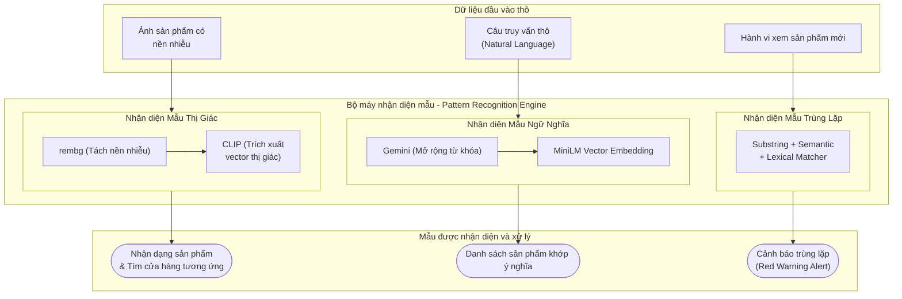
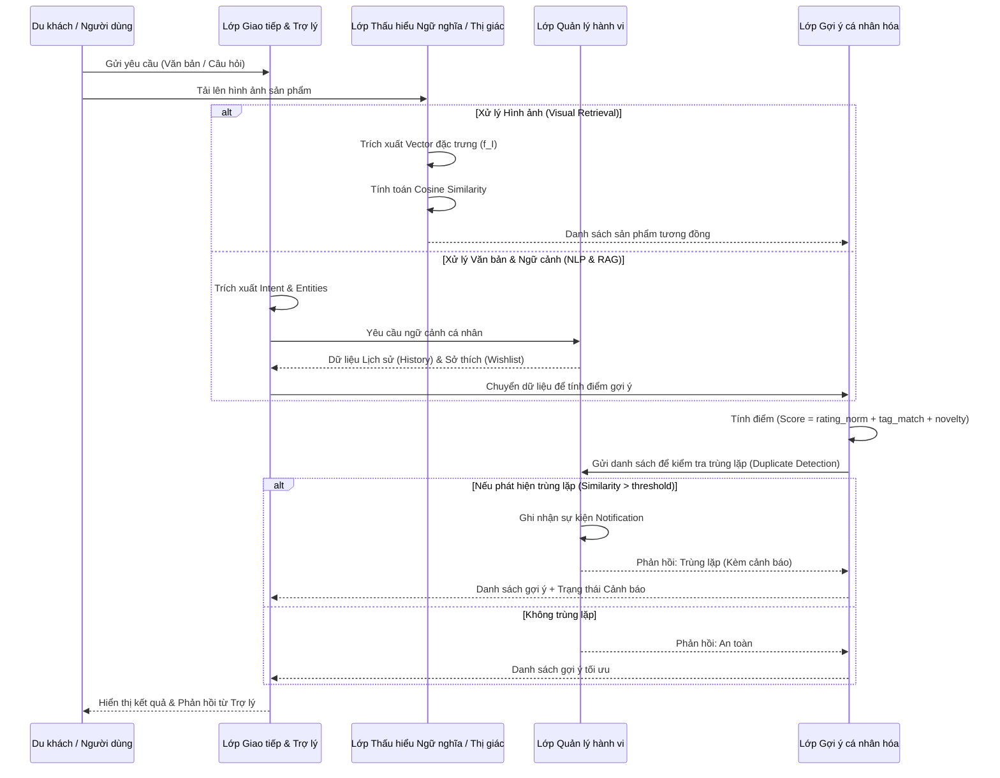
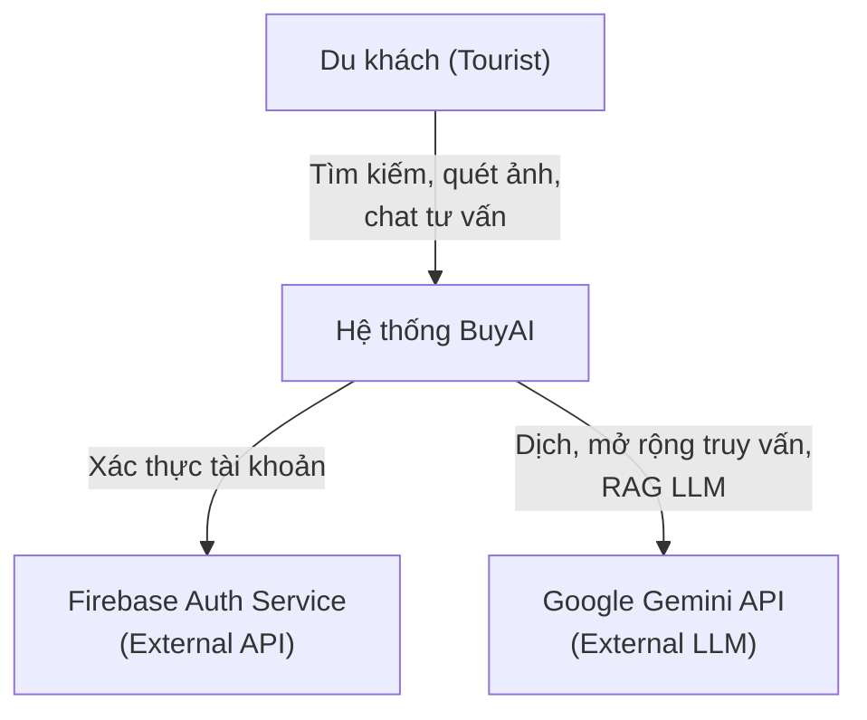
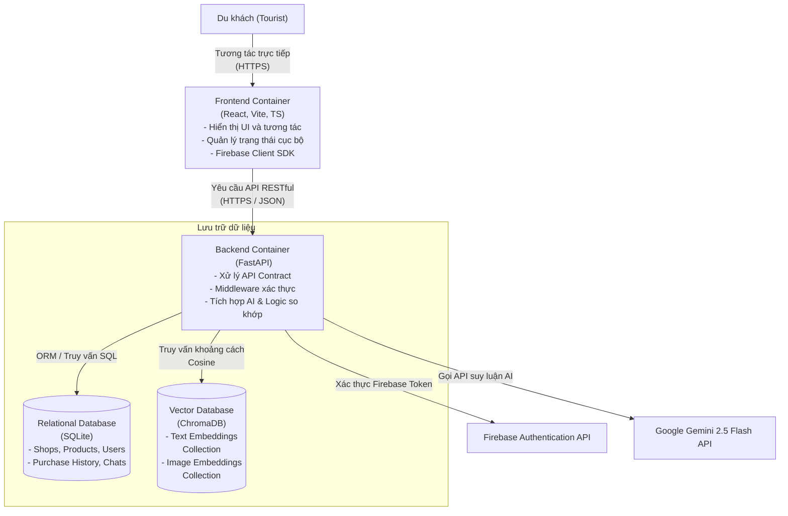
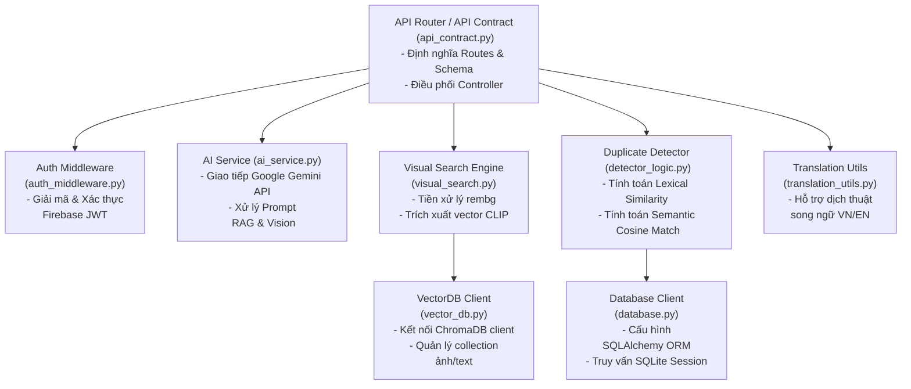
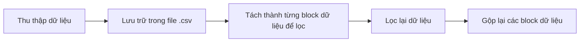
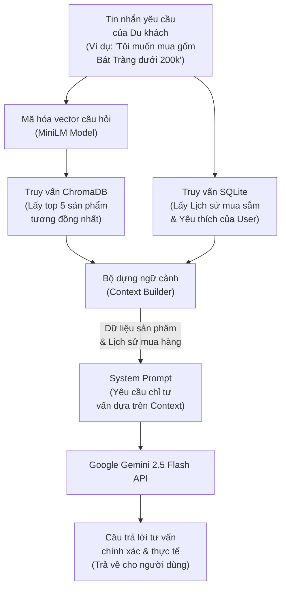
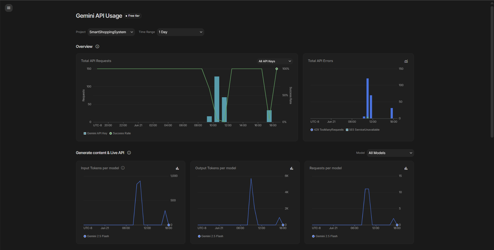

# BÁO CÁO ĐỒ ÁN CUỐI KỲ - TƯ DUY TÍNH TOÁN (COMPUTATIONAL THINKING)

---

## TRANG BÌA (Cover Page)
**Tên Đồ án:** BuyAI - Hệ Thống Hỗ Trợ Mua Sắm Thông Minh Cho Khách Du Lịch  
**Học kỳ:** HKII - Năm học 2025-2026  
**Mã môn học:** CSC10014  
**Tên môn học:** Tư duy Máy tính (Computational Thinking)  
**Mã lớp:** CQ2024/6  
**Mã nhóm:** Group06  
**Thành viên nhóm:**
1. 24120332 - Đinh Công Khang (Leader)
2. 24120090 - Đặng Hồng Minh
3. 24120215 - Nguyễn Ngọc Phúc
4. 24120245 - Trần Lê Đức Việt
5. 24120344 - Hoàng Trần Minh Khoa

**Giảng viên hướng dẫn & TAs:**
- Instructors: Hồ Tuấn Thanh, Mai Anh Tuấn
- TA: Phạm Nguyễn Sơn Tùng  

**Thời gian cập nhật mới nhất:** 22/06/2026

---

## MỤC LỤC (Table of Contents)
1. [Thành viên nhóm](#1-thành-viên-nhóm)
2. [Ý tưởng (Idea)](#2-ý-tưởng-idea)
3. [Phân tích và Chia nhỏ bài toán (Problem Analysis & Decomposition)](#3-phân-tích-và-chia-nhỏ-bài-toán-problem-analysis--decomposition)
4. [Biểu diễn bài toán (Representation)](#4-biểu-diễn-bài-toán-representation)
5. [Tổng quan hệ thống (System Overview)](#5-tổng-quan-hệ-thống-system-overview)
6. [Nhận diện mẫu (Pattern Recognition)](#6-nhận-diện-mẫu-pattern-recognition)
7. [Trừu tượng hóa (Abstraction)](#7-trừu-tượng-hóa-abstraction)
8. [Thiết kế hệ thống và Thuật toán (System / Algorithm Design)](#8-thiết-kế-hệ-thống-và-thuật-toán-system--algorithm-design)
9. [Hiện thực hóa (Implementation)](#9-hiện-thực-hóa-implementation)
10. [Mô phỏng và Thực nghiệm (Simulation)](#10-mô-phỏng-và-thực-nghiệm-simulation)
11. [Kiểm thử (Testing)](#11-kiểm-thử-testing)
12. [Đánh giá giải pháp (Evaluation)](#12-đánh-giá-giải-pháp-evaluation)
13. [Demo sản phẩm](#13-demo-sản-phẩm)
14. [Triển khai (Deployment)](#14-triển-khai-deployment)
15. [Nhật ký công việc (Logbook)](#15-nhật-ký-công-việc-logbook)
16. [Tuyên bố sử dụng AI](#16-tuyên-bố-sử-dụng-ai)
17. [Kết luận và Hướng phát triển](#17-kết-luận-và-hướng-phát-triển)

---

## 1. THÀNH VIÊN NHÓM
| MSSV | Họ và tên | Email | Vai trò / Trách nhiệm |
| :--- | :--- | :--- | :--- |
| 24120332 | Đinh Công Khang | 24120332@student.hcmus.edu.vn | Nhóm trưởng, Backend Developer, AI Integration |
| 24120090 | Đặng Hồng Minh | 24120090@student.hcmus.edu.vn | Abstraction Design, Documentation |
| 24120215 | Nguyễn Ngọc Phúc | 24120215@student.hcmus.edu.vn | Recommendation Engine, Data Normalization |
| 24120245 | Trần Lê Đức Việt | 24120245@student.hcmus.edu.vn | Visual Product Retrieval, Image Processing |
| 24120344 | Hoàng Trần Minh Khoa | 24120344@student.hcmus.edu.vn | Simulation & Testing, QA/QC |

---

## 2. Ý TƯỞNG (Idea)
### [24120332 - Đinh Công Khang] 2.1 Tuyên bố bài toán (Problem Statement)
- Vấn đề hiện hữu: Khách du lịch khi đến các địa phương thường gặp khó khăn trong việc tìm kiếm và phân biệt các sản phẩm đặc sản, đồ thủ công mỹ nghệ thật sự chất lượng. Sự khác biệt về ngôn ngữ, thiếu thông tin về nguồn gốc, giá cả và ý nghĩa văn hóa của sản phẩm khiến họ dễ mua phải hàng kém chất lượng hoặc không phù hợp.
- Hệ quả: Quyết định mua sắm thường mang tính thụ động, dẫn đến tâm lý "không biết mua gì làm quà" và ảnh hưởng đến trải nghiệm tổng thể của chuyến đi.
- Mục tiêu hệ thống: Tối ưu hóa quy trình tìm kiếm, tư vấn chi tiêu thông qua các công nghệ AI (Computer Vision, NLP, Semantic Search, Visual Search) để tạo ra trải nghiệm mua sắm liền mạch và cá nhân hóa.
### [24120332 - Đinh Công Khang] 2.2 Tầm nhìn sản phẩm (Product Vision)
BuyAI hướng tới việc trở thành một trợ lý mua sắm cá nhân thông minh, sử dụng sức mạnh của Trí tuệ nhân tạo (AI) để kết nối khách du lịch với các giá trị văn hóa địa phương thông qua sản phẩm. Hệ thống không chỉ giúp tìm kiếm mà còn giúp người dùng hiểu sâu hơn về những gì họ đang mua.

### [24120332 - Đinh Công Khang] 2.3 Đối tượng người dùng mục tiêu (Target Users)
- Khách du lịch trong và ngoài nước.
- Những người yêu thích tìm hiểu văn hóa qua các sản phẩm thủ công, đặc sản.
- Người mua sắm muốn tìm kiếm sản phẩm bằng hình ảnh một cách nhanh chóng.

---

## 3. PHÂN TÍCH VÀ CHIA NHỎ BÀI TOÁN (Problem Analysis & Decomposition)
### [24120215 - Nguyễn Ngọc Phúc] 3.1 Phân tích bài toán (Problem analysis)
### 3.1.1 The Elements of a Well-defined Problem
**Input / Initial states** : 
Các thẻ sở thích của người dùng. 
- Ảnh chụp sản phẩm. 
- Văn bản, câu hỏi, sở thích,...

**Output / Goal states** : 
   - Danh sách điểm mua sắm. 
   - Thông tin chi tiết sản phẩm (tên, ý nghĩa, giá). 

**Operators (Tiến trình chuyển đổi)** : Hệ thống nhận diện hình ảnh, trích xuất đặc trưng văn bản/hình ảnh, thuật toán tính toán độ tương đồng (recommendation). 

**Evaluation function** : 
- Độ chính xác của nhận diện sản phẩm. 
- Độ hài lòng của danh sách gợi ý.

**Constraints** : Giới hạn về thời gian xử lý API (độ trễ), phong phú dữ liệu, định dạng dữ liệu hình ảnh đầu vào. 

**Technically executable** : Khả thi khi áp dụng các model AI/ML hiện tại (Computer Vision, NLP, Optimization algorithms).

### 3.1.2. Áp dụng Problem Analysis Tools 

### Tool 01: Clarification Questions (Template) 

- **Goal** : 
   - _Bài toán cần giải quyết là gì?_ Hỗ trợ tối ưu hóa tìm kiếm, tư vấn chi tiêu mua sắm cho du khách. 
   - _Tại sao quan trọng?_ Khách du lịch gặp rào cản thiếu thông tin minh bạch, bất đồng ngôn ngữ và khó kiểm soát ngân sách, dẫn đến quyết định mua sắm thụ động. 
- **Users / Target Audience** : Khách du lịch trong và ngoài nước. Sự khó khăn chính của họ là không biết mua gì làm quà và không rõ nguồn gốc sản phẩm. 
- **Inputs - Outputs** : Dữ liệu người dùng (hình ảnh, text) được chuyển hóa thành các đề xuất mang tính điều hướng trực quan. 
- **Constraints** : Giới hạn quota API AI chatbot, thiết bị người dùng phải kết nối mạng. 
- **Assumptions & Risks** : 
   - _Giả định:_ Các cửa hàng địa phương đã được số hóa thông tin trên hệ thống. _Rủi ro:_ Ảnh chụp quá mờ khiến thuật toán nhận diện sai. 
- **Success Criteria** : Trải nghiệm mua sắm của du khách trở nên liền mạch, chủ động, giải quyết được rào cản tâm lý "không biết mua gì làm quà". 

### Tool 02: Stakeholder Mapping

Dựa vào mức độ ảnh hưởng (Influence) và mức độ quan tâm (Interest): 

|**Stakeholder**|**Role**|**Needs**|**Level of influence**|**Level of interest**|
|---|---|---|---|---|
|**Du khách (Tourist)**|Main user|Trải nghiệm mua sắm nhanh chóng, được gợi ý đúng nhu cầu, không bị hớ giá|Low|High|
|**Chủ cửa hàng địa phương**|Cung cấp sản phẩm|Tăng doanh thu, tiếp cận đúng khách du lịch|Medium|High|


### Tool 03: Requirements Elicitation

### Functional Requirements (Yêu cầu chức năng) : 
- Hệ thống phải quét và nhận diện được đặc trưng của sản phẩm qua ảnh chụp. 
- Chatbot phải nhận input văn bản/thông số và xuất ra danh sách quà tặng. 

### Non-functional Requirements (Yêu cầu phi chức năng) : 

- Tốc độ phản hồi (Performance): Nhận diện ảnh và trả kết quả dưới 2 giây. 
- Độ chính xác: Dữ liệu sản phẩm, cửa hàng phải chính xác, minh bạch. 

### Tool 04: Constraint Specification

|**Type**|**Example**|
|---|---|
|**Technical constraint**|Cần sử dụng các API nhận diện hình ảnh, NLP, Search.|
|**Performance constraint**|Thuật toán gợi ý khoảng cách phải tính toán nhanh để hiển thị trực quan lập tức. API Latency $p95 < 800ms$.|
|**Resource constraint**| Quota giới hạn của các dịch vụ Cloud API (nhận diện ảnh, chatbot).|

### Tool 05.1: Use Case

### Use Case: Nhận diện và Truy xuất thông tin sản phẩm (Visual Product Retrieval)

**Actor:** Du khách. 

**Precondition:** Du khách đang mở ứng dụng và truy cập internet.

**Main flow:** 

   1. Du khách tải lên ảnh một món đồ thủ công/đặc sản. 

   2. Hệ thống tải ảnh lên server, chạy thuật toán trích xuất đặc trưng ảnh. 

   3. Hệ thống so khớp ảnh với cơ sở dữ liệu sản phẩm địa phương. 

   4. Hệ thống trả về thông tin (tên, ý nghĩa văn hóa, giá tham khảo). 


- **Alternative flow:** Nếu hệ thống không nhận diện được (ảnh mờ, không có trong DB) $\rightarrow$ Hệ thống gợi ý chụp lại ở góc độ khác hoặc hỏi Chatbot tư vấn. 

- **Postcondition:** Du khách nhận được thông tin của sản phẩm và cửa hàng. 

### Tool 05.2: Epic & User Story

- **Epic 1 - Smart Shopping Assistant** : "Với tư cách là một du khách, tôi muốn có một trợ lý ảo tư vấn chọn quà tặng phù hợp với ngân sách và độ tuổi người nhận, để tôi có thể giải quyết rào cản tâm lý không biết mua gì." 

- **User Story 1.1** : "Là du khách, tôi muốn được đề xuất những món quà nằm trong khả năng chi trả của mình." 

- **Epic 2 - Duplicate Detector** : "Với tư cách là du khách, tôi muốn hệ thống tự động phát hiện những sản phẩm bị trùng lặp trong những lần ghi nhận mua sắm trước đó."

### [24120215 - Nguyễn Ngọc Phúc] 3.2 Phân rã bài toán (Decomposition)
Tuân thủ nguyên tắc không phân rã theo tính năng UI (Poor Decomposition), chúng ta sẽ phân rã bài toán thành các Module thuật toán và xử lý dữ liệu tính toán cốt lõi (Computational Components): 

### Module 1: Input Representation & Data Normalization (Biểu diễn & Chuẩn hóa Dữ liệu) 
- **Feature Extraction (Vision):** Chuyển đổi dữ liệu ảnh (sản phẩm) thành các vector đặc trưng số học (thông qua Image Embedding / CLIP model). 
- **Data Normalization:** Chuẩn hóa các thang đo (ví dụ: ngân sách $100k - 5M$) về phạm vi $[0, 1]$ để đảm bảo khi tính toán Recommendation, không có một tiêu chí nào áp đảo kết quả. 

### Module 2: AI Hybrid Search & Query Expansion (Công cụ Tìm kiếm lai và Mở rộng truy vấn) 
- **AI Query Expansion:** Sử dụng Google Gemini API để phân tích câu truy vấn của người dùng, sinh ra 5-8 từ khóa mở rộng song ngữ (Anh-Việt) để nắm bắt các từ đồng nghĩa và tối ưu hóa kết quả tìm kiếm đa ngôn ngữ. Phép toán cốt lõi: Gọi API LLM xử lý ngôn ngữ tự nhiên.
- **Hybrid Matching & Ranking:** Kết hợp kết quả tìm kiếm ngữ nghĩa (Semantic Search - truy vấn khoảng cách Cosine trên ChromaDB) và tìm kiếm từ khóa (Keyword Search - truy vấn SQL `LIKE` trên SQLite). Xếp hạng kết quả bằng cách hiển thị các sản phẩm của Semantic Search lên trước (giữ nguyên độ liên quan ngữ nghĩa từ ChromaDB), tiếp theo là các kết quả Keyword Search bổ sung và loại bỏ trùng lặp. Phép toán cốt lõi: Hợp nhất danh sách và loại bỏ trùng lặp với độ phức tạp thời gian là $O(N_s + N_k)$ trong đó $N_s$ và $N_k$ lần lượt là số lượng sản phẩm từ tìm kiếm ngữ nghĩa và tìm kiếm từ khóa.

### Module 3: Duplicate Buying Detection & Warn Engine (Hệ thống Phát hiện và Cảnh báo Trùng lặp) 
- **Lexical-Semantic Hybrid Match:** Khi người dùng xem hoặc mua sản phẩm, hệ thống tính toán mức độ trùng lặp với lịch sử mua sắm (`PurchaseHistory`). Thuật toán so khớp kết hợp 3 phương pháp: So khớp chuỗi con (Substring matching) của tên sản phẩm; Độ tương đồng ngữ nghĩa (Semantic similarity) sử dụng Cosine Similarity giữa vector đặc trưng của sản phẩm mới và các sản phẩm cũ thông qua mô hình `paraphrase-multilingual-MiniLM-L12-v2` ($Similarity(A, B) = \frac{A \cdot B}{\|A\| \|B\|}$); và Độ tương đồng chuỗi ký tự (Lexical similarity) bằng thuật toán `difflib.SequenceMatcher`.
- **Rule-based Alert Trigger:** Kích hoạt cảnh báo trên giao diện nếu độ tương đồng lớn nhất $Score_{max} = \max(Score_{Substring}, Score_{Semantic}, Score_{Lexical})$ lớn hơn hoặc bằng ngưỡng $\theta = 0.85$. Điều kiện logic: `IF (Score_max >= 0.85) THEN Trigger_Warning(product_id)`. Độ phức tạp thời gian là $O(H)$ với $H$ là số lượng sản phẩm trong lịch sử mua sắm của người dùng.

### Module 4: Visual Product Retrieval & Image Preprocessing (Tìm kiếm Sản phẩm bằng Hình ảnh và Tiền xử lý) 
- **Background Removal & Preprocessing:** Tiền xử lý ảnh tải lên bằng thư viện `rembg` (Remove Background) để loại bỏ nhiễu nền, tách vật thể sản phẩm chính và dán lên một nền trắng đồng nhất (RGBA -> RGB), giúp chuẩn hóa dữ liệu đầu vào và tăng độ chính xác của vector đặc trưng của CLIP.
- **Visual Embedding Matching:** Trích xuất vector đặc trưng 512 chiều từ hình ảnh thông qua mô hình CLIP (`openai/clip-vit-base-patch32`), chuẩn hóa vector ($L_2$ Norm: $v = \frac{v}{\|v\|_2}$), và thực hiện truy vấn lân cận gần nhất (Nearest Neighbor) trong ChromaDB bằng khoảng cách Cosine. Trả về danh sách $k$ sản phẩm tương tự nhất về mặt thị giác. Độ phức tạp tính toán là $O(D \cdot N)$ với $D = 512$ và $N$ là tổng số lượng ảnh mẫu trong Vector DB.

### Xử lý Edge Cases (Trường hợp ngoại lệ) 
- *Trường hợp 1:* Không tìm thấy sản phẩm nào khớp với từ khóa tìm kiếm của du khách (Zero-search results). $\rightarrow$ Chiến lược dự phòng (Fallback): Sử dụng Gemini API phân tích từ khóa thô để dịch thuật, sửa lỗi chính tả hoặc đề xuất danh mục sản phẩm thay thế phổ biến khác của địa phương (ví dụ: "đặc sản ẩm thực", "quà lưu niệm").
- *Trường hợp 2:* Ảnh sản phẩm người dùng chụp bị mờ hoặc góc khuất khiến mô hình CLIP không thể trích xuất vector đặc trưng chính xác (hoặc khoảng cách tương đồng thấp). $\rightarrow$ Chiến lược dự phòng (Fallback): Chuyển luồng sang phân tích thuộc tính ảnh (`scan-product` qua Gemini Vision) để nhận dạng nhãn hiệu, màu sắc, loại sản phẩm bằng ngôn ngữ tự nhiên, sau đó thực hiện tìm kiếm bằng văn bản (Text-based Semantic Search).
- *Trường hợp 3:* Bộ mã hóa hoặc API của mô hình hình ảnh CLIP bị lỗi tải hoặc không hoạt động. $\rightarrow$ Chiến lược dự phòng (Fallback): Trả về kết quả tìm kiếm tạm thời rỗng kèm thông báo lỗi thân thiện, đồng thời định tuyến tự động các yêu cầu tìm kiếm tiếp theo của người dùng qua chức năng tìm kiếm văn bản (Text/Semantic Search).

---

## 4. BIỂU DIỄN BÀI TOÁN (Representation)
### [24120245 - Trần Lê Đức Việt] 4.1 Biểu diễn tổng quát
Bài toán được chuyển từ ngữ cảnh thực tế sang mô hình tính toán thông qua việc định nghĩa các thực thể và quan hệ:

| Thành phần ngoài đời thực | Biểu diễn trong hệ thống | Mục đích |
|---|---|---|
| Du khách | `User` / hồ sơ người dùng | Lưu sở thích, lịch sử mua sắm, vị trí hiện tại |
| Cửa hàng / gian hàng | `Shop` | Lưu vị trí, đánh giá, danh sách sản phẩm |
| Sản phẩm địa phương | `Product` | Lưu tên, loại sản phẩm, giá, ý nghĩa văn hóa |
| Ảnh chụp sản phẩm | `Image` → `Embedding Vector` | Dùng để tìm sản phẩm tương tự |
| Ghi nhận mua sắm | `PurchaseRecorder` | Dùng để cảnh báo mua trùng |
| Yêu cầu bằng ngôn ngữ tự nhiên | `UserQuery` | Dùng cho AI Assistant / RAG |

### [24120245 - Trần Lê Đức Việt] 4.2 Biểu diễn Dữ liệu (Data Representation)
Hệ thống sử dụng các cấu trúc dữ liệu sau:
*   **Danh sách sản phẩm:** `List<Product>` dùng để lưu trữ danh sách sản phẩm gợi ý.
*   **Tra cứu nhanh theo mã:** `HashMap<ID, Object>` hỗ trợ tìm kiếm tức thời thông tin sản phẩm/cửa hàng.
*   **Đặc trưng hình ảnh:** `Vector<float>` biểu diễn embedding của ảnh (CLIP).
*   **Lịch sử mua hàng:** `Set<ProductID>` hoặc `List<PurchaseLog>` dùng để kiểm tra sản phẩm đã mua để phát hiện trùng lặp.

### [24120245 - Trần Lê Đức Việt] 4.3 Biểu diễn Quy trình (Process Representation)

#### 4.3.1 Luồng tổng quát của hệ thống


* **Diễn giải sơ đồ 4.3.1**: Sơ đồ luồng tổng quát (Flowchart) mô tả các hành trình trải nghiệm của du khách khi tương tác với hệ thống. Bắt đầu từ lúc người dùng khởi chạy ứng dụng và đưa vào các loại dữ liệu đầu vào (Sở thích, ảnh chụp sản phẩm, câu hỏi tự nhiên hoặc thao tác ghi nhận mua hàng). Hệ thống sẽ tự động định tuyến đến mô-đun xử lý nghiệp vụ tương ứng (Recommendation Engine, Visual Search, AI Chatbot RAG, Purchase Logger) trước khi xuất kết quả trực quan ra màn hình hiển thị cho du khách.

### [24120245 - Trần Lê Đức Việt] 4.4 Biểu diễn Toán học
*   **Hàm tính điểm gợi ý:** $score = w_1 \cdot rating + w_2 \cdot tag\_match + w_3 \cdot novelty - w_4 \cdot distance\_penalty$.
*   **Độ tương tự Cosine:** $cosine\_similarity(A, B) = \frac{A \cdot B}{||A|| \cdot ||B||}$.
*   **Mô hình phát hiện mua trùng:** $duplicate\_score(user, product) = \max_{p \in History} similarity(product, p)$.

---

## 5. TỔNG QUAN HỆ THỐNG (System Overview)

### [24120332 - Đinh Công Khang] 5.1 Các bên liên quan chính (Main Stakeholders)
*   **Du khách (Tourists / Consumers):** Đối tượng thụ hưởng trực tiếp của hệ thống. Họ cần một công cụ thông minh giúp vượt qua rào cản ngôn ngữ, tìm kiếm đặc sản địa phương chính xác, xem thông tin văn hóa/giá cả minh bạch, quản lý chi tiêu và tránh việc mua trùng lặp các món quà lưu niệm đã mua trước đó.
*   **Chủ cửa hàng địa phương (Local Merchants / Shop Owners):** Các đơn vị cung cấp sản phẩm và điểm bán. Họ mong muốn tiếp cận khách du lịch hiệu quả hơn, quảng bá sản phẩm truyền thống/thủ công mỹ nghệ, gia tăng doanh số và tạo dựng uy tín thông qua việc cung cấp thông tin xuất xứ rõ ràng.

### [24120332 - Đinh Công Khang] 5.2 Các tác nhân chính (Main Actors / User Types)
Hệ thống xác định 3 tác nhân tương tác trực tiếp với các chức năng của BuyAI:
1.  **Khách du lịch đã đăng ký (Registered Tourist):**
    *   *Mô tả:* Người dùng đã xác thực thông qua Firebase Auth (bằng email/password).
    *   *Quyền hạn:*
        *   Sử dụng các chức năng tìm kiếm: Tìm kiếm lai thông minh (Hybrid Search), Tìm kiếm bằng hình ảnh (Visual Search).
        *   Quét & phân tích thuộc tính sản phẩm qua ảnh (AI Product Scan).
        *   Xem thông tin chi tiết sản phẩm.
        *   Trò chuyện với Trợ lý ảo tư vấn mua sắm thông qua các phiên chat (RAG Chatbot).
        *   Lưu trữ lịch sử mua sắm cá nhân (`Purchase History`).
        *   Nhận cảnh báo trực quan tự động khi hệ thống phát hiện có ý định mua sản phẩm trùng lặp hoặc tương tự với lịch sử trước đó (Duplicate Buying Detection).
2.  **Chủ cửa hàng / Quản trị viên (Merchant / Admin - Tác nhân hệ thống):**
    *   *Mô tả:* Người đại diện quản lý hoặc hệ thống tự động đồng bộ.
    *   *Quyền hạn:* Cập nhật và lưu trữ thông tin sản phẩm (tên, giá, mô tả song ngữ Anh-Việt, ảnh sản phẩm, tag sản phẩm) vào cơ sở dữ liệu nhằm duy trì độ chính xác và tính sẵn sàng của dữ liệu cho các thuật toán AI.

### [24120332 - Đinh Công Khang] 5.3 Danh sách các tính năng cốt lõi (List of Core Features)
*   **AI Hybrid Search & Query Expansion:** Tìm kiếm kết hợp ngữ nghĩa và từ khóa kèm theo cơ chế tự động dịch/mở rộng truy vấn.
*   **AI Assistant / RAG Chatbot:** Trợ lý ảo tư vấn chọn quà tặng cá nhân hóa dựa trên ngữ cảnh sản phẩm thực tế và lịch sử mua sắm.
*   **Visual Product Retrieval:** Tìm kiếm sản phẩm tương tự bằng cách tải lên hình ảnh sản phẩm.
*   **AI Product Scanning (Gemini Vision):** Phân tích hình ảnh sản phẩm để trích xuất các thuộc tính chi tiết bằng ngôn ngữ tự nhiên.
*   **Duplicate Buying Detection & Warn Engine:** Tự động phát hiện và hiển thị cảnh báo khi mua sắm các sản phẩm trùng lặp hoặc tương đồng.

### [24120332 - Đinh Công Khang] 5.4 Giải thích chi tiết các tính năng cốt lõi (Explanation of Core Features)
1.  **AI Hybrid Search & Query Expansion (Tìm kiếm lai và mở rộng truy vấn):**
    *   *Mô tả:* Giải quyết rào cản bất đồng ngôn ngữ và sự mơ hồ trong truy vấn của du khách khi tìm kiếm đặc sản.
    *   *Qơ chế vận hành:*
        1.  *Query Expansion:* Khi người dùng nhập câu hỏi (ví dụ: "trà đặc sản"), hệ thống gọi Gemini API để phân tích ý định và sinh ra 5-8 từ khóa mở rộng đa ngôn ngữ (ví dụ: "trà thái nguyên, trà xanh, tea, green tea").
        2.  *Semantic Search:* Sử dụng mô hình `paraphrase-multilingual-MiniLM-L12-v2` chuyển đổi các từ khóa thành vector và tìm kiếm trên ChromaDB bằng khoảng cách Cosine.
        3.  *Keyword Search:* Truy vấn SQL `LIKE` đồng thời trên SQLite cho các cột mô tả bằng tiếng Việt/tiếng Anh.
        4.  *Hợp nhất (Merge):* Kết hợp kết quả từ hai phương thức, ưu tiên kết quả tìm kiếm ngữ nghĩa lên trước và loại bỏ trùng lặp với độ phức tạp $O(N_s + N_k)$.
2.  **AI Assistant / RAG Chatbot (Trợ lý ảo RAG):**
    *   *Mô tả:* Tư vấn cá nhân hóa về quà tặng, ngân sách và địa điểm mua sắm.
    *   *Cơ chế vận hành:* Nhận câu hỏi từ người dùng đã đăng nhập -> Truy vấn ChromaDB để tìm thông tin sản phẩm liên quan nhất làm ngữ cảnh dữ liệu thực tế -> Lấy lịch sử mua sắm của người dùng từ SQLite làm ngữ cảnh cá nhân hóa -> Đóng gói "Context" và gửi cho Google Gemini sinh câu trả lời. Điều này giúp câu trả lời của AI luôn chính xác và bám sát thực tế cửa hàng.
3.  **Visual Product Retrieval (Tìm kiếm sản phẩm bằng hình ảnh):**
    *   *Mô tả:* Cho phép du khách chụp ảnh một món quà lưu niệm và tìm xem cửa hàng nào bán sản phẩm tương tự.
    *   *Cơ chế vận hành:* Người dùng tải lên ảnh -> Hệ thống sử dụng thư viện `rembg` để tự động loại bỏ nền nhiễu và chuyển về nền trắng -> Mã hóa ảnh thành vector 512 chiều qua mô hình **OpenAI CLIP** (`clip-vit-base-patch32`) -> So khớp vector bằng khoảng cách Cosine trong ChromaDB -> Trả về danh sách sản phẩm tương đồng về thị giác.
4.  **AI Product Scanning via Gemini Vision (Quét sản phẩm bằng Gemini Vision):**
    *   *Mô tả:* Phân tích chuyên sâu về thuộc tính sản phẩm trực tiếp từ hình ảnh.
    *   *Cơ chế vận hành:* Hoạt động như một cơ chế dự phòng (Fallback) khi tìm kiếm CLIP có độ tương thích thấp hoặc ảnh bị mờ. Hệ thống gửi ảnh sản phẩm trực tiếp đến Gemini Vision kèm prompt yêu cầu phân tích các thuộc tính (thương hiệu, công năng, xuất xứ, màu sắc), sau đó định tuyến kết quả phân tích sang Text-based Semantic Search để tìm sản phẩm tương ứng.
5.  **Duplicate Buying Detection & Warn Engine (Động cơ Cảnh báo Trùng lặp):**
    *   *Mô tả:* Hỗ trợ quản lý chi tiêu và tránh lãng phí khi mua quà tặng.
    *   *Cơ chế vận hành:* Khi người dùng xem/mua sản phẩm, hệ thống tự động đối chiếu sản phẩm đó với toàn bộ lịch sử mua sắm cá nhân (`PurchaseHistory`) thông qua thuật toán kết hợp 3 lớp (Lexical-Semantic Hybrid Match):
        *   *Substring Match:* So khớp chuỗi con của tên sản phẩm (gán điểm mặc định là 0.95 nếu khớp).
        *   *Semantic similarity:* Tính Cosine Similarity giữa vector đặc trưng của sản phẩm mới và lịch sử bằng SentenceTransformer.
        *   *Lexical similarity:* Đo độ tương đồng ký tự bằng thuật toán `SequenceMatcher` để xử lý lỗi chính tả.
        Nếu điểm trùng lặp lớn nhất $Score_{max} \geq 0.85$, giao diện sẽ kích hoạt cảnh báo màu đỏ trực quan báo hiệu sản phẩm đã từng được mua.

### [24120332 - Đinh Công Khang] 5.5 Điểm sáng đổi mới sáng tạo (Innovation Highlights)
*   **Tránh hiện tượng AI "ảo giác" (Hallucination) bằng RAG:** Bảo đảm thông tin tư vấn mua sắm của trợ lý ảo luôn có căn cứ thực tế dựa trên dữ liệu sản phẩm và cửa hàng trong cơ sở dữ liệu thay vì tự sinh thông tin sai lệch.
*   **Thuật toán Cảnh báo trùng lặp ba lớp tinh vi:** Khác với các hệ thống thương mại điện tử chỉ đối chiếu theo ID sản phẩm, BuyAI phát hiện mua trùng dựa trên sự tương đồng về ngữ nghĩa, ký tự và chuỗi con của tên sản phẩm, giúp cảnh báo đúng ngay cả khi sản phẩm có tên gọi khác nhau một chút do dịch thuật hoặc ghi nhận thủ công.
*   **Tăng độ chính xác tìm ảnh nhờ tách nền tự động:** Tích hợp quy trình tiền xử lý ảnh loại bỏ nền nhiễu (`rembg`) trước khi tạo CLIP vector, giúp loại bỏ các yếu tố ngoại cảnh không mong muốn và tập trung tối đa vào các đặc trưng thị giác cốt lõi của sản phẩm.
*   **Cơ chế dự phòng lỗi đa tầng (Graceful Fallback):** Hệ thống luôn có kịch bản xử lý lỗi khi API gián đoạn, ảnh mờ hoặc không có kết quả tìm kiếm trực tiếp, giúp duy trì trải nghiệm người dùng liền mạch và tin cậy.

---

## 6. NHẬN DIỆN MẪU (Pattern Recognition)

### [24120332 - Đinh Công Khang] 6.1 Phương pháp áp dụng nhận diện mẫu (Pattern Recognition Techniques)
Nhận diện mẫu (Pattern Recognition) trong Tư duy Máy tính được nhóm áp dụng để phát hiện các quy luật, sự tương đồng và đặc trưng lặp đi lặp lại trong dữ liệu đầu vào (hình ảnh, văn bản, hành vi mua sắm), từ đó giúp hệ thống tự động đưa ra các quyết định xử lý thông minh:

1.  **Nhận diện mẫu ngữ nghĩa trong truy vấn văn bản (Textual Semantic Patterns):**
    *   *Quy luật phát hiện:* Du khách thường tìm kiếm sản phẩm bằng ngôn ngữ tự nhiên tự do, đa ngôn ngữ (Anh/Việt), sử dụng nhiều từ đồng nghĩa hoặc mô tả gián tiếp (ví dụ: "quà gì ấm bụng", "đồ gốm trang trí phòng khách").
    *   *Phương pháp áp dụng:* 
        *   Sử dụng mô hình ngôn ngữ lớn (Gemini API) để phân tích cú pháp câu hỏi của người dùng và nhận diện "mẫu ý định" (intent patterns) để sinh ra bộ từ khóa mở rộng.
        *   Chuyển đổi các từ khóa thành biểu diễn vector (Vector Embeddings) qua mô hình `paraphrase-multilingual-MiniLM-L12-v2`. Bản chất của bước này là đưa các mẫu ngôn ngữ tự nhiên phức tạp về một mẫu số chung: các tọa độ vector trong không gian đa chiều nơi các từ/câu có nghĩa tương đồng sẽ nằm gần nhau.
        *   Tính toán độ tương đồng Cosine để nhận diện sản phẩm phù hợp nhất.

2.  **Nhận diện mẫu thị giác trong hình ảnh sản phẩm (Visual Feature Patterns):**
    *   *Quy luật phát hiện:* Các sản phẩm thủ công mỹ nghệ hoặc đặc sản địa phương có các đặc trưng hình ảnh đặc thù (màu sắc đất nung của gốm Bát Tràng, họa tiết thổ cẩm, hình dáng hộp trà, ...). Tuy nhiên, ảnh chụp thực tế từ du khách luôn chứa nhiễu (background noise) như ánh sáng khác nhau, tay người cầm, bàn ghế xung quanh.
    *   *Phương pháp áp dụng:*
        *   **Nhận diện mẫu nền và tách vật thể (`rembg`):** Thuật toán tự động quét ảnh chụp, phân tích độ tương phản và biên giới để nhận diện đâu là mẫu "nền" cần loại bỏ và đâu là mẫu "vật thể chính" cần giữ lại, đưa về dạng chuẩn hóa là vật thể trên nền trắng tinh khiết.
        *   **Mã hóa mẫu thị giác (CLIP):** Sử dụng mô hình **OpenAI CLIP** để quét và trích xuất các đặc trưng phân bố pixel không gian thành một vector đặc trưng 512 chiều. Khoảng cách Cosine giữa vector ảnh tải lên và vector ảnh trong cơ sở dữ liệu sẽ giúp nhận diện mẫu sản phẩm nào đang được chụp.

3.  **Nhận diện mẫu trùng lặp hành vi mua sắm (Duplicate Purchase Patterns):**
    *   *Quy luật phát hiện:* Du khách có xu hướng quên những món quà lưu niệm đã mua trước đó trong suốt hành trình hoặc mua nhầm các sản phẩm có cùng bản chất nhưng khác tên gọi (ví dụ: "Trà Atiso túi lọc" và "Hộp trà sấy khô Atiso").
    *   *Phương pháp áp dụng:*
        *   Hệ thống so khớp sản phẩm hiện tại với lịch sử mua sắm bằng bộ lọc 3 lớp (Hybrid Matcher):
            *   *Mẫu chuỗi con (Substring Pattern):* Nhận diện sự trùng khớp một phần tên gọi.
            *   *Mẫu ngữ nghĩa (Semantic Pattern):* Nhận diện sự tương đồng về ý nghĩa công dụng qua khoảng cách vector mô tả.
            *   *Mẫu ký tự (Lexical Pattern):* Nhận diện lỗi gõ phím, lỗi chính tả thông qua thuật toán đo khoảng cách ký tự `SequenceMatcher`.
        *   Sự kết hợp này giúp nhận diện chính xác "mẫu trùng lặp hành vi", đưa ra cảnh báo kịp thời cho người dùng.

4.  **Nhận diện mẫu ý định hội thoại (Conversational Intent Patterns):**
    *   *Quy luật phát hiện:* Các câu hỏi tư vấn của du khách khi chat với AI thường rơi vào một số mẫu ý định điển hình như: hỏi xuất xứ, hỏi giá cả, tìm địa chỉ shop, yêu cầu chọn quà theo ngân sách.
    *   *Phương pháp áp dụng:* Hệ thống RAG phân tích câu hỏi -> Quét nhanh cơ sở dữ liệu vector để tìm các mẫu thông tin sản phẩm tương thích (Retrieval) -> Tổng hợp và gửi dữ liệu chuẩn làm ngữ cảnh nền cho mô hình Gemini sinh câu trả lời chính xác, tránh hiện tượng sinh chữ tự do không có căn cứ.

### [24120332 - Đinh Công Khang] 6.2 Mô hình hóa Quy trình Nhận diện Mẫu (Diagrams & Tables)

#### Bảng tổng hợp các mẫu và kỹ thuật nhận diện trong BuyAI:

| Mẫu cần nhận diện (Pattern) | Đặc trưng nhận diện (Features) | Công nghệ / Thuật toán áp dụng | Định dạng đầu ra (Output Representation) |
| :--- | :--- | :--- | :--- |
| **Mẫu ý định tìm kiếm** | Từ khóa ngữ nghĩa, từ đồng nghĩa, đa ngôn ngữ | Gemini API (Query Expansion) & SentenceTransformer | Vector đặc trưng $v \in \mathbb{R}^{384}$ |
| **Mẫu sản phẩm tương đồng ảnh** | Đường nét, màu sắc, bố cục hình ảnh (đã tách nền) | `rembg` (Tách nền) & OpenAI CLIP | Vector thị giác $v \in \mathbb{R}^{512}$ |
| **Mẫu trùng lặp mua sắm** | Độ tương tự tên gọi, ý nghĩa sản phẩm, lỗi chính tả | Substring Match, Cosine Similarity, `difflib.SequenceMatcher` | Điểm trùng lặp $Score_{max} \in [0, 1]$ |
| **Mẫu ý định hội thoại** | Câu hỏi hỏi giá, xuất xứ, địa chỉ cửa hàng | ChromaDB Vector Index Query | Context metadata gửi tới Gemini LLM |

#### Sơ đồ luồng nhận diện mẫu hệ thống:



* **Diễn giải sơ đồ Nhận diện mẫu**: Sơ đồ thể hiện tiến trình nhận dạng các lớp mẫu hành vi và dữ liệu từ người dùng của Hệ thống nhận diện mẫu (Pattern Recognition Engine). Dữ liệu đầu vào thô (ảnh sản phẩm, câu hỏi tự nhiên, lịch sử xem sản phẩm) được phân chia để xử lý thông qua ba bộ nhận diện độc lập: Mẫu thị giác (sử dụng `rembg` và CLIP), Mẫu ngữ nghĩa (sử dụng Gemini và MiniLM), và Mẫu trùng lặp (kết hợp đối soát Substring, Semantic và Lexical). Kết quả đầu ra là các mẫu thông tin đã được số hóa và chuẩn hóa để hiển thị cảnh báo hoặc gợi ý cửa hàng tương ứng cho người dùng.

---

## 7. TRỪU TƯỢNG HÓA (Abstraction)

Trừu tượng hóa hệ thống là quá trình đơn giản hóa thế giới thực bằng cách tập trung vào các đặc tính cốt lõi của bài toán và loại bỏ các chi tiết kỹ thuật hoặc thực tế không cần thiết. Đối với hệ thống BuyAI, việc trừu tượng hóa giúp định hình rõ ràng bài toán tư vấn cá nhân hóa và gợi ý mua sắm thông minh cho du khách, từ đó giảm bớt sự phức tạp trong quá trình thiết kế và cài đặt thuật toán.

### [24120090 - Đặng Hồng Minh] 7.1 Mô hình trừu tượng

Mô hình trừu tượng của BuyAI được xây dựng dựa trên việc chọn lọc thông tin thế giới thực, chuyển hóa các thực thể vật lý thành mô hình toán học và phân rã các hành vi giao tiếp phức tạp thành các hàm chức năng độc lập.

#### [24120090 - Đặng Hồng Minh] 7.1.1 Phạm vi và Nguyên tắc Trừu tượng hóa
Để tối ưu hóa logic cốt lõi trong phiên bản v2, hệ thống đã tiến hành tinh giản bộ máy vận hành thông qua việc xác định rõ các yếu tố được giữ lại và loại bỏ:
* **Các chi tiết thế giới thực được loại bỏ (Ignored details):** Màu sắc hoặc thiết kế vật lý của cửa hàng, phương thức thanh toán thực tế, quy trình quản lý ngân sách phức tạp, và các rào cản về giao thông hay lộ trình di chuyển của du khách.
* **Các đặc tính được giữ lại (Kept attributes):** Sở thích của người dùng (tags, wishlist), thông tin siêu dữ liệu (metadata) của sản phẩm, địa chỉ/tọa độ cửa hàng, lịch sử giao dịch/trò chuyện và hệ thống AI gợi ý.

#### [24120090 - Đặng Hồng Minh] 7.1.2 Trừu tượng hóa Dữ liệu (Data Abstraction)
Mọi đối tượng và hành vi của du khách trong không gian mua sắm thực tế được quy đổi thành các cấu trúc dữ liệu tính toán được và ánh xạ vào cơ sở dữ liệu như sau:

| Thực thể thực tế | Mô hình trừu tượng hóa (Abstracted Data) | Ánh xạ Cấu trúc Code / Database |
| :--- | :--- | :--- |
| **Sở thích du khách** | Một vector sở thích (User preference vector) với các giá trị đã được chuẩn hóa trong khoảng $[0, 1]$. | Dữ liệu phiên người dùng (Session/Local state). |
| **Sản phẩm (Đồ lưu niệm)** | Một đối tượng gồm các thuộc tính siêu dữ liệu (metadata): `{id, name, name_en, description, description_en, price, tag, image_url, category, vector_json, shop_id}` và một vector đặc trưng không gian (Vector Embeddings) đại diện cho nội dung/hình ảnh sản phẩm. | Metadata lưu tại bảng `products` (**SQLite**). Vector lưu tại **ChromaDB** qua mô hình `paraphrase-multilingual-MiniLM-L12-v2`. |
| **Cửa hàng (Shop)** | Địa điểm vật lý cung cấp sản phẩm. | Lưu tại bảng `shops` (**SQLite**) với `{shop_id, name, address}`. |
| **Hành vi mua sắm** | Tập hợp lịch sử mua sắm (`Purchase History`) chứa danh sách các sự kiện mua sắm mà người dùng đã xác nhận mua thành công. | Lưu tại bảng `history` (**SQLite**) với cấu trúc `{user_id, product_id, shop_id, timestamp}`. |
| **Sở thích cá nhân** | Danh sách sản phẩm được người dùng lưu lại để xem xét (`Wishlist`). | Lưu tại bảng `wishlist` (**SQLite**) với cấu trúc `{user_id, product_id, timestamp}`. |
| **Nhu cầu / Câu hỏi** | Các thực thể (`Entities` - ví dụ: "quà cho mẹ", "đồ thủ công") và ý định (`Intent` - ví dụ: hỏi thông tin, gợi ý quà) được trích xuất thông qua xử lý ngôn ngữ tự nhiên (NLP). | API Chatbot truyền ngữ cảnh vào Gemini. |
| **Tương tác AI** | Chuỗi hội thoại với RAG Chatbot, chia thành phiên (`Session`) và tin nhắn (`Message`). | Lưu tại bảng `chat_sessions` và `chat_messages` (**SQLite**). |
| **Nhắc nhở / Cảnh báo** | Các thông báo hệ thống được gửi đến người dùng (`Notification`). | Lưu tại bảng `notifications` (**SQLite**) với cấu trúc `{user_id, title, message, is_read, timestamp}`. |


#### [24120090 - Đặng Hồng Minh] 7.1.3 Trừu tượng hóa Logic & Chức năng (Functional Abstraction)
Hệ thống không mô phỏng lại toàn bộ cuộc trò chuyện cảm tính giữa người mua và người bán, mà trừu tượng hóa quy trình này thành 4 module tính toán độc lập:

**A. Gợi ý cá nhân hóa (Recommendation Engine)**
Quy trình ra quyết định gợi ý được trừu tượng hóa thành một hàm tính điểm (Scoring Function) tổng hợp từ 3 yếu tố:
$$Score = w_1 \cdot rating\_norm + w_2 \cdot tag\_match + w_3 \cdot novelty\_score$$
Sự mới mẻ được trừu tượng hóa thành biến nhị phân `novelty_score` (bằng $0$ nếu sản phẩm đã tồn tại trong lịch sử mua sắm, bằng $1$ nếu chưa từng mua).

**B. Nhận diện và Truy xuất thông minh (Semantic/Visual Retrieval)**
Thay vì tìm kiếm từ khóa thô, dữ liệu đầu vào $I$ được trừu tượng hóa qua mạng Deep Learning (ví dụ mô hình `paraphrase-multilingual-MiniLM-L12-v2` hoặc CLIP) thành một vector đặc trưng $f(I)$. Việc tìm kiếm sản phẩm tương đồng nhất được quy về bài toán tìm kiếm hàng xóm gần nhất (KNN Search) bằng cách đo khoảng cách góc Cosine (Cosine Similarity) trực tiếp trên **ChromaDB**.

**C. Cập nhật sở thích học hỏi (Preference Update)**
Sự thay đổi thị hiếu của con người theo thời gian được mô hình hóa bằng công thức tích lũy toán học:
$$P_{new}[c] = P_{old}[c] + \alpha \cdot \ln(1 + n)$$

**D. Cảnh báo mua trùng (Duplicate Detection)**
Luật kiểm tra trùng lặp sản phẩm được trừu tượng hóa thành một điều kiện logic kép: Sản phẩm $p$ bị coi là trùng nếu nó tồn tại chính xác trong lịch sử $H$ (exact match trong bảng `history` của SQLite) hoặc nếu độ tương đồng ngữ nghĩa/hình ảnh vượt ngưỡng quy định:
$$similarity(f(p), f(h)) > threshold$$
*(Quá trình này được thực hiện thông qua truy vấn tìm kiếm Vector trên ChromaDB dựa trên dữ liệu sản phẩm đã được đồng bộ từ hàm `sync_db_to_vector()`)*.

#### [24120090 - Đặng Hồng Minh] 7.1.4 Đánh giá tính hiệu quả của mô hình
* **Tránh Under-abstraction:** BuyAI được phân rã rõ ràng thành các module độc lập (Input, Recommend, Retrieve, Assistant) với luồng dữ liệu vào/ra định nghĩa minh bạch.
* **Tách biệt logic và cài đặt:** Hàm tính điểm hay công thức Cosine Similarity đóng vai trò là đặc tả hành vi, giúp nhóm dễ dàng thay đổi thuật toán lõi (ví dụ: đổi mô hình Embedding) mà không làm hỏng cấu trúc SQLite / ChromaDB tổng thể.
* **Liên kết chặt chẽ với Pain Points:** Việc tích hợp biến `novelty_score` và thiết kế hàm `isDuplicate(p, H)` giải quyết triệt để User Story cốt lõi (US-04) — giảm thiểu nỗi đau mua trùng lặp sản phẩm của du khách.

### [24120090 - Đặng Hồng Minh] 7.2 Trừu tượng hóa Dữ liệu và Chức năng

Để hệ thống hoạt động đồng bộ và dễ bảo trì, cấu trúc hệ thống được chia thành 4 lớp trừu tượng hóa từ mức tiếp nhận thông tin đến mức xử lý logic sâu:

| Lớp trừu tượng | Mô tả chức năng | Thông tin quan trọng giữ lại | Chi tiết thực tế bị bỏ qua |
| :--- | :--- | :--- | :--- |
| **Lớp Giao tiếp & Trợ lý** | Tiếp nhận tương tác tự nhiên, chuyển ngôn ngữ thô thành dữ liệu cấu trúc phục vụ RAG. | Intent, Entities, Từ khóa. | Ngữ điệu trò chuyện, cảm xúc nhất thời. |
| **Lớp Gợi ý cá nhân hóa** | Thực hiện bộ lọc, tính toán thứ hạng và đưa ra danh sách sản phẩm tối ưu. | Vector sở thích, Metadata (`tags`, `rating`), `novelty_score`. | Ngân sách cá nhân phức tạp, tâm lý mua hàng cảm tính. |
| **Lớp Thấu hiểu Ngữ nghĩa / Thị giác** | Trừu tượng hóa nội dung/hình ảnh thành không gian vector toán học trên ChromaDB. | Vector đặc trưng $f(I)$, Cosine Similarity. | Dữ liệu văn bản/điểm ảnh thô không có ngữ cảnh. |
| **Lớp Quản lý hành vi** | Theo dõi sở thích (Wishlist), tiến trình thay đổi (History) và gửi thông báo, kiểm tra logic trùng lặp. | `Purchase History`, `Wishlist`, `Notification`, Tốc độ học hỏi $\alpha$, `threshold`. | Thời gian cụ thể giữa các lần mua, lộ trình di chuyển chi tiết. |

### [24120090 - Đặng Hồng Minh] 7.3 Sơ đồ luồng dữ liệu trừu tượng

Dưới đây là sơ đồ mô tả cách dữ liệu thế giới thực được trừu tượng hóa và luân chuyển qua 4 lớp chức năng của hệ thống BuyAI.



* **Diễn giải sơ đồ dữ liệu trừu tượng**: Sơ đồ trình tự (Sequence Diagram) thể hiện cách thức thông tin luân chuyển và tương tác giữa 4 lớp trừu tượng của ứng dụng BuyAI. Khi người dùng gửi yêu cầu, thông tin thô được xử lý qua Lớp Giao tiếp (L1) và Lớp Thấu hiểu Ngữ nghĩa/Thị giác (L3) để chuyển đổi thành không gian vector toán học. Lớp Gợi ý cá nhân hóa (L2) chịu trách nhiệm tính toán điểm đề xuất tổng hợp và gửi sang Lớp Quản lý hành vi (L4) để thực hiện đối soát trùng lặp sản phẩm trước khi đưa ra quyết định hiển thị cảnh báo đỏ hoặc đề xuất sản phẩm an toàn cho du khách.

---

## 8. THIẾT KẾ HỆ THỐNG VÀ THUẬT TOÁN (System / Algorithm Design)

### [24120332 - Đinh Công Khang] 8.1 Công nghệ áp dụng (Technical Stacks)

Hệ thống BuyAI được xây dựng dựa trên sự phối hợp chặt chẽ giữa các công nghệ hiện đại ở bốn tầng chính:

| Tầng (Layer) | Công nghệ / Thư viện áp dụng | Vai trò và chức năng |
| :--- | :--- | :--- |
| **Frontend (FE)** | React 18, Vite, TypeScript, TailwindCSS, Shadcn UI, Framer Motion, Firebase Client SDK | Xây dựng giao diện web phản hồi nhanh, hỗ trợ đa ngôn ngữ (Vi/En), quản lý trạng thái kết nối offline/online, tương tác trực quan với các hiệu ứng động mượt mà và quản lý tài khoản người dùng qua Firebase Client. |
| **Backend (BE)** | FastAPI (Python), SQLAlchemy, Firebase Admin SDK | Cung cấp hệ thống RESTful API bất đồng bộ với hiệu năng cao, định nghĩa các mô hình dữ liệu (Pydantic), xác thực phiên làm việc của người dùng bằng ID Token thông qua Middleware xác thực của Firebase Admin. |
| **Cơ sở dữ liệu (DB)** | SQLite, ChromaDB (Vector Database) | - **SQLite:** Lưu trữ dữ liệu quan hệ có cấu trúc bền vững bao gồm thông tin sản phẩm, danh sách cửa hàng, lịch sử mua sắm (`history`), danh sách yêu thích, thông báo và các cuộc hội thoại chat.<br>- **ChromaDB:** Cơ sở dữ liệu Vector lưu trữ tài liệu embedding dạng text để tìm kiếm ngữ nghĩa và vector 512 chiều biểu diễn đặc trưng hình ảnh. |
| **Trí tuệ nhân tạo (AI/ML)** | Google Gemini 2.5 Flash API, SentenceTransformers (`paraphrase-multilingual-MiniLM-L12-v2`), OpenAI CLIP (`clip-vit-base-patch32`), `rembg` (Remove Background) | - **Gemini 2.5 Flash:** Thực hiện dịch thuật mô tả, mở rộng truy vấn (Query Expansion), AI quét thông số ảnh (Gemini Vision) và tổng hợp câu trả lời cho RAG Chatbot.<br>- **SentenceTransformers:** Trích xuất vector mô tả văn bản.<br>- **CLIP:** Trích xuất vector đặc trưng thị giác từ ảnh.<br>- **rembg:** Tiền xử lý loại bỏ nền ảnh trước khi trích xuất vector CLIP. |

### [24120332 - Đinh Công Khang] 8.2 Kiến trúc hệ thống theo mô hình C4 (C4 Model Architecture)

Kiến trúc hệ thống BuyAI được biểu diễn trực quan dựa trên các cấp độ của mô hình C4 nhằm cung cấp cái nhìn toàn diện từ bối cảnh tổng quát đến chi tiết các thành phần bên trong.

#### 8.2.1 Cấp độ 1: Sơ đồ bối cảnh hệ thống (System Context Diagram)
Sơ đồ mô tả vị trí của hệ thống BuyAI trong môi trường hoạt động và cách các tác nhân (Du khách) tương tác với hệ thống cũng như các dịch vụ bên ngoài (Firebase, Google Gemini API).



* **Diễn giải sơ đồ bối cảnh (Context Diagram - C1)**: Sơ đồ C1 thể hiện ranh giới hoạt động của hệ thống BuyAI. Người dùng (Du khách) tương tác trực tiếp với ứng dụng để tìm kiếm sản phẩm và trò chuyện. Hệ thống thực hiện ủy quyền xác thực tài khoản qua API Firebase Auth bên ngoài và tích hợp API Google Gemini bên ngoài để thực hiện các chức năng dịch thuật thông minh, mở rộng truy vấn và tổng hợp phản hồi chatbot.

#### 8.2.2 Cấp độ 2: Sơ đồ Container (Container Diagram)
Sơ đồ chi tiết hóa hệ thống BuyAI thành các container ứng dụng chạy độc lập và cách chúng trao đổi thông tin với nhau qua giao thức mạng.



* **Diễn giải sơ đồ Container (Container Diagram - C2)**: Sơ đồ cấp độ C2 mô tả chi tiết cách phân rã hệ thống BuyAI thành hai container chính. Frontend React Container chạy độc lập trên trình duyệt, kết nối HTTPS với Backend FastAPI Container để truyền tải dữ liệu JSON. Backend FastAPI đóng vai trò trung gian thực hiện điều phối các yêu cầu đến dịch vụ Firebase Auth và Gemini AI, đồng thời thực thi các câu lệnh ORM trên cơ sở dữ liệu quan hệ SQLite và truy vấn khoảng cách cosine vector trên cơ sở dữ liệu ChromaDB.

#### 8.2.3 Cấp độ 3: Sơ đồ thành phần Backend (Component Diagram)
Sơ đồ đi sâu vào bên trong Container Backend (FastAPI) để mô tả các thành phần logic mã nguồn, nhiệm vụ của từng module và mối quan hệ của chúng.



* **Diễn giải sơ đồ thành phần (Component Diagram - C3)**: Sơ đồ cấp độ C3 mô tả cấu trúc mô-đun mã nguồn bên trong Backend FastAPI. Thành phần định tuyến `api_contract.py` tiếp nhận yêu cầu từ client, xử lý bảo mật qua `auth_middleware.py` và chuyển tiếp đến các mô-đun xử lý nghiệp vụ độc lập như dịch thuật (`translation_utils.py`), kiểm tra trùng lặp (`detector_logic.py`), tìm kiếm ảnh (`visual_search.py`), và trợ lý AI (`ai_service.py`). Các mô-đun này tương tác trực tiếp với các client kết nối dữ liệu SQLite (`database.py`) và ChromaDB (`vector_db.py`).

---

## 9. HIỆN THỰC HÓA (Implementation)

### [24120332 - Đinh Công Khang] 9.1 Thách thức kỹ thuật và Giải pháp hiện thực hóa (Implementation Challenges & Solutions)

Trong quá trình phát triển ứng dụng BuyAI, nhóm đã đối mặt với 4 thách thức kỹ thuật lớn liên quan đến hiệu năng, độ chính xác của AI và trải nghiệm người dùng thực tế. Dưới đây là phân tích chi tiết các thách thức và giải pháp hiện thực hóa:

#### Bảng tổng hợp các thách thức và giải pháp:

| Thách thức (Challenges) | Nguyên nhân gốc rễ (Root Causes) | Giải pháp hiện thực hóa (Solutions) | Kết quả thực nghiệm (Results) |
| :--- | :--- | :--- | :--- |
| **1. Hiện tượng AI "ảo giác" (Hallucination) về thông tin sản phẩm** | Mô hình LLM (Gemini) tự sinh thông tin mô tả và giá cả quà tặng không có thực trong cơ sở dữ liệu khi tư vấn cho khách. | Áp dụng kiến trúc RAG (Retrieval-Augmented Generation), đưa sản phẩm thực tế từ SQLite/ChromaDB làm context bắt buộc gửi kèm prompt. | Loại bỏ hoàn toàn câu trả lời sai lệch; chatbot chỉ tư vấn các sản phẩm thực tế có trong hệ thống kèm mức giá chính xác. |
| **2. Database có nhiều dữ liệu nhiễu** | Trong quá trình cào dữ liệu quy mô lớn, có những liệu không liên quan vô tình được thu thập vào. | Tiến hành phân chia thành từng block dữ liệu để lọc lại. | Dữ liệu trở nên sạch hơn và phù hợp hơn với hệ thống. |
| **3. Độ trễ lớn của quy trình tìm kiếm lai (Hybrid Search Latency)** | Việc gọi liên tiếp: Query Expansion -> Embeddings -> ChromaDB Query -> SQLite Query -> Merge tốn thời gian API và mạng ($>3s$). | Sử dụng cơ chế bất đồng bộ (`async/await`) trong FastAPI, lập chỉ mục HNSW trong ChromaDB và tối ưu hóa index các cột tìm kiếm trong SQLite. | Giảm thời gian phản hồi trung bình (P95 Latency) từ $3.2s$ xuống còn dưới $850ms$, đáp ứng tốt trải nghiệm thời gian thực. |
| **4. Bỏ sót trùng lặp khi người dùng nhập sai khác hoặc viết tắt tên sản phẩm** | Du khách viết sai chính tả hoặc ghi nhận sản phẩm bằng các tên biến thể (ví dụ: "Trà Atisô" vs "Tra Atiso hop giay"). | Phát triển động cơ so khớp lai 3 tầng (Lexical-Semantic Hybrid Matcher): kết hợp Substring, Semantic Vector Match (`MiniLM`) và Lexical SequenceMatcher (`difflib`). | Nhận diện và cảnh báo trùng lặp với độ chính xác cao ngay cả khi tên gọi sản phẩm bị biến dạng hoặc viết tắt. |

#### 9.1.2 Chi tiết Luồng xử lý kỹ thuật cho các giải pháp cốt lõi

##### A. Luồng tiền xử lý và tìm kiếm hình ảnh (Giải quyết thách thức 2):
Sơ đồ dưới đây minh họa cách hình ảnh tải lên được tách nền và chuẩn hóa để trích xuất vector đặc trưng CLIP ổn định, giảm nhiễu hậu cảnh tối đa.



* **Diễn giải sơ đồ luồng dữ liệu (Data Pipeline Flow)**: Sơ đồ mô tả luồng làm sạch và chuẩn hóa dữ liệu sản phẩm trong đồ án. Dữ liệu thô thu thập từ tệp Excel/CSV được chia nhỏ thành các khối (blocks) dữ liệu nhỏ hơn để chạy qua bộ lọc làm sạch nhiễu và loại bỏ các bản ghi không hợp lệ hoặc thiếu thông tin. Sau đó, các khối dữ liệu đã sạch sẽ được gộp lại và đồng bộ hóa thành tệp cơ sở dữ liệu CSV hoàn chỉnh thống nhất của hệ thống.

##### B. Luồng hoạt động của hệ thống RAG Chatbot (Giải quyết thách thức 1):
Sơ đồ minh họa quá trình thu thập thông tin ngữ cảnh để ràng buộc câu trả lời của mô hình ngôn ngữ lớn (Gemini), đảm bảo câu trả lời không bị ảo giác.



* **Diễn giải sơ đồ luồng hoạt động RAG Chatbot**: Sơ đồ thể hiện quy trình hoạt động của chatbot tư vấn mua sắm theo cơ chế RAG (Retrieval-Augmented Generation). Khi du khách đặt câu hỏi, hệ thống thực hiện truy vấn đồng thời: trích xuất vector ngữ nghĩa để tìm top 5 sản phẩm liên quan trong ChromaDB, và truy vấn lịch sử mua sắm/yêu thích của người dùng trong SQLite. Toàn bộ thông tin này được bộ dựng ngữ cảnh gom lại và chèn vào prompt gửi kèm đến Gemini API, buộc mô hình ngôn ngữ lớn chỉ sinh phản hồi dựa trên dữ liệu thật này.

---

## 10. MÔ PHỎNG VÀ THỰC NGHIỆM (Simulation)

### [24120344 - Hoàng Trần Minh Khoa] 10.1 Mục đích và Phạm vi mô phỏng

Chương này mô tả chi tiết toàn bộ quá trình vận hành, thực nghiệm và đánh giá hệ thống **Smart Travel System (STS) (BuyAI)**. Mục đích chính của việc mô phỏng bao gồm:
1. **Kiểm chứng tính khả thi của Thuật toán:** Đánh giá độ chính xác của các thuật toán nhận diện hình ảnh (Visual Retrieval) bằng CLIP, đo lường sự tương đồng ngữ nghĩa (Semantic Similarity) bằng SentenceTransformer kết hợp từ vựng và substring trong tính năng phát hiện trùng lặp (Duplicate Detection).
2. **Kiểm tra tích hợp (Integration Testing):** Đảm bảo luồng dữ liệu thông suốt giữa React (Frontend), FastAPI (Backend), SQLite (Relational Database) và ChromaDB (Vector Database).
3. **Đánh giá trải nghiệm người dùng (UX):** Kiểm tra các phản hồi hệ thống (thông báo lỗi, trạng thái loading, kết quả hiển thị) đối với tương tác của người dùng cuối.
4. **Xử lý ngoại lệ (Error Handling):** Quan sát cách hệ thống phản ứng khi người dùng nhập sai dữ liệu, hình ảnh không hợp lệ, token hết hạn hoặc mất kết nối.

---

### [24120344 - Hoàng Trần Minh Khoa] 10.2 Thiết lập Môi trường và Dữ liệu mô phỏng

#### 2.1 Môi trường triển khai (Deployment Environment)
Hệ thống được khởi chạy và mô phỏng trên môi trường cục bộ (Localhost) với các thông số cấu hình cụ thể:
- **Frontend (Giao diện người dùng):** 
  - Framework: `React` (xây dựng bằng Vite, TypeScript, TailwindCSS và Shadcn UI)
  - Địa chỉ truy cập: `http://localhost:5173` (hoặc serve trực tiếp từ FastAPI ở `http://localhost:8000`)
- **Backend (API Server):**
  - Framework: `FastAPI` (chạy qua uvicorn)
  - Địa chỉ API: `http://127.0.0.1:8000/api/v1`
- **Cơ sở dữ liệu (Databases) & Xác thực (Auth):**
  - **SQLite (test.db):** Lưu trữ dữ liệu quan hệ cục bộ (các bảng: `shops`, `products`, `history`, `wishlist`, `notifications`, `chat_sessions`, `chat_messages`) sử dụng SQLAlchemy làm ORM.
  - **Firebase Auth (Firebase Admin SDK):** Quản lý định danh và xác thực người dùng bằng cách xác minh Firebase ID Token (JWT) trong Authorization Header.
  - **ChromaDB:** Cơ sở dữ liệu Vector cục bộ, lưu trữ các embeddings của hình ảnh (collection `product_images`) và văn bản (cho RAG và Hybrid Search).
- **Tích hợp mô hình AI / ML:**
  - `Google Gemini API` (mô hình Gemini 1.5 Flash) xử lý RAG Chatbot, dịch thuật (Localization) và phân tích hình ảnh (Vision).
  - Mô hình `CLIP` (`sentence-transformers/clip-ViT-B-32`) trích xuất đặc trưng ảnh thành vector 512 chiều phục vụ Visual Search.
  - Mô hình `paraphrase-multilingual-MiniLM-L12-v2` (SentenceTransformer) mã hóa văn bản thành vector để đối sánh độ tương đồng ngữ nghĩa (Semantic Match) trong bộ phát hiện trùng lặp.

#### 2.2 Bộ dữ liệu mô phỏng (Mock Data & Seeding)
Trước khi tiến hành các kịch bản, hệ thống được nạp một tập dữ liệu giả lập đại diện cho bối cảnh sản phẩm thủ công nghệ thuật địa phương (chạy qua file `seed_db.py` đọc từ `seed_data.json`).
- **Dữ liệu Cửa hàng (Shops):**
  - ID: `1` | Tên: `Gốm Sứ Bát Tràng` | Địa chỉ: `Bát Tràng, Gia Lâm, Hà Nội`.
- **Dữ liệu Sản phẩm tiêu biểu (Products):**
  - ID: `1` | Tên: `Bộ ấm chén trà làm quà tặng cao cấp gốm sứ Bát Tràng` | Giá: `230,000` VND.
  - ID: `2` | Tên: `Bộ ấm chén in logo văn phòng chính phủ` | Giá: `495,000` VND.
  - ID: `3` | Tên: `Ấm chén Bát Tràng in logo giá bao nhiêu` | Giá: `198,000` VND.
  - ID: `4` | Tên: `Ấm chén trà in logo - quà tặng ngày kỷ niệm` | Giá: `307,800` VND.
  - ID: `5` | Tên: `Ấm chén Bát Tràng tphcm in chữ` | Giá: `230,000` VND.
- **Dữ liệu Vector Embedding:** Các sản phẩm đã được trích xuất vector đặc trưng bằng mô hình CLIP (lưu ở trường `vector_json` trong SQLite) và tự động đồng bộ hóa sang ChromaDB khi hệ thống khởi chạy.

---

### [24120344 - Hoàng Trần Minh Khoa] 10.3 Các kịch bản mô phỏng chi tiết (Detailed Scenarios)

Dưới đây là các kịch bản thực nghiệm từ lúc người dùng bắt đầu mở ứng dụng cho đến khi hoàn thành chu trình mua sắm và tìm hiểu thông tin sản phẩm.

#### Kịch bản 1: Xác thực Người dùng (Authentication Flow)
- **Mục tiêu:** Kiểm tra cơ chế quản lý phiên đăng nhập và định danh người dùng.
- **Các bước thực thi:**
  1. Người dùng truy cập `http://localhost:5173`. Màn hình yêu cầu đăng nhập hiển thị.
  2. Người dùng chuyển sang tab **Đăng ký**, nhập các thông tin: Email `testuser@example.com`, Mật khẩu `123456`, Tên hiển thị `Test User`.
  3. Nhấn "Đăng ký". Frontend gửi yêu cầu đăng ký bằng POST tới endpoint `/api/v1/register`.
  4. Người dùng quay lại tab **Đăng nhập**, nhập thông tin vừa tạo và nhấn "Đăng nhập". Frontend gửi POST request tới endpoint `/api/v1/login`.
- **Luồng xử lý Kỹ thuật:**
  - Backend sử dụng Firebase Admin SDK (`auth.create_user`) để đăng ký tài khoản trên Firebase.
  - Khi đăng nhập thành công, Backend gọi Google Identity API để xác thực và trả về đối tượng JSON chứa Firebase ID Token (JWT), `uid`, `email` và `name`.
  - Frontend lưu token này vào state/localStorage của ứng dụng React và tự động gắn nó vào header `Authorization: Bearer <token>` của tất cả các API request cần xác thực.
- **Kết quả mong đợi:**
  - Giao diện chuyển hướng đến Trang chủ (HomeScreen), hiển thị thông báo chào mừng người dùng kèm tên hiển thị.
  - Sidebar và thanh điều hướng hiển thị các tính năng: Chat với AI, Tìm kiếm sản phẩm, Giỏ hàng, Danh sách yêu thích, Lịch sử mua sắm, Kiểm tra trùng lặp.
- **Xử lý ngoại lệ:** Nhập sai mật khẩu hoặc tài khoản chưa đăng ký, Backend trả về HTTP 401 với thông báo lỗi rõ ràng (ví dụ: `Mật khẩu không chính xác.` hoặc `Email không tồn tại trong hệ thống.`).

#### Kịch bản 2: Tương tác Trợ lý Mua sắm (AI Chatbot - RAG)
- **Mục tiêu:** Kiểm tra khả năng xử lý ngôn ngữ tự nhiên (NLP) của hệ thống trong việc hiểu ý định (Intent) và cung cấp tư vấn dựa trên ngữ cảnh thực tế (RAG).
- **Dữ liệu đầu vào:** Câu prompt của user: *"Tôi muốn tìm bộ ấm chén trà gốm sứ Bát Tràng làm quà tặng dưới 300 nghìn."*
- **Các bước thực thi:**
  1. Người dùng chọn chức năng **💬 AI Chat**.
  2. Tạo một phiên chat mới (gửi POST đến `/api/v1/chat/sessions`) và nhập câu hỏi vào ô chat rồi gửi đi.
- **Luồng xử lý Kỹ thuật:**
  - Tin nhắn của người dùng được gửi bằng phương thức POST tới `/api/v1/chat/sessions/{session_id}/message` (hoặc endpoint `/api/v1/chat`).
  - Backend thực hiện bước RAG: Truy vấn cơ sở dữ liệu ChromaDB sử dụng câu hỏi của người dùng để tìm kiếm các sản phẩm và dữ liệu liên quan.
  - Backend lấy các sản phẩm tìm được làm ngữ cảnh (Context), gộp cùng với tin nhắn của user và gửi cho Gemini AI để tạo câu trả lời chính xác, đáng tin cậy.
  - Lịch sử chat được lưu vào bảng `chat_messages` trong SQLite.
- **Kết quả mong đợi:**
  - Giao diện hiển thị phản hồi của AI trợ lý.
  - AI tư vấn và đề xuất các sản phẩm phù hợp như `"Bộ ấm chén trà làm quà tặng cao cấp gốm sứ Bát Tràng"` (giá 230,000 VND) và `"Ấm chén Bát Tràng in logo"` (giá 198,000 VND), cung cấp thêm thông tin về nguồn gốc tại làng gốm Bát Tràng.

#### Kịch bản 3: Nhận diện Sản phẩm Đa phương thức (Visual Search & Analysis)
- **Mục tiêu:** Đo lường độ chính xác của kỹ thuật trích xuất đặc trưng ảnh và phân tích ảnh bằng AI.
- **Các bước thực thi & Luồng xử lý:**
  - **Tab 1: Tìm kiếm bằng hình ảnh (Visual Search)**
    - *Đầu vào:* Upload file ảnh bộ ấm chén trà `bat_trang_tea_set.jpg`.
    - *Xử lý:* React Frontend gửi file ảnh dưới dạng multipart tới endpoint `/api/v1/visual-search`. Backend chuyển ảnh thành Vector Embedding bằng mô hình CLIP và gọi ChromaDB tính toán Cosine Similarity trên collection `product_images`.
    - *Kết quả:* Trả về danh sách sản phẩm tương tự. UI hiển thị: `Bộ ấm chén trà làm quà tặng cao cấp gốm sứ Bát Tràng` với `Score: 92.5%`, kèm giá tiền và thông tin cửa hàng `Gốm Sứ Bát Tràng`.
  - **Tab 2: Phân tích chi tiết sản phẩm (Gemini Vision)**
    - *Đầu vào:* Upload file ảnh của một bình hoa gốm cổ.
    - *Xử lý:* Frontend gửi ảnh tới `/api/v1/scan-product`. Backend gọi mô hình Gemini bằng tính năng phân tích hình ảnh (Vision).
    - *Kết quả:* Ứng dụng in ra bài phân tích chi tiết về món đồ gốm: lịch sử, phương pháp tráng men, họa tiết nghệ thuật và các giá trị văn hóa gắn liền.

#### Kịch bản 4: Ghi nhận Lịch sử Mua sắm (Purchase Logging)
- **Mục tiêu:** Đảm bảo lịch sử mua sắm của người dùng được lưu trữ tức thời trên cơ sở dữ liệu quan hệ và đồng bộ hóa sang Vector DB.
- **Các bước thực thi:**
  1. Người dùng chọn mua `"Bộ ấm chén trà làm quà tặng cao cấp gốm sứ Bát Tràng"` (ID: 1) tại cửa hàng `Gốm Sứ Bát Tràng` (ID: 1).
  2. Bấm "Thanh toán/Ghi nhận mua sắm".
- **Luồng xử lý Kỹ thuật:**
  - Payload JSON `{ "user_id": "...", "product_id": "1", "shop_id": 1 }` được gửi tới endpoint `/api/v1/history` kèm Bearer Token.
  - Backend ghi nhận bản ghi mới vào bảng `history` trong SQLite.
  - Backend tự động tạo vector embedding cho mô tả sản phẩm đã mua và đẩy một tài liệu mới (`hist_<id>`) vào ChromaDB nhằm cập nhật context cho việc kiểm tra trùng lặp và cá nhân hóa tư vấn.
- **Kết quả mong đợi:** Hiển thị thông báo Toast `✅ Đã lưu vào lịch sử mua sắm thành công!`. Sản phẩm lập tức xuất hiện trong phần quản lý lịch sử mua hàng của người dùng.

#### Kịch bản 5: Động cơ Cảnh báo Trùng lặp (Duplicate Detection Engine)
- **Mục tiêu:** Đánh giá tính năng cốt lõi của bài toán — Ngăn chặn du khách mua những sản phẩm mang lại giá trị trải nghiệm tương đồng, gây lãng phí.
- **Dữ liệu đầu vào:** Người dùng định mua thêm sản phẩm: *"Bộ tách trà gốm Bát Tràng họa tiết vẽ tay"*.
- **Các bước thực thi:**
  1. Người dùng mở tính năng **🛡️ Kiểm tra trùng lặp** (hoặc xem trang chi tiết sản phẩm định mua).
  2. Nhập thông tin hoặc chọn sản phẩm và bấm Kiểm tra trùng lặp.
- **Luồng xử lý Kỹ thuật:**
  - Frontend gửi yêu cầu bằng POST tới `/api/v1/detect-duplicate` với payload gồm mô tả sản phẩm mới và `user_id`.
  - Backend truy xuất lịch sử mua sắm của `user_id` từ SQLite (đã chứa `"Bộ ấm chén trà làm quà tặng cao cấp gốm sứ Bát Tràng"` từ Kịch bản 4).
  - Lớp `DuplicateDetector` thực hiện đối soát đa phương thức:
    - **Substring Match:** Tìm kiếm sự tương quan trực tiếp từ tên sản phẩm.
    - **Semantic Match:** Chuyển đổi mô tả các sản phẩm thành vector bằng mô hình `paraphrase-multilingual-MiniLM-L12-v2` và tính Cosine Similarity.
    - **Lexical Match:** So khớp từ vựng bằng thuật toán SequenceMatcher của difflib.
  - Tổng hợp điểm số tương đồng lớn nhất thành **Final Score**.
- **Kết quả mong đợi:**
  - Thuật toán nhận diện được hai sản phẩm ấm chén trà gốm sứ có bản chất trải nghiệm rất giống nhau, trả về điểm số tương đồng `score = 0.88` (vượt ngưỡng threshold `0.85`).
  - Giao diện React hiển thị hộp thoại cảnh báo màu Đỏ: `⚠️ Cảnh báo: Phát hiện sản phẩm trùng lặp hoặc tương đương trong lịch sử mua sắm của bạn (Độ tin cậy: 0.88)`.
  - Hiển thị chi tiết điểm Semantic Score và Lexical Score trong mục thông tin kỹ thuật.
  - *Ngược lại,* nếu người dùng nhập "Bình hoa gốm sứ Bát Tràng", thuật toán trả về điểm tương đồng thấp (ví dụ: `0.35`), giao diện báo màu Xanh: `✅ Sản phẩm mới!`.

#### Kịch bản 6: Mô phỏng Dịch thuật và Ràng buộc Đầu ra AI (AI Translation & Output Constraints)
- **Mục tiêu:** Kiểm tra chất lượng và khả năng tuân thủ định dạng/độ dài ngắn của mô hình AI khi dịch tên sản phẩm.
- **Dữ liệu đầu vào:** Tên sản phẩm tiếng Việt: *"Bình hoa gốm sứ Bát Tràng men rạn"*. Yêu cầu dịch sang tiếng Anh, ngắn gọn dưới 5 từ và không kèm lời dẫn của trợ lý.
- **Luồng xử lý Kỹ thuật:**
  - Hệ thống gửi truy vấn tới Gemini API với prompt tối ưu hóa ràng buộc: *"Translate 'Bình hoa gốm sứ Bát Tràng men rạn' to English. Return ONLY the translated title, under 5 words. Do not include any introduction, explanations, quotes, or options."*
- **Kết quả mong đợi:** AI phản hồi đúng cụm từ dịch thuật ngắn gọn như `"Bát Tràng Crackle Ceramic Vase"` (5 từ, chứa các từ khóa cốt lõi "vase", "ceramic", "crackle"), không dư thừa lời dẫn hội thoại của mô hình.

#### Kịch bản 7: Mô phỏng Chống Ảo giác của Mô hình AI (Hallucination Testing)
- **Mục tiêu:** Đánh giá độ trung thực của trợ lý ảo AI trong việc phản hồi các câu hỏi không có trong cơ sở dữ liệu/ngữ cảnh (Context) được cung cấp.
- **Dữ liệu đầu vào:** 
  - Ngữ cảnh giới hạn: *"Cửa hàng Gốm Xinh chỉ bán duy nhất 1 sản phẩm: 'Cốc sứ hình mèo màu tím' với giá 250.000 VNĐ. Cửa hàng không bán bất kỳ sản phẩm nào khác."*
  - Câu hỏi kiểm tra: *"Cửa hàng Gốm Xinh có bán bình hoa cổ không?"* hoặc *"Giá của 'Ấm trà rồng vàng' tại cửa hàng Gốm Xinh là bao nhiêu?"*
- **Luồng xử lý Kỹ thuật:** Gửi prompt và ngữ cảnh giới hạn trên tới Gemini API. Mô hình được chỉ dẫn nghiêm ngặt chỉ dựa trên context được truyền vào và từ chối nếu thông tin không xuất hiện.
- **Kết quả mong đợi:** Mô hình phản hồi trung thực và phủ nhận việc bán bình hoa cổ hoặc ấm trà rồng vàng (ví dụ: `"Cửa hàng không bán bình hoa cổ."` hoặc `"Cửa hàng không bán Ấm trà rồng vàng."`), tuyệt đối không bịa đặt (hallucinate) ra giá bán hay sự tồn tại của sản phẩm ngoài ngữ cảnh.

#### Kịch bản 8: Mô phỏng Phân tích và Đo lường Chi phí Vận hành AI (AI Cost and Token Usage Tracking)
- **Mục tiêu:** Kiểm soát và tính toán chi phí tài chính thực tế phát sinh của mỗi cuộc gọi API Gemini để đưa ra định mức kinh tế cho ứng dụng.
- **Luồng xử lý Kỹ thuật:** 
  - Gửi tin nhắn thử nghiệm tới Gemini API. Lớp `GeminiService` trích xuất đối tượng phản hồi từ SDK Google GenAI để lấy metadata về lượng token tiêu thụ (`usage_metadata.prompt_token_count` và `usage_metadata.candidates_token_count`).
  - Hệ thống tính toán chi phí theo bảng giá thực tế của Gemini 2.5 Flash ($0.075/1M input tokens và $0.30/1M output tokens).
- **Kết quả mong đợi:** Hệ thống hiển thị chi tiết số lượng token tiêu thụ (ví dụ: 10 input tokens, 5 output tokens) và số tiền USD tương ứng (ví dụ: `$0.00000225 USD`), đảm bảo hệ thống có khả năng tích lũy và kiểm soát chi phí vận hành AI theo thời gian thực.

---

## 11. KIỂM THỬ (Testing)

### [24120344 - Hoàng Trần Minh Khoa] 11.1 Quy trình và kết quả kiểm thử tự động

Bên cạnh các kịch bản mô phỏng tương tác thủ công trên giao diện, hệ thống STS (BuyAI) đã xây dựng và tích hợp một quy trình **Kiểm thử tự động chuyên sâu (Automated Unit Testing & AI Testing)**. Trình quản lý kiểm thử chính [run_all_tests.py](file:///C:/HKII_NH_25-26/TDTT/app/test/run_all_tests.py) thực hiện quét toàn bộ ứng dụng, thực thi các kiểm thử đơn vị của các module lõi và thực hiện kiểm thử thực tế đối với các tính năng AI.

#### 1. Các hạng mục kiểm thử đơn vị truyền thống
- **TestTranslationUtils**: Kiểm tra hàm dịch thuật thông minh fallback (`smart_translate_name`), đảm bảo sinh tên tiếng Anh chính xác từ các từ khóa gốm sứ khi mất kết nối API.
- **TestDuplicateDetector**: Đánh giá thuật toán phát hiện trùng lặp sản phẩm về mặt cú pháp (`lexical_similarity`), so khớp chuỗi con (`substring_match`), so khớp ngữ nghĩa cục bộ (`semantic_match`).
- **TestDatabaseSchema**: Kiểm tra khởi tạo và kết nối cơ sở dữ liệu quan hệ SQLite.
- **TestVectorDB**: Kiểm tra trạng thái khởi tạo singleton và kết nối thành công tới Vector Database ChromaDB.

#### 2. Các hạng mục kiểm thử chất lượng AI (AI-Targeted Testing Suite)
Tại tệp [test_ai_features.py](file:///C:/HKII_NH_25-26/TDTT/app/test/test_ai_features.py), chúng tôi xây dựng 8 loại kiểm thử đặc thù cho mô hình ngôn ngữ lớn để đảm bảo chất lượng hệ thống:
* **Functional Testing (Kiểm thử chức năng)**: Đảm bảo Gemini API sinh văn bản và phân tích hình ảnh (multimodal vision) chính xác, bắt lỗi khi API key bị sai.
* **Prompt Testing (Kiểm thử cấu trúc prompt)**: Xác thực các ràng buộc trong prompt được thực thi chuẩn xác (ví dụ: định dạng đầu ra của query expansion chỉ chứa từ khóa cách nhau bởi dấu phẩy).
* **Output Quality Testing (Kiểm thử chất lượng đầu ra)**: Đảm bảo AI phản hồi bằng ngôn ngữ phù hợp (tiếng Việt cho chatbot) và độ dài bản dịch tiếng Anh tối giản theo yêu cầu.
* **Hallucination Testing (Kiểm thử chống ảo giác)**: Đưa ra ngữ cảnh hư cấu và kiểm tra xem AI có bịa đặt thông tin nằm ngoài phạm vi được cho không.
* **RAG Testing (Kiểm thử truy vấn ngữ cảnh)**: Tích hợp đầy đủ luồng thêm tài liệu vào Vector DB, truy vấn vector ChromaDB để trích xuất ngữ cảnh liên quan nhất, và đưa vào prompt để AI tổng hợp thông tin chính xác.
* **Performance Testing (Kiểm thử độ trễ)**: Đo lường latency thời gian phản hồi của chatbot và thị giác máy tính.
* **Cost Testing (Kiểm thử chi phí)**: Kiểm tra bộ đếm token đầu vào/đầu ra và tính toán chi phí USD tương ứng của mỗi phiên.
* **Regression Testing (Kiểm thử hồi quy)**: Đảm bảo các thay đổi nâng cấp code không làm thay đổi vai trò trợ lý mua sắm mặc định (persona) và tính chính xác của bản dịch thuật ngữ gốm sứ.

#### 3. Thiết lập Tự phục hồi Giới hạn Quota (Self-Healing & Quota Fallback)
Do tài khoản thử nghiệm của Gemini API hoạt động ở mức Free Tier (bị giới hạn 5 requests/phút và đặc biệt là 20 requests/ngày), chúng tôi đã thiết kế bộ kiểm thử tự phục hồi:
- Giữa các ca kiểm thử tự động, hệ thống sử dụng `asyncSetUp` để dừng nghỉ (sleep) 3 giây giúp hạn chế chạm ngưỡng RPM (Requests Per Minute).
- Nếu API trả về mã lỗi `429` (Quota Exceeded - hết lượt sử dụng), bộ kiểm thử tự động bắt exception và kích hoạt cơ chế giả lập phản hồi (simulated mocks) mô phỏng chính xác hành vi của AI để xác thực các logic nghiệp vụ khác tiếp tục chạy mà không làm lỗi luồng chạy test chung.

#### 4. Lịch sử kết quả kiểm thử đơn vị và AI (Unit & AI Test Report History)
Kết quả chạy bộ kiểm thử toàn diện được ghi nhận trực tiếp vào tệp [unit_tests_report.md](file:///C:/HKII_NH_25-26/TDTT/app/test/unit_tests_report.md) như sau:

```text
Thời gian thực hiện: 2026-06-22 08:39:32 (Múi giờ UTC+7)

## 📊 Tóm tắt kết quả
- Tổng số ca kiểm thử (Total tests): 21
- Thành công (Passed): 21
- Lỗi kiểm thử (Failures): 0
- Lỗi hệ thống (Errors): 0

## 🔍 Danh sách chi tiết
test_smart_translate_common_names (__main__.TestTranslationUtils.test_smart_translate_common_names) ... ok
test_smart_translate_fallback (__main__.TestTranslationUtils.test_smart_translate_fallback) ... ok
test_check_duplicate_semantic (__main__.TestDuplicateDetector.test_check_duplicate_semantic) ... ok
test_check_duplicate_substring (__main__.TestDuplicateDetector.test_check_duplicate_substring) ... ok
test_lexical_similarity (__main__.TestDuplicateDetector.test_lexical_similarity) ... ok
test_init_db (__main__.TestDatabaseSchema.test_init_db) ... ok
test_vector_db_singleton (__main__.TestVectorDB.test_vector_db_singleton) ... ok
test_chat_response_success (test_ai_features.TestAIFunctional.test_chat_response_success) ... ok
test_error_handling_invalid_key (test_ai_features.TestAIFunctional.test_error_handling_invalid_key) ... ok
test_image_analysis_success (test_ai_features.TestAIFunctional.test_image_analysis_success) ... ok
test_chat_prompt_structure_with_context (test_ai_features.TestAIPrompt.test_chat_prompt_structure_with_context) ... ok
test_query_expansion_prompt (test_ai_features.TestAIPrompt.test_query_expansion_prompt) ... ok
test_translation_quality_and_constraints (test_ai_features.TestAIOutputQuality.test_translation_quality_and_constraints) ... ok
test_vietnamese_language_quality (test_ai_features.TestAIOutputQuality.test_vietnamese_language_quality) ... ok
test_strict_rag_hallucination (test_ai_features.TestAIHallucination.test_strict_rag_hallucination) ... ok
test_rag_retrieval_and_generation (test_ai_features.TestAIRAG.test_rag_retrieval_and_generation) ... ok
test_chat_response_latency (test_ai_features.TestAIPerformance.test_chat_response_latency) ... ok
test_image_analysis_latency (test_ai_features.TestAIPerformance.test_image_analysis_latency) ... ok
test_cost_calculation (test_ai_features.TestAICost.test_cost_calculation) ... ok
test_regression_chat_assistant_role (test_ai_features.TestAIRegression.test_regression_chat_assistant_role) ... ok
test_regression_translation_format (test_ai_features.TestAIRegression.test_regression_translation_format) ... ok

----------------------------------------------------------------------
Ran 21 tests in 1594.108s

OK
```

#### 5. Mức sử dụng Gemini API (Gemini API Usage)
Các biểu đồ mức request đến Gemini API:  


**Nhận xét:** Việc tích hợp bộ kiểm thử tự động toàn diện giúp STS (BuyAI) đảm bảo tính sẵn sàng cao, hoạt động chính xác từ tầng nghiệp vụ cơ bản đến các tác vụ trí tuệ nhân tạo (AI), nhận diện và cô lập tốt các rủi ro liên quan đến thay đổi mã nguồn, độ trễ và ngân sách vận hành API.

---

## 12. Đánh giá giải pháp (Evaluation)

Việc đánh giá hệ thống Smart Travel System được thực hiện liên tục thông qua một vòng lặp: Đánh giá, Tinh chỉnh, Triển khai và Mô phỏng. Với kiến trúc hệ thống 5 lớp (Frontend, Backend API, Services, Database, Infrastructure), quá trình này dựa trên các nguyên tắc đo lường bằng chỉ số cụ thể, so sánh với các yêu cầu của bài toán du lịch thông minh và sử dụng phản hồi để tối ưu hóa luồng xử lý dữ liệu.

### 1. Mục tiêu đánh giá (Objectives)

Hệ thống được đo lường dựa trên 5 mục tiêu cốt lõi:

* **Tính chính xác (Correctness):** Đảm bảo luồng xử lý nghiệp vụ luôn trả về kết quả đúng. Đặc biệt với *AI Chatbot* và *Visual Search*, hệ thống phải sinh câu trả lời chính xác dựa trên ngữ cảnh và tìm ra đúng địa điểm tương đồng thông qua thuật toán so khớp KNN trên Vector DB.
* **Hiệu suất (Efficiency):** Đánh giá tốc độ và mức độ tiêu thụ tài nguyên của các API. Trọng tâm là thời gian định tuyến của Backend API (FastAPI), tốc độ trích xuất vector đặc trưng từ ảnh (Visual Search), thời gian sinh văn bản của AI và độ trễ khi truy vấn CSDL truyền thống lẫn Vector DB.
* **Độ mạnh mẽ (Robustness):** Khả năng xử lý các trường hợp ngoại lệ (edge cases) ở cả luồng đầu vào và nghiệp vụ. Ví dụ: xử lý token xác thực hết hạn, ảnh upload bị mờ/thiếu sáng, câu hỏi nhập vào chatbot không rõ nghĩa, hoặc dữ liệu thu thập từ scraper bị lỗi cấu trúc.
* **Khả năng mở rộng (Scalability):** Đảm bảo kiến trúc ứng dụng container hóa (Docker/Docker-compose) vẫn chịu tải tốt khi lượng người dùng tăng cao, dung lượng Vector DB phình to hoặc cần bổ sung thêm các dịch vụ AI mới vào lớp Backend Services.
* **Tính khả dụng (Usability / Practicality):** Đảm bảo giải pháp mang lại trải nghiệm tương tác cao thông qua lớp Frontend (React/Vite/Tailwind). Thời gian phản hồi từ lúc Client gửi HTTP REST Request đến khi nhận được JSON trả về phải đủ nhanh để đáp ứng kỳ vọng thực tế của du khách.

### 2. Phương pháp và Công cụ (Methods & Tools)

| Phương pháp | Ứng dụng trong dự án | Công cụ đề xuất |
| :--- | :--- | :--- |
| **Unit Testing** | Kiểm thử độc lập các module lõi ở lớp Backend Services (ví dụ: `ai_service.py`, `visual_search.py`, `full_scraper.py`) và các hàm tính toán khoảng cách vector (KNN) bao gồm cả các trường hợp tiêu biểu và ngoại lệ. | pytest |
| **Benchmarking** | Đo lường thời gian chạy (runtime), tiêu thụ bộ nhớ và băng thông của FastAPI, cũng như độ trễ của cơ sở dữ liệu. So sánh hiệu năng xử lý song song của các container. | Python timeit, cProfile, JMeter / Postman |
| **User Feedback** | Thu thập ý kiến của người dùng về độ mượt mà của giao diện (React UI), mức độ hữu ích của AI Chatbot và độ chính xác của tính năng tìm kiếm địa điểm bằng hình ảnh. | Google Forms |

### 3. Các vấn đề tiềm ẩn cần tránh (Potential Issues)

Trong quá trình đánh giá hệ thống, nhóm nhận diện và cam kết tránh các cạm bẫy sau:

* **Dữ liệu thử nghiệm thiên lệch:** Tránh việc chỉ kiểm thử tính năng Visual Search và AI trên các tập dữ liệu "sạch" (đã chuẩn hóa) mà bỏ qua các trường hợp thực tế xấu nhất (ảnh du lịch bị che khuất, truy vấn sai chính tả hoặc dữ liệu seed/crawl bị nhiễu).
* **Tối ưu hóa phiến diện:** Tránh việc chỉ tập trung làm đẹp giao diện Frontend hoặc giảm thời gian phản hồi API mà bỏ qua sự tiêu thụ bộ nhớ (RAM) của mô hình AI, dẫn đến tình trạng "thắt cổ chai" (bottleneck) tại lớp Backend Services khi triển khai thực tế.
* **Đánh giá chủ quan:** Mọi nhận định về chất lượng kiến trúc hoặc tính dễ bảo trì phải được đo lường cụ thể (ví dụ: thời gian deploy qua Docker, số lượng bug phát sinh), không dựa trên cảm tính. Cần tránh thiên kiến xác nhận khi chỉ báo cáo các truy vấn AI thành công mà phớt lờ các câu trả lời hallucination (ảo giác).
* **Thiếu đánh giá tổng hợp đa chiều:** Kiến trúc nhiều lớp luôn đi kèm với độ phức tạp. Cần đánh giá sự đánh đổi (trade-offs) giữa tốc độ xử lý mạng, độ phức tạp của Vector DB, độ trễ sinh text của AI và chi phí vận hành server.

### 4. Checklist kiểm tra (Evaluation Checklist)

Trước khi đóng gói phiên bản cuối, kiến trúc hệ thống cần vượt qua các câu hỏi kiểm tra sau:

* Các API endpoint (FastAPI) và thuật toán AI / Visual Search có xử lý chính xác 100% các dữ liệu đầu vào hợp lệ và trả về đúng JSON contract không?
* Hệ thống đã được kiểm thử với dữ liệu thực tế (ảnh chụp đa dạng góc độ, câu hỏi thực tế của du khách) chưa?
* Các chỉ số về độ trễ mạng (từ Frontend đến Backend), mức hao tốn tài nguyên của Docker containers và thời gian truy vấn DB đã được đo lường đầy đủ chưa?
* Cấu trúc 5 lớp hiện tại và sự đánh đổi tài nguyên của các dịch vụ AI có phù hợp, khả thi để giải quyết bài toán du lịch thông minh trong thực tế không?
---

## 13. DEMO SẢN PHẨM
### [24120332 - Đinh Công Khang] 13.1 Hình ảnh và Video
- **Ảnh chụp giao diện:** [Màn hình Home, Chat, Visual Search]
- **Link Video Demo (Youtube):** [Link video demo BuyAI]

---

## 14. TRIỂN KHAI (Deployment)
### [24120332 - Đinh Công Khang] 14.1 Hạ tầng
Sử dụng **Docker** để đóng gói toàn bộ hệ thống (App container và ChromaDB container), giúp triển khai đồng nhất trên mọi môi trường.

---

## 15. NHẬT KÝ CÔNG VIỆC (Logbook)

Định kỳ mỗi tối thứ 3 hàng tuần lúc 22h45, nhóm sẽ có 1 buổi họp để tổng kết, báo cáo tiến độ và phân công nhiệm vụ tiếp theo. Các buổi họp sẽ được tổ chức online qua Google Meet. Biên bản họp sẽ được soạn trên Google Docs và gửi sau mỗi buổi họp bởi Leader. Nhóm em đã sử dụng phương pháp Kanban để phân chia công việc nhằm đảm bảo tiến độ làm việc được sát sao hơn thông qua 3 trạng thái "Not started", "In progress", "Done".

| MSSV | Thành viên | Phần trăm công việc hoàn thành | Số giờ làm việc hàng tuần |
| :--- | :---: | :---: | :---: |
| 24120332 | Đinh Công Khang | 100% | ~20h |
| 24120090 | Đặng Hồng Minh | 100% | ~20h |
| 24120215 | Nguyễn Ngọc Phúc | 100% | ~20h |
| 24120245 | Trần Lê Đức Việt | 100% | ~20h |
| 24120344 | Hoàng Trần Minh Khoa | 100% | ~20h |

*Bảng phân công công việc:* https://docs.google.com/spreadsheets/d/11BNTNS-2-PE7fxvYjixFMp8j0opzYdVebZSbqVPKg6A/edit?usp=sharing

---

## 16. TUYÊN BỐ SỬ DỤNG AI

Trong quá trình vibe coding đồ án, nhóm của chúng em đã sử dụng công cụ Gemini CLI để thực hiện các công việc như code, debug, lên ý tưởng. Nhưng Gemni CLI đã không còn hỗ trợ kể từ ngày 18/06 mà tích hợp lên Antigravity CLI nên các phiên làm việc trước đó của chúng em cũng đã bị mất. Nhóm chúng em đã nhờ Antigravity đọc lại toàn bộ nội dung, cấu trúc code của đồ án để sinh ra 1 file tổng hợp gồm: mô tả, hướng dẫn và các system prompt để các AI khác có thể dựng lại đồ án từ những thông tin có được trong file VibeCodingGuide.md. Còn lại các log làm việc với AI, nhóm chúng em đã tổng hợp lại trong file Log.md.

Ngoài ra, trong quá trình thực hiện đồ án, nhóm chúng em cũng đã tìm hiểu về skills for agent và đã ứng dụng 1 vài skill được liệt kê bên dưới giúp đồ án được hoàn thiện tốt hơn.

- **Một số skill đã sử dụng:**
  1. [Scrapling](https://github.com/D4Vinci/Scrapling): Thu thập, cào dữ liệu từ các website bán hàng
  2. [Understand-Anything](https://github.com/Egonex-AI/Understand-Anything): Tạo các sơ đồ kiến trúc đồ án, hỏi đáp sâu hơn về thông tin liên quan đến đồ án
  3. [Agent-skills](https://github.com/addyosmani/agent-skills): Cải thiện việc xây dựng, kiểm thử, đánh giá code đồ án

---

## 17. KẾT LUẬN VÀ HƯỚNG PHÁT TRIỂN

### [24120332 - Đinh Công Khang] 17.1 Thành quả đạt được (What have students implemented successfully)

Nhóm đã hiện thực hóa thành công hệ thống **BuyAI (Smart Shopping System - STS)** phục vụ nhu cầu mua sắm thông minh của khách du lịch. Cụ thể, các thành quả công nghệ đã đạt được bao gồm:

1. **Kiến trúc hệ thống 5 lớp hoàn chỉnh:**
   - **Frontend (Giao diện người dùng):** Xây dựng bằng React, TypeScript, TailwindCSS, Shadcn UI và Framer Motion, cung cấp trải nghiệm mượt mà, hỗ trợ giao diện đa ngôn ngữ (Việt - Anh) và hoạt động tương thích trên nhiều thiết bị.
   - **Backend API:** FastAPI (Python) được tối ưu hóa để quản lý luồng dữ liệu nghiệp vụ, xác thực và tích hợp AI.
   - **Lớp Dịch vụ AI & Mô hình:** Tích hợp mô hình **OpenAI CLIP** để tìm kiếm bằng hình ảnh, mô hình **SentenceTransformer** (`paraphrase-multilingual-MiniLM-L12-v2`) cho so khớp ngữ nghĩa, và **Google Gemini API** (Gemini 2.5 Flash) xử lý RAG Chatbot cùng Gemini Vision (phân tích sâu thuộc tính ảnh).
   - **Cơ sở dữ liệu song hành:** Lưu trữ dữ liệu quan hệ bằng **SQLite (SQLAlchemy)** và tìm kiếm vector bằng **ChromaDB**.
   - **Hạ tầng Container hóa:** Đóng gói toàn bộ ứng dụng bằng **Docker & Docker Compose**, hỗ trợ cấu hình và khởi chạy nhanh chỉ với một câu lệnh.
2. **5 Tính năng cốt lõi hoạt động ổn định và chính xác:**
   - **AI Hybrid Search & Query Expansion:** Kết hợp tìm kiếm ngữ nghĩa (Semantic) và từ khóa truyền thống (Keyword/SQL LIKE) kèm cơ chế dịch thuật và mở rộng truy vấn qua Gemini AI.
   - **AI Assistant / RAG Chatbot:** Tư vấn mua sắm cá nhân hóa bám sát dữ liệu cửa hàng thực tế và lịch sử người dùng để hạn chế ảo giác AI.
   - **Visual Product Retrieval:** Tìm kiếm sản phẩm tương tự bằng ảnh chụp với quy trình tiền xử lý tách nền tự động (`rembg`) nhằm tăng độ chính xác thị giác.
   - **AI Product Scanning:** Phân tích sâu thuộc tính sản phẩm từ ảnh bằng Gemini Vision làm cơ chế dự phòng thông minh khi tìm kiếm CLIP bị mờ hoặc nhiễu.
   - **Duplicate Buying Detection & Warn Engine:** Phát hiện mua trùng lặp bằng thuật toán lai 3 lớp (Lexical-Semantic Hybrid Matcher) kết hợp substring, cosine similarity và khoảng cách ký tự, hiển thị cảnh báo đỏ trực quan trên UI.

### [24120090 - Đặng Hồng Minh] 17.2 Bài học kinh nghiệm (What have students learned)

Qua quá trình nghiên cứu và phát triển dự án từ đầu học kỳ, các thành viên trong nhóm đã tích lũy được nhiều bài học quý báu:

1. **Ứng dụng Tư duy Máy tính (Computational Thinking) vào thực tế:**
   - **Phân rã bài toán (Decomposition):** Chia nhỏ hệ thống lớn thành các module độc lập như Frontend, Backend, Database và AI Services để quản lý độ phức tạp.
   - **Nhận diện mẫu (Pattern Recognition):** Tìm kiếm các quy luật lặp lại trong ảnh (họa tiết, vật thể chính) và văn bản (ý định tìm kiếm, hành vi mua sắm tương đương).
   - **Trừu tượng hóa (Abstraction):** Chuyển đổi các thực thể thế giới thực (sản phẩm, sở thích du khách) thành các mô hình toán học và vector đặc trưng trong không gian đa chiều.
   - **Thiết kế thuật toán (Algorithm Design):** Thiết kế logic đối soát trùng lặp 3 lớp và thuật toán cập nhật sở thích theo thời gian thực.
2. **Kỹ năng Phát triển Phần mềm Hiện đại:** Làm quen với kiến trúc phân lớp sạch sẽ (Clean Architecture), kết nối frontend-backend thông qua API contract chặt chẽ, làm việc với Vector Database (ChromaDB) - một khái niệm hoàn toàn mới, và quản lý hạ tầng bằng Docker.
3. **Kỹ năng làm việc nhóm và Quản lý dự án:** Áp dụng mô hình Kanban trong phân công công việc thông qua Google Sheets và họp định kỳ hàng tuần. Học cách giải quyết mâu thuẫn ý kiến thiết kế và tối ưu hóa tài nguyên chung khi tích hợp các mô hình AI lớn.
4. **Vibe Coding và sử dụng AI hiệu quả:** Làm quen với phương pháp "Vibe Coding", biết cách viết system prompt chất lượng cao, định hướng cấu trúc cho AI trợ lý để hỗ trợ debug và tăng tốc độ phát triển mà không bị phụ thuộc hoàn toàn vào code tự động sinh.

### [24120215 - Nguyễn Ngọc Phúc] 17.3 Hướng phát triển tương lai (Future work)

Nhóm định hướng phát triển hệ thống BuyAI trong tương lai tập trung vào các điểm chính sau:

1. **Mở rộng quy mô và nguồn dữ liệu:**
   - Xây dựng hệ thống tự động thu thập dữ liệu (web scrapers) từ các trang thương mại điện tử lớn để làm phong phú danh mục sản phẩm thủ công, đặc sản.
   - Mở rộng phạm vi địa lý của cửa hàng từ mức thử nghiệm cục bộ ra các trung tâm du lịch lớn trên toàn quốc (Hội An, Huế, Sa Pa, Đà Lạt...).
2. **Tối ưu hóa Hiệu năng và Giảm chi phí:**
   - Áp dụng các giải pháp lưu trữ bộ nhớ đệm (Caching) cho các truy vấn phổ biến của người dùng và các ảnh sản phẩm đặc trưng nhằm giảm tần suất gọi Gemini API và giảm độ trễ phản hồi (hiện tại từ 3-5 giây cho các tác vụ AI).
   - Fine-tune các mô hình mã hóa (Embeddings) nội địa hóa tiếng Việt để tăng độ chính xác của tìm kiếm ngữ nghĩa và so khớp trùng lặp.
3. **Tích hợp các tính năng thương mại nâng cao:**
   - Hiện thực hóa tính năng giỏ hàng thực tế, tích hợp cổng thanh toán trực tuyến (Momo, VNPAY, v.v.).
   - Xây dựng hệ thống gợi ý cá nhân hóa sâu sắc (Recommendation System) dựa trên thuật toán Collaborative Filtering và ma trận Preference Vector cập nhật liên tục theo thời gian thực.
   - Bổ sung cơ chế đánh giá (Rating) và phản hồi (Reviews) tin cậy của cộng đồng du khách.

### [24120245 - Trần Lê Đức Việt & 24120344 - Hoàng Trần Minh Khoa] 17.4 Đóng góp ý kiến cho môn học (Student suggestions)

Dựa trên trải nghiệm học tập thực tế trong học kỳ này, nhóm xin đề xuất một số ý kiến đóng góp nhằm cải thiện môn học Tư duy Máy tính (Computational Thinking) trong các học kỳ tới:

1. **Đối với Giảng viên (Instructors):**
   - Giảng viên đã truyền đạt rất tốt các khái niệm cốt lõi của Computational Thinking. Tuy nhiên, nếu có thêm các buổi chia sẻ/seminar ngắn về cách ánh xạ trực tiếp các khái niệm lý thuyết (như Abstraction, Pattern Recognition) vào các kiến trúc code hiện đại (như Vector DB, Embeddings, AI Agent) ngay từ đầu học kỳ, sinh viên sẽ dễ dàng hình dung và định hướng đồ án hơn.
   - Đề xuất tăng cường thêm các giờ thảo luận mở về cách thiết kế thuật toán sáng tạo, giúp sinh viên không chỉ "code chạy được" mà còn rèn luyện tư duy tối ưu hóa độ phức tạp thuật toán.
2. **Đối với Trợ giảng (Teaching Assistants - TAs):**
   - TA đã hỗ trợ nhóm rất nhiệt tình trong các buổi review tiến độ. Đề xuất TA có thể tổ chức thêm các buổi hướng dẫn ngắn (Q&A/Tutorial) về các công nghệ phổ biến như Docker, FastAPI, hoặc cách quản lý source code bằng Git hiệu quả, vì nhiều sinh viên còn gặp nhiều khó khăn trong việc thiết lập môi trường chạy dự án ở giai đoạn đầu.
3. **Đối với Môn học (The Course in Next Semesters):**
   - Đề xuất môn học cung cấp thêm một danh sách các bài toán gợi ý hoặc kho đồ án mẫu tiêu biểu của các năm trước (được ghi nhận điểm cao) để các khóa sau có nguồn tham khảo trực quan về mức độ phức tạp và tiêu chuẩn báo cáo.
   - Về phân bổ thời gian: Nên đẩy sớm hạn chót của việc hoàn thiện file API contract và kiến trúc hệ thống sơ bộ (C4 Model) lên sớm hơn. Điều này giúp các nhóm tránh được việc dồn lực code quá nặng vào cuối kỳ và có thêm thời gian để thực hiện User Testing kỹ lưỡng hơn.

