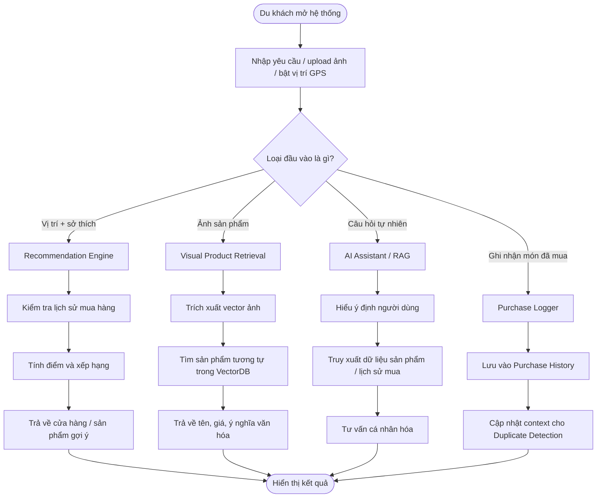

# BÁO CÁO ĐỒ ÁN CUỐI KỲ - KHÓA HỌC TƯ DUY MÁY TÍNH (COMPUTATIONAL THINKING)

---

## TRANG BÌA (Cover Page)
**Tên Đồ án:** BuyAI - Hệ Thống Hỗ Trợ Mua Sắm Thông Minh Cho Khách Du Lịch  
**Học kỳ:** HKII - Năm học 2025-2026  
**Mã môn học:** CSC10014  
**Tên môn học:** Tư duy Máy tính (Computational Thinking)  
**Mã lớp:** CQ2024/6  
**Mã nhóm:** Group06  
**Thành viên nhóm:**
1. 24120332 - Đinh Công Khang
2. 24120215 - Nguyễn Ngọc Phúc
3. 24120245 - Trần Lê Đức Việt
4. 24120344 - Hoàng Trần Minh Khoa
5. 24120090 - Đặng Hồng Minh
**Giảng viên hướng dẫn & TAs:**
- Instructors: Hồ Tuấn Thanh, Mai Anh Tuấn
- TA: Phạm Nguyễn Sơn Tùng
**Thời gian cập nhật mới nhất:** 16/06/2026

---

## MỤC LỤC (Table of Contents)
1. [Thành viên nhóm](#1-thành-viên-nhóm)
2. [Ý tưởng đồ án](#2-ý-tưởng-đồ-án)
3. [Phân tích và Chia nhỏ bài toán (Decomposition)](#3-phân-tích-và-chia-nhỏ-bài-toán-decomposition)
4. [Biểu diễn bài toán (Representation)](#4-biểu-diễn-bài-toán-representation)
5. [Tổng quan hệ thống (System Overview)](#5-tổng-quan-hệ-thống-system-overview)
6. [Nhận diện mẫu (Pattern Recognition)](#6-nhận-diện-mẫu-pattern-recognition)
7. [Trừu tượng hóa (Abstraction)](#7-trừu-tượng-hóa-abstraction)
8. [Thiết kế hệ thống và Thuật toán (System / Algorithm Design)](#8-thiết-kế-hệ-thống-và-thuật-toán-system--algorithm-design)
9. [Hiện thực hóa (Implementation)](#9-hiện-thực-hóa-implementation)
10. [Mô phỏng và Thực nghiệm (Simulation)](#10-mô-phỏng-và-thực-nghiệm-simulation)
11. [Kiểm thử (Testing)](#11-kiểm-thử-testing)
12. [Đánh giá giải pháp (Evaluation)](#12-đánh-giá-giải-pháp-evaluation)
13. [Demo sản phẩm](#13-demo-sản-phẩm)
14. [Triển khai (Deployment)](#14-triển-khai-deployment)
15. [Nhật ký công việc (Logbook)](#15-nhật-ký-công-việc-logbook)
16. [Tuyên bố sử dụng AI](#16-tuyên-bố-sử-dụng-ai)
17. [Kết luận và Hướng phát triển](#17-kết-luận-và-hướng-phát-triển)

---

## 1. THÀNH VIÊN NHÓM
| MSSV | Họ và tên | Email | Vai trò / Trách nhiệm |
| :--- | :--- | :--- | :--- |
| 24120332 | Đinh Công Khang | 24120332@student.hcmus.edu.vn | Nhóm trưởng, Backend Developer, AI Integration |
| 24120215 | Nguyễn Ngọc Phúc | 24120215@student.hcmus.edu.vn | Recommendation Engine, Data Normalization |
| 24120245 | Trần Lê Đức Việt | 24120245@student.hcmus.edu.vn | Visual Product Retrieval, Image Processing |
| 24120344 | Hoàng Trần Minh Khoa | 24120344@student.hcmus.edu.vn | Simulation & Testing, QA/QC |
| 24120090 | Đặng Hồng Minh | 24120090@student.hcmus.edu.vn | Abstraction Design, Documentation |

---

## 2. Ý TƯỞNG (Idea)
### [24120332 - Đinh Công Khang] 2.1 Tuyên bố bài toán (Problem Statement)
Khách du lịch khi đến các địa phương thường gặp khó khăn trong việc tìm kiếm và phân biệt các sản phẩm đặc sản, đồ thủ công mỹ nghệ thật sự chất lượng. Sự khác biệt về ngôn ngữ, thiếu thông tin về nguồn gốc, giá cả và ý nghĩa văn hóa của sản phẩm khiến họ dễ mua phải hàng kém chất lượng hoặc không phù hợp.

### [24120332 - Đinh Công Khang] 2.2 Tầm nhìn sản phẩm (Product Vision)
BuyAI hướng tới việc trở thành một trợ lý mua sắm cá nhân thông minh, sử dụng sức mạnh của Trí tuệ nhân tạo (AI) để kết nối khách du lịch với các giá trị văn hóa địa phương thông qua sản phẩm. Hệ thống không chỉ giúp tìm kiếm mà còn giúp người dùng hiểu sâu hơn về những gì họ đang mua.

### [24120332 - Đinh Công Khang] 2.3 Đối tượng người dùng mục tiêu (Target Users)
- Khách du lịch trong và ngoài nước.
- Những người yêu thích tìm hiểu văn hóa qua các sản phẩm thủ công, đặc sản.
- Người mua sắm muốn tìm kiếm sản phẩm bằng hình ảnh một cách nhanh chóng.

---

## 3. PHÂN TÍCH VÀ CHIA NHỎ BÀI TOÁN (Decomposition)
### [24120332 - Đinh Công Khang] 3.1 Cấu trúc phân rã
Hệ thống BuyAI được chia thành các bài toán nhỏ hơn để dễ quản lý và thực hiện:
1. **Quản lý dữ liệu (Data Management):** Scraper thu thập dữ liệu, SQLite lưu metadata, ChromaDB lưu vector embeddings.
2. **Xử lý AI và Tìm kiếm (AI & Search Logic):** Semantic Search, Visual Search, RAG Chatbot.
3. **Giao diện người dùng (User Interface):** Đăng nhập, Trang chủ, Chi tiết sản phẩm, Chat tư vấn.
4. **Hạ tầng (Infrastructure):** API Contract, Docker Deployment.

---

## 4. BIỂU DIỄN BÀI TOÁN (Representation)
### [24120245 - Trần Lê Đức Việt] 4.1 Biểu diễn tổng quát
Bài toán được chuyển từ ngữ cảnh thực tế sang mô hình tính toán thông qua việc định nghĩa các thực thể và quan hệ:

| Thành phần ngoài đời thực | Biểu diễn trong hệ thống | Mục đích |
|---|---|---|
| Du khách | `User` / hồ sơ người dùng | Lưu sở thích, lịch sử mua sắm, vị trí hiện tại |
| Cửa hàng / gian hàng | `Shop` | Lưu vị trí, đánh giá, danh sách sản phẩm |
| Sản phẩm địa phương | `Product` | Lưu tên, loại sản phẩm, giá, ý nghĩa văn hóa |
| Ảnh chụp sản phẩm | `Image` → `Embedding Vector` | Dùng để tìm sản phẩm tương tự |
| Lịch sử mua hàng | `PurchaseHistory` | Dùng để cảnh báo mua trùng |
| Yêu cầu bằng ngôn ngữ tự nhiên | `UserQuery` | Dùng cho AI Assistant / RAG |

### [24120245 - Trần Lê Đức Việt] 4.2 Biểu diễn Dữ liệu (Data Representation)
Hệ thống sử dụng các cấu trúc dữ liệu sau:
*   **Danh sách sản phẩm:** `List<Product>` dùng để lưu trữ danh sách sản phẩm gợi ý.
*   **Tra cứu nhanh theo mã:** `HashMap<ID, Object>` hỗ trợ tìm kiếm tức thời thông tin sản phẩm/cửa hàng.
*   **Đặc trưng hình ảnh:** `Vector<float>` biểu diễn embedding của ảnh (CLIP).
*   **Lịch sử mua hàng:** `Set<ProductID>` hoặc `List<PurchaseLog>` dùng để kiểm tra sản phẩm đã mua để phát hiện trùng lặp.

### [24120245 - Trần Lê Đức Việt] 4.3 Biểu diễn Quy trình (Process Representation)

#### 4.3.1 Luồng tổng quát của hệ thống

### [24120245 - Trần Lê Đức Việt] 4.4 Biểu diễn Toán học
*   **Hàm tính điểm gợi ý:** $score = w_1 \cdot rating + w_2 \cdot tag\_match + w_3 \cdot novelty - w_4 \cdot distance\_penalty$.
*   **Độ tương tự Cosine:** $cosine\_similarity(A, B) = \frac{A \cdot B}{||A|| \cdot ||B||}$.
*   **Mô hình phát hiện mua trùng:** $duplicate\_score(user, product) = \max_{p \in History} similarity(product, p)$.

---

## 5. TỔNG QUAN HỆ THỐNG (System Overview)
### [24120332 - Đinh Công Khang] 5.1 Các tính năng cốt lõi
- **Hybrid Search:** Kết hợp Semantic Search và Keyword Search.
- **AI Chatbot (RAG):** Trợ lý ảo tư vấn thông tin sản phẩm dựa trên ngữ cảnh thực tế.
- **Visual Search:** Tìm kiếm sản phẩm tương đồng từ hình ảnh người dùng tải lên.
- **Innovation Highlights:** Ứng dụng RAG để tránh hiện tượng AI "ảo giác", đảm bảo độ chính xác của thông tin sản phẩm.

---

## 6. NHẬN DIỆN MẪU (Pattern Recognition)
### [24120332 - Đinh Công Khang] 6.1 Các mẫu đặc trưng
- **Mẫu tìm kiếm (Search Pattern):** Nhận diện người dùng thường tìm kiếm theo ý nghĩa ngữ nghĩa.
- **Mẫu hội thoại (Conversation Pattern):** Nhận diện các câu hỏi thường gặp về nguồn gốc, giá và cách sử dụng.
- **Mẫu hình ảnh (Visual Pattern):** Sử dụng model CLIP để nhận diện các đặc trưng thị giác của sản phẩm địa phương.

---

## 7. TRỪU TƯỢNG HÓA (Abstraction)
### [24120090 - Đặng Hồng Minh] 7.1 Mô hình trừu tượng
Trừu tượng hóa hệ thống là quá trình đơn giản hóa thế giới thực bằng cách tập trung vào các đặc tính cốt lõi của bài toán.

* **Các chi tiết được loại bỏ (Ignored details):** Màu sắc/thiết kế vật lý của cửa hàng, quy trình quản lý ngân sách phức tạp, lộ trình di chuyển chi tiết.
* **Các đặc tính được giữ lại (Kept attributes):** Sở thích người dùng (tags), metadata sản phẩm (name, category, price), tọa độ cửa hàng, lịch sử mua sắm.

### [24120090 - Đặng Hồng Minh] 7.2 Trừu tượng hóa Dữ liệu và Chức năng
| Thực thể thực tế | Mô hình trừu tượng hóa (Abstracted Data) | Ánh xạ Cấu trúc Code / Database |
| :--- | :--- | :--- |
| **Sản phẩm** | Đối tượng `{id, name, description, category, price}` và Vector Embedding. | Metadata lưu tại `products` (SQLite). Vector lưu tại ChromaDB. |
| **Hành vi mua sắm** | Lịch sử mua sắm (`Purchase History`). | Bảng `history` (SQLite) với cấu trúc `{user_id, product_id, timestamp}`. |
| **Gợi ý sản phẩm** | Hàm tính điểm (Scoring Function) tổng hợp từ rating, tag_match và novelty. | Logic xử lý tại Backend service. |

### [24120090 - Đặng Hồng Minh] 7.3 Sơ đồ luồng dữ liệu trừu tượng

---

## 8. THIẾT KẾ HỆ THỐNG VÀ THUẬT TOÁN (System / Algorithm Design)
### [24120332 - Đinh Công Khang] 8.1 Tech Stack
- **Frontend:** React, TypeScript, TailwindCSS.
- **Backend:** FastAPI, Python, SQLAlchemy.
- **Database:** SQLite (Relational), ChromaDB (Vector).
- **AI Models:** Google Gemini 1.5 Flash, OpenAI CLIP.

---

## 9. HIỆN THỰC HÓA (Implementation)
### [24120332 - Đinh Công Khang] 9.1 Thách thức và Giải pháp
*   **Thách thức:** Tốc độ tìm kiếm vector trên lượng dữ liệu lớn.
*   **Giải pháp:** Sử dụng ChromaDB với cơ chế lập chỉ mục HNSW hiệu quả.
*   **Thách thức:** Chatbot trả lời sai thông tin sản phẩm (Hallucination).
*   **Giải pháp:** Áp dụng kiến trúc RAG, cung cấp context từ database sản phẩm cho Gemini.

---

## 10. MÔ PHỎNG VÀ THỰC NGHIỆM (Simulation)
### [24120344 - Hoàng Trần Minh Khoa] 10.1 Các kịch bản mô phỏng

#### Kịch bản 1: AI Assistant & RAG Chatbot
*   **Đầu vào:** User hỏi: *"Tôi muốn mua một món quà tặng mẹ tốt cho sức khỏe dưới 500k."*
*   **Xử lý:** Backend truy vấn lịch sử mua sắm và sản phẩm phù hợp làm Context gửi Gemini.
*   **Kết quả:** Chatbot đề xuất "Trà Atiso" vì phù hợp tiêu chí và nằm trong ngân sách.

#### Kịch bản 2: Visual Search & Phân tích ảnh
*   **Đầu vào:** Upload ảnh món đồ thủ công.
*   **Xử lý:** Backend gọi CLIP để lấy Embedding, so sánh Cosine Similarity trên ChromaDB.
*   **Kết quả:** Trả về sản phẩm tương đồng nhất kèm ý nghĩa văn hóa từ Gemini Vision.

#### Kịch bản 3: Động cơ Cảnh báo Trùng lặp
*   **Đầu vào:** User định mua "Hộp trà sấy khô Atiso" trong khi lịch sử đã có "Trà Atiso".
*   **Xử lý:** Tính toán **Semantic Match** giữa sản phẩm mới và lịch sử.
*   **Kết quả:** `score = 0.85 > threshold`, UI hiển thị cảnh báo trùng lặp màu Đỏ.

---

## 11. KIỂM THỬ (Testing)
### [24120344 - Hoàng Trần Minh Khoa] 11.1 Kết quả kiểm thử
- **Unit Testing:** Kiểm tra logic các hàm AI và xử lý dữ liệu (Sử dụng `pytest`).
- **Integration Testing:** Đảm bảo luồng dữ liệu thông suốt giữa FE, BE, SQLite và ChromaDB.
- **User Testing:** Thử nghiệm với 5 người dùng, ghi nhận độ chính xác cao (Precision/Recall) trong tìm kiếm ảnh và chatbot.

---

## 12. ĐÁNH GIÁ GIẢI PHÁP (Evaluation)
### [24120215 - Nguyễn Ngọc Phúc] 12.1 Mục tiêu đánh giá
*   **Tính chính xác (Correctness):** Thuật toán Duplicate Detection phải cảnh báo đúng.
*   **Hiệu suất (Efficiency):** Thời gian trích xuất vector và truy vấn ChromaDB dưới 1.5s.
*   **Độ mạnh mẽ (Robustness):** Xử lý được các trường hợp ngoại lệ (ảnh mờ, dữ liệu nhập sai).
*   **Tính khả dụng (Usability):** Giao diện dễ sử dụng, phù hợp bối cảnh thực tế của du khách.

### [24120215 - Nguyễn Ngọc Phúc] 12.2 Các vấn đề tiềm ẩn cần tránh
Nhóm cam kết tránh các lỗi: Dữ liệu thử nghiệm thiên lệch (Confirmation Bias), Tối ưu hóa phiến diện (chỉ tập trung vào tốc độ mà bỏ qua độ chính xác), và Đánh giá chủ quan thiếu chỉ số đo lường.

---

## 13. DEMO SẢN PHẨM
### [24120332 - Đinh Công Khang] 13.1 Hình ảnh và Video
- **Ảnh chụp giao diện:** [Màn hình Home, Chat, Visual Search]
- **Link Video Demo (Youtube):** [Link video demo BuyAI]

---

## 14. TRIỂN KHAI (Deployment)
### [24120344 - Hoàng Trần Minh Khoa] 14.1 Hạ tầng
Sử dụng **Docker** để đóng gói toàn bộ hệ thống (App container và ChromaDB container), giúp triển khai đồng nhất trên mọi môi trường.

---

## 15. NHẬT KÝ CÔNG VIỆC (Logbook)
| Thành viên | Phần trăm công việc | Số giờ làm việc |
| :--- | :---: | :---: |
| Đinh Công Khang |  |  |
| Nguyễn Ngọc Phúc |  |  |
| Trần Lê Đức Việt |  |  |
| Hoàng Trần Minh Khoa |  |  |
| Đặng Hồng Minh |  |  |

---

## 16. TUYÊN BỐ SỬ DỤNG AI
Nhóm sử dụng Gemini CLI và Claude để hỗ trợ phân tích mã nguồn, tạo template báo cáo và tối ưu hóa logic API.

---

## 17. KẾT LUẬN VÀ HƯỚNG PHÁT TRIỂN
### [24120332 - Đinh Công Khang] 17.1 Kết luận
Hệ thống đã hoàn thiện các tính năng cốt lõi, giải quyết được bài toán hỗ trợ mua sắm thông minh cho khách du lịch thông qua AI đa mô thức. Hướng phát triển tương lai bao gồm tích hợp thanh toán và mở rộng dữ liệu sản phẩm toàn quốc.
