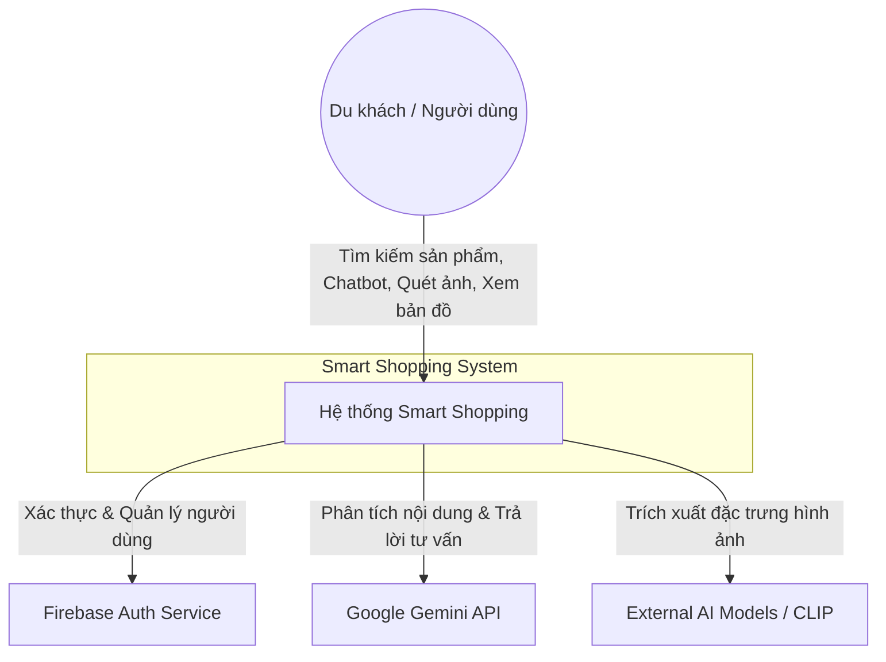

# Level 1: System Context Diagram - Smart Shopping System (SSS)

Mô tả tổng quan về phạm vi của hệ thống và cách nó tương tác với người dùng cùng các hệ thống bên ngoài.

## Sơ đồ (Mermaid)

## Các thành phần chính
- **Du khách (User):** Người dùng cuối tương tác với hệ thống để tìm kiếm thông tin mua sắm và quản lý lịch sử.
- **Smart Shopping System:** Hệ thống trung tâm cung cấp các tính năng nhận diện, tư vấn và bản đồ.
- **Firebase Auth:** Hệ thống bên ngoài quản lý việc đăng ký, đăng nhập và bảo mật tài khoản.
- **Google Gemini API:** Cung cấp khả năng hiểu ngôn ngữ tự nhiên và phân tích ảnh Multimodal.
- **External AI Models:** Các mô hình như CLIP dùng để trích xuất vector phục vụ tìm kiếm hình ảnh.
