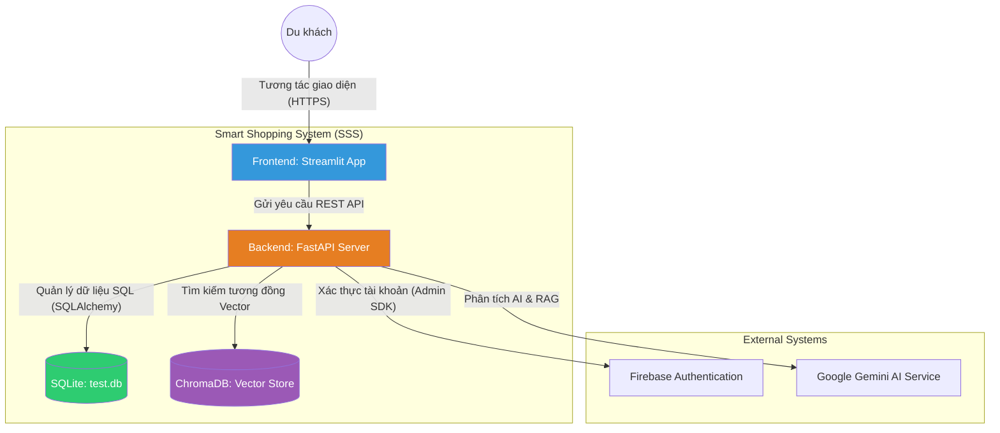

# Level 2: Container Diagram - Smart Shopping System (SSS)

Mô tả các thành phần phần mềm (Container) bên trong hệ thống SSS và cách chúng giao tiếp với nhau.

## Sơ đồ (Mermaid)

## Chi tiết các Container

### 1. Frontend (Streamlit)
- **Công nghệ:** Python, Streamlit.
- **Trách nhiệm:** Giao diện Chatbot, form nhập lịch sử và khu vực xử lý hình ảnh.

### 2. Backend (FastAPI)
- **Công nghệ:** Python, FastAPI, Uvicorn.
- **Trách nhiệm:** Xử lý logic nghiệp vụ, điều phối yêu cầu đến các dịch vụ AI, quản lý xác thực và thực hiện thuật toán kiểm tra trùng lặp (Duplicate Detection).

### 3. SQLite (Database)
- **Công nghệ:** SQLite 3.
- **Trách nhiệm:** Lưu trữ dữ liệu quan hệ như thông tin cửa hàng, tài khoản người dùng và lịch sử mua sắm.

### 4. ChromaDB (Vector Store)
- **Công nghệ:** ChromaDB.
- **Trách nhiệm:** Lưu trữ và truy vấn các vector đặc trưng của sản phẩm phục vụ tính năng Visual Search.
