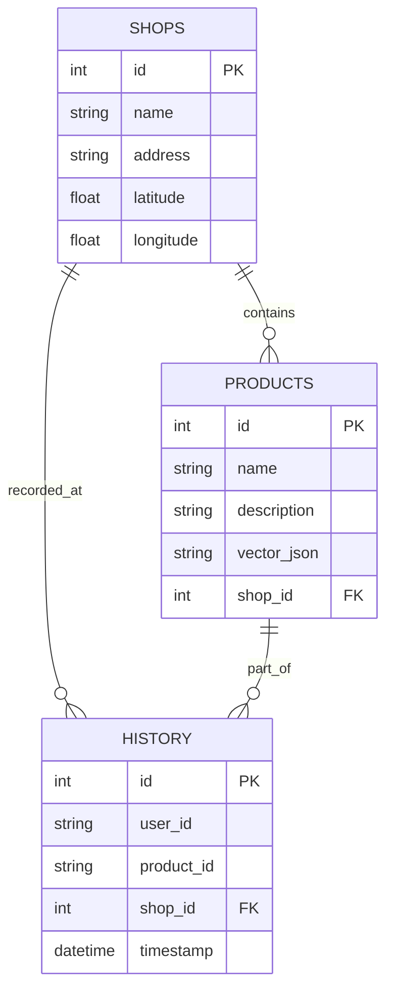

# Database Schema Design - Smart Shopping System (SSS)

Tài liệu này mô tả cấu trúc cơ sở dữ liệu cho hệ thống Smart Shopping System (SSS), được thiết kế để lưu trữ thông tin cửa hàng, sản phẩm và lịch sử mua sắm.

## 1. Overview
Hệ thống sử dụng **SQLite** cho việc lưu trữ dữ liệu quan hệ trong giai đoạn phát triển. Các vector embedding của sản phẩm được lưu dưới dạng JSON string trong bảng `products` để phục vụ tính năng tìm kiếm tương đồng.

## 2. Entity Relationship Diagram (ERD)

## 3. Data Dictionary

### 3.1. Bảng `shops` (Cửa hàng)
Lưu trữ thông tin về các địa điểm mua sắm trên bản đồ.

| Column | Type | Constraints | Description |
| :--- | :--- | :--- | :--- |
| `id` | Integer | PRIMARY KEY, AUTOINCREMENT | ID duy nhất của cửa hàng. |
| `name` | String | INDEX, NOT NULL | Tên cửa hàng (ví dụ: Co.op Mart). |
| `address` | String | | Địa chỉ chi tiết của cửa hàng. |
| `latitude` | Float | | Vĩ độ của cửa hàng trên bản đồ. |
| `longitude` | Float | | Kinh độ của cửa hàng trên bản đồ. |

### 3.2. Bảng `products` (Sản phẩm)
Lưu trữ thông tin sản phẩm và vector đặc trưng để nhận diện.

| Column | Type | Constraints | Description |
| :--- | :--- | :--- | :--- |
| `id` | Integer | PRIMARY KEY, AUTOINCREMENT | ID duy nhất của sản phẩm. |
| `name` | String | INDEX, NOT NULL | Tên sản phẩm. |
| `description` | String | | Mô tả chi tiết sản phẩm. |
| `vector_json` | String (JSON) | | Vector embedding được lưu dưới dạng chuỗi JSON. |
| `shop_id` | Integer | FOREIGN KEY (`shops.id`) | Liên kết tới cửa hàng chứa sản phẩm này. |

### 3.3. Bảng `history` (Lịch sử mua sắm)
Ghi nhận các sự kiện mua sắm của người dùng.

| Column | Type | Constraints | Description |
| :--- | :--- | :--- | :--- |
| `id` | Integer | PRIMARY KEY, AUTOINCREMENT | ID duy nhất của bản ghi lịch sử. |
| `user_id` | String | INDEX, NOT NULL | ID của người dùng thực hiện mua sắm. |
| `product_id` | String | INDEX | ID hoặc mã sản phẩm đã mua. |
| `shop_id` | Integer | FOREIGN KEY (`shops.id`) | Cửa hàng nơi sự kiện diễn ra. |
| `timestamp` | DateTime | DEFAULT (NOW) | Thời gian ghi nhận sự kiện. |

---
