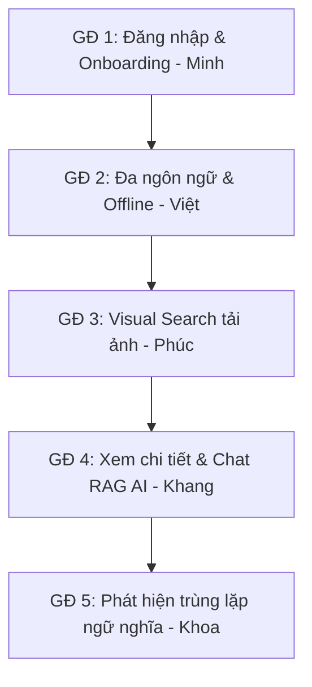

# KỊCH BẢN DEMO ĐỒ ÁN BUyAI (SMART SOUVENIR SHOPPING ASSISTANT)

Tài liệu này xây dựng một luồng demo (workflow) liền mạch, tập trung hoàn toàn vào trải nghiệm người dùng trên giao diện để phô diễn các tính năng nổi bật của **BuyAI** - Hệ thống hỗ trợ mua sắm quà lưu niệm thông minh. Kịch bản được phân bổ thành **5 giai đoạn** tương ứng với **5 thành viên**.

---

## 👥 THÀNH VIÊN VÀ VAI TRÒ TRÌNH DIỄN

| Giai đoạn | Tính năng trình diễn | Người phụ trách | Bộ phận mã nguồn phụ trách |
| :--- | :--- | :--- | :--- |
| **Giai đoạn 1** | Đăng nhập & Thiết lập ưu tiên (Auth & Onboarding) | **Đặng Hồng Minh** | UI / UX Login Screen & Onboarding Screen |
| **Giai đoạn 2** | Bản địa hóa & Trạng thái ngoại tuyến (Localization & Offline) | **Trần Lê Đức Việt** | Đa ngôn ngữ (VI/EN), Offline Detection Banner |
| **Giai đoạn 3** | Tìm kiếm thông minh bằng hình ảnh (Visual Search) | **Đinh Công Khang** | Chroma Vector DB, Image Feature Extraction |
| **Giai đoạn 4** | Khám phá sản phẩm & Trợ lý ảo tư vấn (RAG Chat) | **Nguyễn Ngọc Phúc** | Backend API endpoints & RAG context setup |
| **Giai đoạn 5** | Phát hiện & Cảnh báo trùng lặp (Duplicate Detector) | **Hoàng Trần Minh Khoa** | SentenceTransformers NLP, Lịch sử xem hàng |

---

## 📖 BỐI CẢNH DEMO (STORYLINE)
> **Kịch bản:** Emma, một khách du lịch nước ngoài lần đầu đến làng gốm Bát Tràng. Cô muốn sử dụng ứng dụng **BuyAI** để đăng ký tài khoản, cá nhân hóa sở thích, tìm kiếm thông tin bằng cách chụp ảnh sản phẩm, trò chuyện với trợ lý AI bằng tiếng Anh và cuối cùng là kiểm tra tránh mua trùng lặp các món quà khi ghé qua nhiều cửa hàng khác nhau.

---

## 🚀 QUY TRÌNH DEMO CHI TIẾT (5 GIAI ĐOẠN)

---

### 🎬 GIAI ĐOẠN 1: ĐĂNG NHẬP & THIẾT LẬP ƯU TIÊN (AUTH & ONBOARDING)
👤 **Người thực hiện:** **Đặng Hồng Minh**

#### 🔹 Các bước thực hiện trên giao diện:
1. **Đăng nhập người dùng mới:**
   * Minh thực hiện đăng ký/đăng nhập một tài khoản mới bằng Email/Mật khẩu thông qua hệ thống Firebase Auth được tích hợp trong ứng dụng.
2. **Khảo sát Onboarding:**
   * Vì là người dùng mới, hệ thống tự động điều hướng đến màn hình Onboarding khảo sát sở thích (`OnboardingScreen`).
   * Minh tick chọn các sở thích tiêu biểu (Ví dụ: *"Gốm sứ truyền thống"* hoặc *"Quà lưu niệm tặng người thân"*).
   * Bấm hoàn tất để hệ thống lưu sở thích vào cấu hình cá nhân hóa và chuyển về trang chủ (`HomeScreen`).

---

### 🎬 GIAI ĐOẠN 2: BẢN ĐỊA HÓA ĐA NGÔN NGỮ & XỬ LÝ KHI MẤT MẠNG (OFFLINE MODE)
👤 **Người thực hiện:** **Trần Lê Đức Việt**

#### 🔹 Các bước thực hiện trên giao diện:
1. **Chuyển đổi ngôn ngữ (Localization):**
   * Ngay tại màn hình trang chủ, Việt click nút chuyển đổi ngôn ngữ (`LangToggle`) từ Tiếng Việt sang Tiếng Anh.
   * Toàn bộ giao diện (bao gồm cả dữ liệu danh mục gốm sứ và tên sản phẩm trong DB) lập tức được bản địa hóa sang Tiếng Anh để phục vụ Emma.
2. **Giả lập Mất kết nối mạng (Offline Resilience):**
   * Việt bật tính năng **Offline** trong tab Network của Chrome DevTools.
   * Ngay lập tức, một banner đỏ cảnh báo hiển thị trên đầu màn hình: *"Mất kết nối mạng. Đang chờ kết nối lại..."*
   * Việt thử thao tác như nhấn nút lưu sản phẩm (Wishlist) hoặc gửi chat, hệ thống hiển thị thông báo lỗi mạng một cách an toàn. Sau đó Việt tắt Offline để hệ thống tự động kết nối lại và biến mất banner.

---

### 🎬 GIAI ĐOẠN 3: TÌM KIẾM SẢN PHẨM BẰNG HÌNH ẢNH (VISUAL SEARCH)
👤 **Người thực hiện:** **Đinh Công Khang**

#### 🔹 Các bước thực hiện trên giao diện:
1. **Tải ảnh lên hệ thống:**
   * Emma thấy một bộ ấm chén đẹp nhưng không biết tên để gõ. Khang click vào biểu tượng máy ảnh trên thanh tìm kiếm và chọn tải lên một tấm ảnh ấm chén Bát Tràng đã chuẩn bị sẵn.
2. **Hiển thị kết quả Vector Search:**
   * Dưới 1 giây, hệ thống trả về danh sách các sản phẩm gốm sứ có hình dáng và họa tiết tương đồng nhất trong kho dữ liệu Chroma Vector DB kèm điểm số tương quan (Score) (Ví dụ: bộ ấm trà Bát Tràng đạt `Score: 0.95`).

---

### 🎬 GIAI ĐOẠN 4: KHÁM PHÁ CHI TIẾT & TRÒ CHUYỆN VỚI TRỢ LÝ AI (RAG CHAT)
👤 **Người thực hiện:** **Nguyễn Ngọc Phúc**

#### 🔹 Các bước thực hiện trên giao diện:
1. **Xem chi tiết & Lưu sản phẩm (Wishlist):**
   * Phúc click chọn bộ ấm chén trà hàng đầu trong danh sách kết quả tìm kiếm hình ảnh của Phúc.
   * Giao diện hiển thị chi tiết sản phẩm: Tên cửa hàng, địa chỉ bán, mô tả bằng Tiếng Anh. Phúc thực hiện click **Lưu sản phẩm** (thêm vào Wishlist).
2. **Trò chuyện với AI thông qua RAG Chat:**
   * Phúc bấm nút **"Ask AI"** ngay dưới thông tin sản phẩm. Hệ thống tạo phiên chat mới và tự động gửi lời chào hỏi kèm ngữ cảnh về bộ ấm chén đó.
   * Phúc gõ câu hỏi: *"What is the cultural meaning of this ceramic tea set in Vietnam?"* (Ý nghĩa văn hóa của bộ ấm trà này tại Việt Nam là gì?)
   * Trợ lý ảo AI sử dụng Gemini-2.5-Flash (kèm RAG cung cấp thông tin chính xác từ database) đưa ra câu trả lời chi tiết và giàu chiều sâu văn hóa bằng Tiếng Anh.

---

### 🎬 GIAI ĐOẠN 5: PHÁT HIỆN TRÙNG LẶP SẢN PHẨM THÔNG MINH
👤 **Người thực hiện:** **Hoàng Trần Minh Khoa**

#### 🔹 Các bước thực hiện trên giao diện:
1. **Tình huống mua sắm:**
   * Emma di chuyển sang một gian hàng khác cách đó 2km. Cô thấy một bộ ấm trà khác có tên *"Bộ ấm chén trà in logo quà tặng ngày kỷ niệm"* và muốn kiểm tra thông tin.
2. **Kích hoạt tính năng Duplicate Detector:**
   * Khoa nhập mô tả sản phẩm mới này hoặc quét ảnh. Backend tiến hành so sánh ngữ nghĩa (Semantic) thông qua SentenceTransformers và so sánh cú pháp (Lexical) của sản phẩm này với bộ ấm chén mà Khang đã lưu vào Wishlist trước đó.
3. **Cảnh báo trùng lặp trực quan:**
   * Trên màn hình xuất hiện một banner cảnh báo màu vàng nổi bật:
     > ⚠️ **Cảnh báo mua trùng lặp!**
     > Bạn đã lưu một sản phẩm tương tự có tên là *"Bộ ấm chén trà làm quà tặng cao cấp"* tại gian hàng *"Gốm Sứ Bát Tràng"* trước đây.
     > *(Độ tương đồng ngữ nghĩa: 92% - Loại khớp: Semantic)*
   * Khoa nhấn mạnh ý nghĩa tính năng này giúp người dùng không bị lỡ mua trùng lặp những sản phẩm thủ công mỹ nghệ giống nhau ở nhiều cửa hàng khác nhau tại khu du lịch.

---

## 📈 KẾT LUẬN DEMO

Trưởng nhóm tổng kết lại hiệu quả của luồng demo:
* Đồ án giải quyết tốt bài toán thực tế của khách du lịch.
* Sự kết hợp mượt mà giữa các công nghệ AI hiện đại (Gemini RAG cho hội thoại thông minh và SentenceTransformers chạy cục bộ để tối ưu chi phí phát hiện trùng lặp).
* Thiết kế UX/UI tối ưu đa ngôn ngữ và có khả năng chống chịu khi kết nối mạng yếu.
