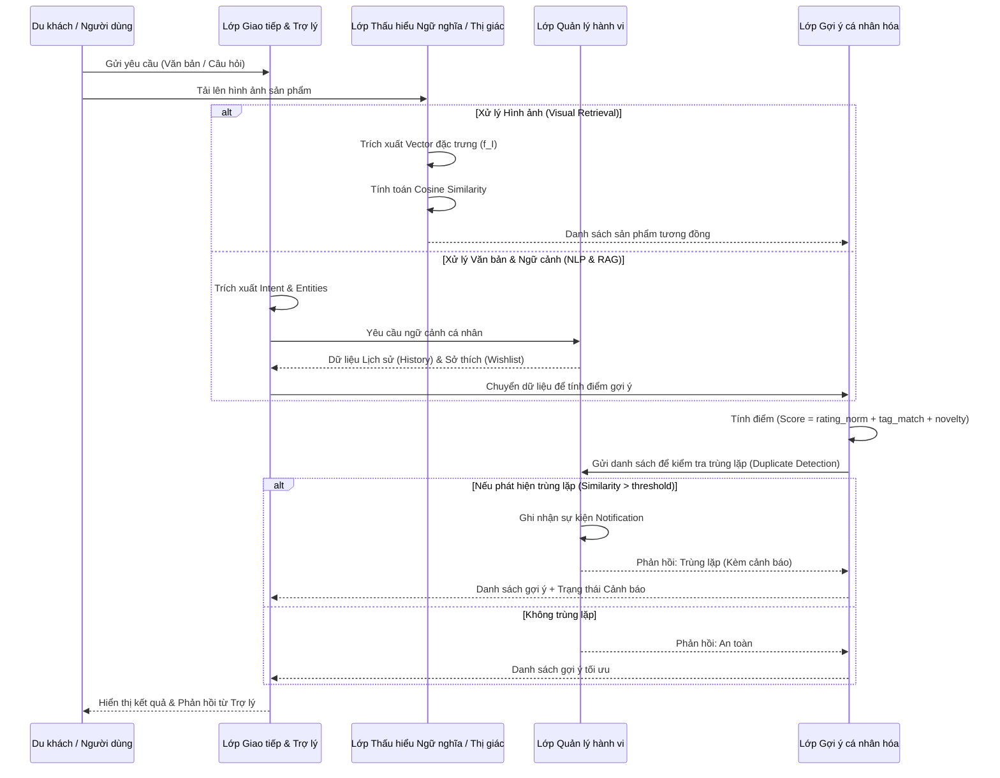

# 7. TRỪU TƯỢNG HÓA (Abstraction)

Trừu tượng hóa hệ thống là quá trình đơn giản hóa thế giới thực bằng cách tập trung vào các đặc tính cốt lõi của bài toán và loại bỏ các chi tiết kỹ thuật hoặc thực tế không cần thiết. Đối với hệ thống BuyAI, việc trừu tượng hóa giúp định hình rõ ràng bài toán tư vấn cá nhân hóa và gợi ý mua sắm thông minh cho du khách, từ đó giảm bớt sự phức tạp trong quá trình thiết kế và cài đặt thuật toán.

## [24120090 - Đặng Hồng Minh] 7.1 Mô hình trừu tượng

Mô hình trừu tượng của BuyAI được xây dựng dựa trên việc chọn lọc thông tin thế giới thực, chuyển hóa các thực thể vật lý thành mô hình toán học và phân rã các hành vi giao tiếp phức tạp thành các hàm chức năng độc lập.

### [24120090 - Đặng Hồng Minh] 7.1.1 Phạm vi và Nguyên tắc Trừu tượng hóa
Để tối ưu hóa logic cốt lõi trong phiên bản v2, hệ thống đã tiến hành tinh giản bộ máy vận hành thông qua việc xác định rõ các yếu tố được giữ lại và loại bỏ:
* **Các chi tiết thế giới thực được loại bỏ (Ignored details):** Màu sắc hoặc thiết kế vật lý của cửa hàng, phương thức thanh toán thực tế, quy trình quản lý ngân sách phức tạp, và các rào cản về giao thông hay lộ trình di chuyển của du khách.
* **Các đặc tính được giữ lại (Kept attributes):** Sở thích của người dùng (tags, wishlist), thông tin siêu dữ liệu (metadata) của sản phẩm, địa chỉ/tọa độ cửa hàng, lịch sử giao dịch/trò chuyện và hệ thống AI gợi ý.

### [24120090 - Đặng Hồng Minh] 7.1.2 Trừu tượng hóa Dữ liệu (Data Abstraction)
Mọi đối tượng và hành vi của du khách trong không gian mua sắm thực tế được quy đổi thành các cấu trúc dữ liệu tính toán được và ánh xạ vào cơ sở dữ liệu như sau:

| Thực thể thực tế | Mô hình trừu tượng hóa (Abstracted Data) | Ánh xạ Cấu trúc Code / Database |
| :--- | :--- | :--- |
| **Sở thích du khách** | Một vector sở thích (User preference vector) với các giá trị đã được chuẩn hóa trong khoảng $[0, 1]$. | Dữ liệu phiên người dùng (Session/Local state). |
| **Sản phẩm (Đồ lưu niệm)** | Một đối tượng gồm các thuộc tính siêu dữ liệu (metadata): `{id, name, description, shop_id}` và một vector đặc trưng không gian (Vector Embeddings) đại diện cho nội dung/hình ảnh sản phẩm. | Metadata lưu tại bảng `products` (**SQLite**). Vector lưu tại **ChromaDB** qua mô hình `paraphrase-multilingual-MiniLM-L12-v2`. |
| **Cửa hàng (Shop)** | Địa điểm vật lý cung cấp sản phẩm. | Lưu tại bảng `shops` (**SQLite**) với `{latitude, longitude, shop_type, opening_hours}`. |
| **Hành vi mua sắm** | Tập hợp lịch sử mua sắm (`Purchase History`) chứa danh sách các sự kiện mua sắm mà người dùng đã xác nhận mua thành công. | Lưu tại bảng `history` (**SQLite**) với cấu trúc `{user_id, product_id, shop_id, timestamp}`. |
| **Sở thích cá nhân** | Danh sách sản phẩm được người dùng lưu lại để xem xét (`Wishlist`). | Lưu tại bảng `wishlist` (**SQLite**) với cấu trúc `{user_id, product_id, timestamp}`. |
| **Nhu cầu / Câu hỏi** | Các thực thể (`Entities` - ví dụ: "quà cho mẹ", "đồ thủ công") và ý định (`Intent` - ví dụ: hỏi thông tin, gợi ý quà) được trích xuất thông qua xử lý ngôn ngữ tự nhiên (NLP). | API Chatbot truyền ngữ cảnh vào Gemini. |
| **Tương tác AI** | Chuỗi hội thoại với RAG Chatbot, chia thành phiên (`Session`) và tin nhắn (`Message`). | Lưu tại bảng `chat_sessions` và `chat_messages` (**SQLite**). |
| **Nhắc nhở / Cảnh báo** | Các thông báo hệ thống được gửi đến người dùng (`Notification`). | Lưu tại bảng `notifications` (**SQLite**) với cấu trúc `{user_id, title, message, is_read, timestamp}`. |

### [24120090 - Đặng Hồng Minh] 7.1.3 Trừu tượng hóa Logic & Chức năng (Functional Abstraction)
Hệ thống không mô phỏng lại toàn bộ cuộc trò chuyện cảm tính giữa người mua và người bán, mà trừu tượng hóa quy trình này thành 4 module tính toán độc lập:

**A. Gợi ý cá nhân hóa (Recommendation Engine)**
Quy trình ra quyết định gợi ý được trừu tượng hóa thành một hàm tính điểm (Scoring Function) tổng hợp từ 3 yếu tố:
$$Score = w_1 \cdot rating\_norm + w_2 \cdot tag\_match + w_3 \cdot novelty\_score$$
Sự mới mẻ được trừu tượng hóa thành biến nhị phân `novelty_score` (bằng $0$ nếu sản phẩm đã tồn tại trong lịch sử mua sắm, bằng $1$ nếu chưa từng mua).

**B. Nhận diện và Truy xuất thông minh (Semantic/Visual Retrieval)**
Thay vì tìm kiếm từ khóa thô, dữ liệu đầu vào $I$ được trừu tượng hóa qua mạng Deep Learning (ví dụ mô hình `paraphrase-multilingual-MiniLM-L12-v2` hoặc CLIP) thành một vector đặc trưng $f(I)$. Việc tìm kiếm sản phẩm tương đồng nhất được quy về bài toán tìm kiếm hàng xóm gần nhất (KNN Search) bằng cách đo khoảng cách góc Cosine (Cosine Similarity) trực tiếp trên **ChromaDB**.

**C. Cập nhật sở thích học hỏi (Preference Update)**
Sự thay đổi thị hiếu của con người theo thời gian được mô hình hóa bằng công thức tích lũy toán học:
$$P_{new}[c] = P_{old}[c] + \alpha \cdot \ln(1 + n)$$

**D. Cảnh báo mua trùng (Duplicate Detection)**
Luật kiểm tra trùng lặp sản phẩm được trừu tượng hóa thành một điều kiện logic kép: Sản phẩm $p$ bị coi là trùng nếu nó tồn tại chính xác trong lịch sử $H$ (exact match trong bảng `history` của SQLite) hoặc nếu độ tương đồng ngữ nghĩa/hình ảnh vượt ngưỡng quy định:
$$similarity(f(p), f(h)) > threshold$$
*(Quá trình này được thực hiện thông qua truy vấn tìm kiếm Vector trên ChromaDB dựa trên dữ liệu sản phẩm đã được đồng bộ từ hàm `sync_db_to_vector()`)*.

### [24120090 - Đặng Hồng Minh] 7.1.4 Đánh giá tính hiệu quả của mô hình
* **Tránh Under-abstraction:** BuyAI được phân rã rõ ràng thành các module độc lập (Input, Recommend, Retrieve, Assistant) với luồng dữ liệu vào/ra định nghĩa minh bạch.
* **Tách biệt logic và cài đặt:** Hàm tính điểm hay công thức Cosine Similarity đóng vai trò là đặc tả hành vi, giúp nhóm dễ dàng thay đổi thuật toán lõi (ví dụ: đổi mô hình Embedding) mà không làm hỏng cấu trúc SQLite / ChromaDB tổng thể.
* **Liên kết chặt chẽ với Pain Points:** Việc tích hợp biến `novelty_score` và thiết kế hàm `isDuplicate(p, H)` giải quyết triệt để User Story cốt lõi (US-04) — giảm thiểu nỗi đau mua trùng lặp sản phẩm của du khách.

---

## [24120090 - Đặng Hồng Minh] 7.2 Trừu tượng hóa Dữ liệu và Chức năng

Để hệ thống hoạt động đồng bộ và dễ bảo trì, cấu trúc hệ thống được chia thành 4 lớp trừu tượng hóa từ mức tiếp nhận thông tin đến mức xử lý logic sâu:

| Lớp trừu tượng | Mô tả chức năng | Thông tin quan trọng giữ lại | Chi tiết thực tế bị bỏ qua |
| :--- | :--- | :--- | :--- |
| **Lớp Giao tiếp & Trợ lý** | Tiếp nhận tương tác tự nhiên, chuyển ngôn ngữ thô thành dữ liệu cấu trúc phục vụ RAG. | Intent, Entities, Từ khóa. | Ngữ điệu trò chuyện, cảm xúc nhất thời. |
| **Lớp Gợi ý cá nhân hóa** | Thực hiện bộ lọc, tính toán thứ hạng và đưa ra danh sách sản phẩm tối ưu. | Vector sở thích, Metadata (`tags`, `rating`), `novelty_score`. | Ngân sách cá nhân phức tạp, tâm lý mua hàng cảm tính. |
| **Lớp Thấu hiểu Ngữ nghĩa / Thị giác** | Trừu tượng hóa nội dung/hình ảnh thành không gian vector toán học trên ChromaDB. | Vector đặc trưng $f(I)$, Cosine Similarity. | Dữ liệu văn bản/điểm ảnh thô không có ngữ cảnh. |
| **Lớp Quản lý hành vi** | Theo dõi sở thích (Wishlist), tiến trình thay đổi (History) và gửi thông báo, kiểm tra logic trùng lặp. | `Purchase History`, `Wishlist`, `Notification`, Tốc độ học hỏi $\alpha$, `threshold`. | Thời gian cụ thể giữa các lần mua, lộ trình di chuyển chi tiết. |

---

## [24120090 - Đặng Hồng Minh] 7.3 Sơ đồ luồng dữ liệu trừu tượng

Dưới đây là sơ đồ mô tả cách dữ liệu thế giới thực được trừu tượng hóa và luân chuyển qua 4 lớp chức năng của hệ thống BuyAI.

