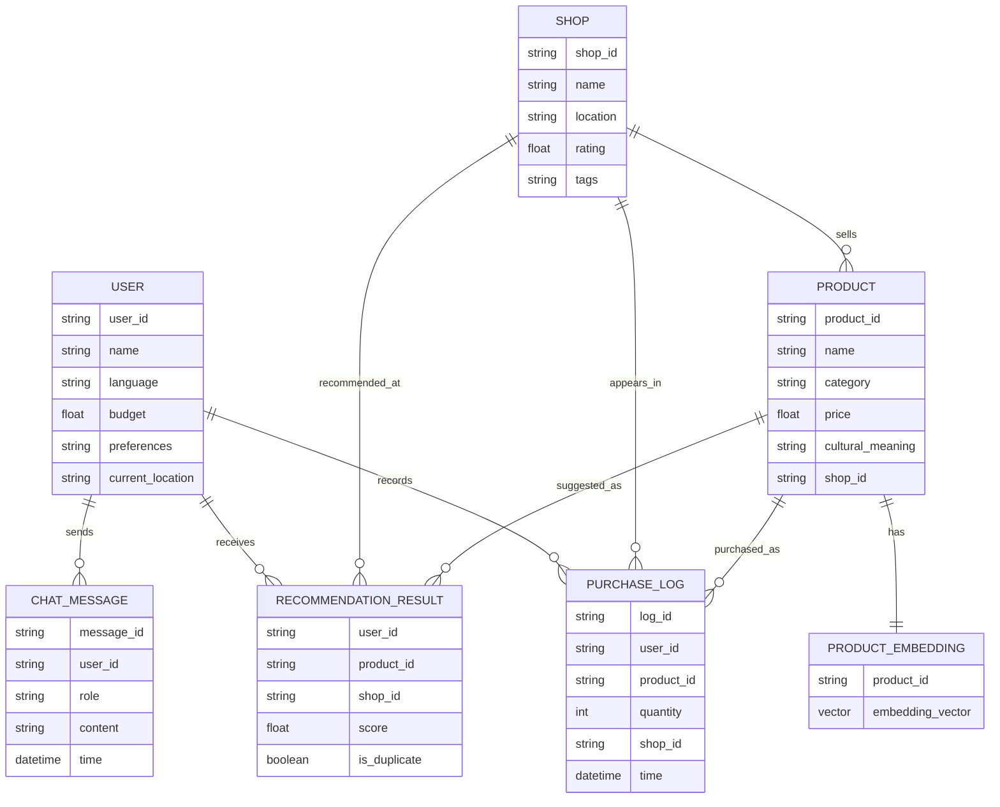
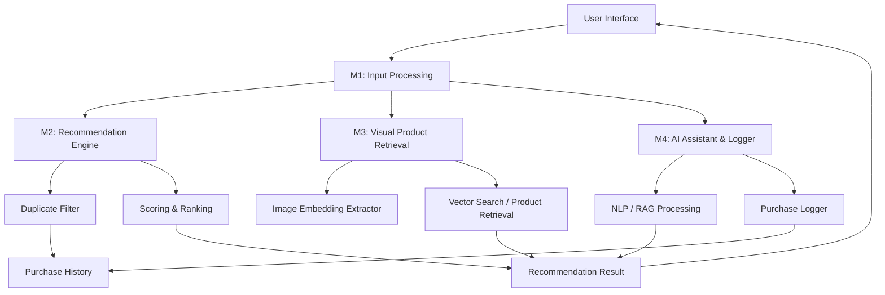
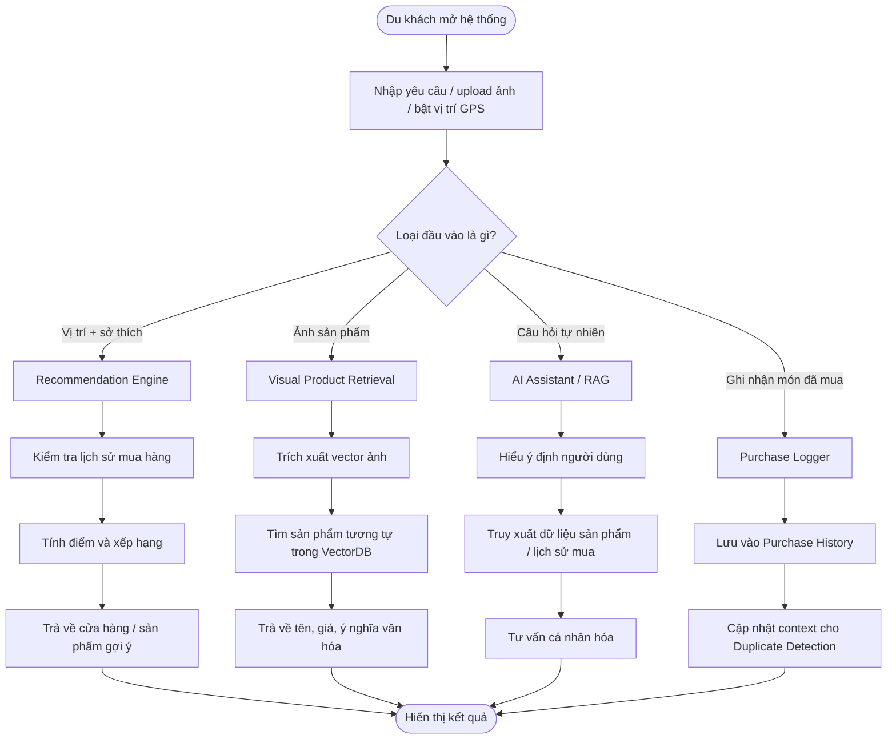
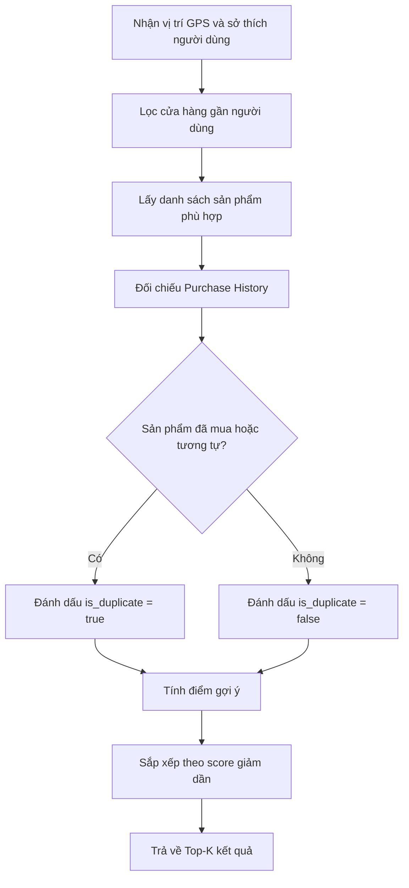
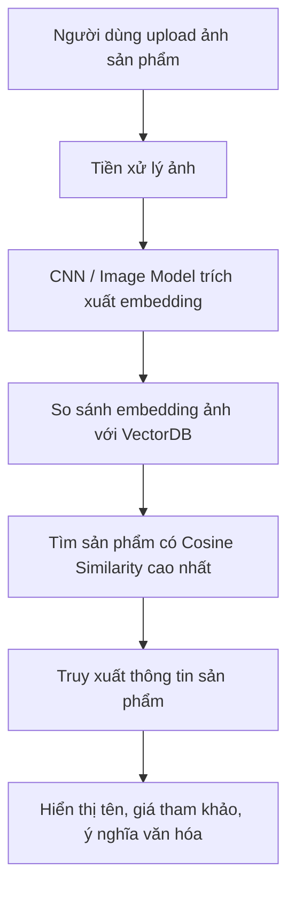

# Representation – Smart Shopping System

> *Phần này trình bày cách nhóm biểu diễn bài toán Smart Shopping System theo góc nhìn Tư duy Tính toán, dựa trên lý thuyết **Problem Representation** và báo cáo sơ bộ của đồ án.*

---

## 1. Mục tiêu của phần Representation

Trong Tư duy Tính toán, **Representation** là bước chuyển đổi bài toán ngoài đời thực thành một mô hình, ký hiệu, cấu trúc hoặc dạng dữ liệu phù hợp để con người và máy tính có thể xử lý bằng thuật toán.

Đối với đồ án **Smart Shopping System**, bài toán thực tế là:

> Du khách khi mua sắm tại điểm du lịch thường gặp rào cản ngôn ngữ, thiếu thông tin minh bạch về sản phẩm, khó biết ý nghĩa văn hóa của món hàng và dễ mua trùng các món quà lưu niệm đã mua trước đó.

Vì vậy, mục tiêu của Representation trong hệ thống là trả lời câu hỏi:

> **Dữ liệu, quan hệ giữa dữ liệu, luồng xử lý và các luật ra quyết định của hệ thống sẽ được biểu diễn như thế nào để có thể triển khai thành thuật toán và chương trình?**

---

## 2. Biểu diễn tổng quát bài toán

Bài toán được chuyển từ ngữ cảnh thực tế sang mô hình tính toán như sau:

| Thành phần ngoài đời thực | Biểu diễn trong hệ thống | Mục đích |
|---|---|---|
| Du khách | `User` / hồ sơ người dùng | Lưu sở thích, lịch sử mua sắm, vị trí hiện tại |
| Cửa hàng / gian hàng | `Shop` | Lưu vị trí, đánh giá, danh sách sản phẩm |
| Sản phẩm địa phương | `Product` | Lưu tên, loại sản phẩm, giá, ý nghĩa văn hóa |
| Ảnh chụp sản phẩm | `Image` → `Embedding Vector` | Dùng để tìm sản phẩm tương tự |
| Lịch sử mua hàng | `PurchaseLog` | Dùng để cảnh báo mua trùng |
| Yêu cầu bằng ngôn ngữ tự nhiên | `UserQuery` | Dùng cho AI Assistant / RAG |
| Gợi ý mua sắm | `RecommendationResult` | Danh sách sản phẩm hoặc cửa hàng được xếp hạng |

Như vậy, hệ thống không xử lý trực tiếp các khái niệm mơ hồ như “món quà đẹp”, “sản phẩm phù hợp”, “ý nghĩa văn hóa” ở dạng tự nhiên, mà chuyển chúng thành các trường dữ liệu, vector, điểm số, luật logic và kết quả xếp hạng.

---

## 3. Data Representation – Biểu diễn dữ liệu

### 3.1 Các thực thể dữ liệu chính

| Thực thể | Thuộc tính quan trọng | Vai trò trong hệ thống |
|---|---|---|
| `User` | `user_id`, `name`, `language`, `budget`, `preferences`, `current_location` | Đại diện cho du khách đang sử dụng hệ thống |
| `Shop` | `shop_id`, `name`, `location`, `rating`, `tags` | Đại diện cho cửa hàng hoặc gian hàng tại địa điểm du lịch |
| `Product` | `product_id`, `name`, `category`, `price`, `cultural_meaning`, `shop_id` | Đại diện cho sản phẩm địa phương hoặc quà lưu niệm |
| `ProductEmbedding` | `product_id`, `vector` | Biểu diễn đặc trưng hình ảnh của sản phẩm dưới dạng vector |
| `PurchaseLog` | `log_id`, `user_id`, `product_id`, `quantity`, `shop_id`, `time` | Ghi nhận sản phẩm người dùng đã mua |
| `ChatMessage` | `message_id`, `user_id`, `role`, `content`, `time` | Lưu lịch sử hội thoại với AI Assistant |
| `RecommendationResult` | `user_id`, `product_id`, `shop_id`, `score`, `is_duplicate` | Lưu kết quả gợi ý và trạng thái cảnh báo trùng lặp |

### 3.2 Cấu trúc dữ liệu phù hợp

| Loại dữ liệu | Cấu trúc biểu diễn | Ứng dụng trong Smart Shopping |
|---|---|---|
| Danh sách sản phẩm | `List<Product>` | Lưu danh sách sản phẩm có thể gợi ý |
| Danh sách cửa hàng gần người dùng | `List<Shop>` | Lọc cửa hàng theo vị trí GPS |
| Tra cứu nhanh theo mã | `HashMap<ID, Object>` | Tìm nhanh sản phẩm, cửa hàng, người dùng theo ID |
| Lịch sử sản phẩm đã mua | `Set<ProductID>` hoặc `List<PurchaseLog>` | Kiểm tra sản phẩm đã mua để phát hiện trùng lặp |
| Đặc trưng hình ảnh | `Vector<float>` | Lưu embedding của ảnh sản phẩm |
| Tập vector sản phẩm | `Matrix<float>` | Truy xuất sản phẩm tương tự trong VectorDB |
| Quan hệ cửa hàng – sản phẩm – người dùng | `Data Table` / `ERD` | Thiết kế database cho hệ thống |
| Quan hệ vị trí | `Graph` hoặc danh sách điểm tọa độ | Mô hình hóa cửa hàng xung quanh người dùng |

### 3.3 Ví dụ biểu diễn một sản phẩm

```json
{
  "product_id": "P001",
  "name": "Nón lá Hội An",
  "category": "souvenir",
  "price": 120000,
  "cultural_meaning": "Biểu tượng văn hóa truyền thống Việt Nam, thường gắn với hình ảnh người phụ nữ Việt và đời sống nông thôn.",
  "shop_id": "S012",
  "tags": ["traditional", "handmade", "vietnamese-culture"]
}
```

### 3.4 Ví dụ biểu diễn lịch sử mua hàng

```json
{
  "log_id": "L001",
  "user_id": "U001",
  "product_id": "P001",
  "quantity": 2,
  "shop_id": "S012",
  "time": "2026-04-22T09:00:00"
}
```

Dữ liệu này giúp hệ thống biết người dùng đã mua sản phẩm nào, từ đó tránh gợi ý lặp lại hoặc đưa ra cảnh báo khi người dùng định mua sản phẩm tương tự.

---

## 4. Structural Representation – Biểu diễn cấu trúc

Structural Representation trả lời câu hỏi: **Các thành phần của hệ thống liên kết với nhau như thế nào?**

### 4.1 Cấu trúc phân rã module

Hệ thống Smart Shopping được biểu diễn thành 4 module chính:

```text
Smart Shopping System
├── M1. Input Processing
│   ├── Chuẩn hóa tọa độ GPS
│   └── Trích xuất đặc trưng hình ảnh
├── M2. Recommendation Engine
│   ├── Duplicate Filter
│   └── Scoring & Ranking
├── M3. Visual Product Retrieval
│   ├── Trích xuất Vector Embedding
│   └── Truy xuất thông tin sản phẩm và ý nghĩa văn hóa
└── M4. AI Assistant & Logger
    ├── Chatbot tư vấn bằng ngôn ngữ tự nhiên
    └── Purchase Logger
```

Cách biểu diễn này giúp nhóm nhìn rõ trách nhiệm của từng module, đồng thời hỗ trợ chia việc, kiểm thử và triển khai độc lập.

### 4.2 ERD – Biểu diễn quan hệ dữ liệu



### 4.3 Biểu diễn quan hệ giữa các module



---

## 5. Process Representation – Biểu diễn quy trình xử lý

Process Representation mô tả cách dữ liệu di chuyển hoặc thay đổi theo thời gian.

### 5.1 Luồng tổng quát của hệ thống



### 5.2 Luồng Recommendation Engine



### 5.3 Luồng Visual Product Retrieval



---

## 6. Mathematical Representation – Biểu diễn toán học

Mathematical Representation giúp hệ thống định lượng các tiêu chí như mức độ phù hợp, độ tương tự và nguy cơ mua trùng.

### 6.1 Hàm chấm điểm gợi ý

Trong báo cáo sơ bộ, hệ thống sử dụng hàm chấm điểm:

```text
score = w1 * rating + w2 * tag_match + w3 * novelty
```

Trong đó:

| Thành phần | Ý nghĩa |
|---|---|
| `rating` | Điểm đánh giá của cửa hàng hoặc sản phẩm |
| `tag_match` | Mức độ khớp giữa sở thích người dùng và tag sản phẩm |
| `novelty` | Độ mới, ưu tiên sản phẩm chưa từng mua |
| `w1`, `w2`, `w3` | Trọng số thể hiện tầm quan trọng của từng tiêu chí |

Có thể mở rộng công thức khi triển khai:

```text
score = w1 * rating + w2 * tag_match + w3 * novelty - w4 * distance_penalty - w5 * duplicate_penalty
```

Công thức mở rộng này giúp hệ thống giảm điểm các cửa hàng quá xa hoặc sản phẩm có nguy cơ trùng lặp cao.

### 6.2 Độ tương tự ảnh bằng Cosine Similarity

Khi người dùng upload ảnh sản phẩm, ảnh được chuyển thành vector đặc trưng. Hệ thống so sánh vector ảnh đầu vào với vector sản phẩm trong cơ sở dữ liệu.

```text
cosine_similarity(A, B) = (A · B) / (||A|| * ||B||)
```

Trong đó:

| Ký hiệu | Ý nghĩa |
|---|---|
| `A` | Vector embedding của ảnh người dùng upload |
| `B` | Vector embedding của sản phẩm trong cơ sở dữ liệu |
| `A · B` | Tích vô hướng giữa hai vector |
| `||A||`, `||B||` | Độ dài của vector |

Nếu `cosine_similarity` càng cao, hai ảnh càng giống nhau, khả năng cùng là một loại sản phẩm càng lớn.

### 6.3 Mô hình phát hiện mua trùng

Hệ thống có thể biểu diễn nguy cơ mua trùng bằng cách so sánh sản phẩm đang xét với các sản phẩm đã có trong `PurchaseHistory`.

```text
duplicate_score(user, product) =
max(similarity(product, purchased_product))
for purchased_product in PurchaseHistory(user)
```

Quy tắc quyết định:

```text
Nếu duplicate_score >= threshold
→ sản phẩm được xem là có nguy cơ trùng lặp
```

Ví dụ:

| `duplicate_score` | Kết luận |
|---:|---|
| `0.95` | Gần như trùng sản phẩm đã mua |
| `0.75` | Có thể là sản phẩm cùng loại, cần cảnh báo nhẹ |
| `0.30` | Khác biệt, có thể gợi ý bình thường |

---

## 7. Logical Representation – Biểu diễn logic

Logical Representation biểu diễn các quy tắc ra quyết định dưới dạng IF–THEN hoặc biểu thức điều kiện.

### 7.1 Luật cảnh báo trùng lặp

```text
IF product_id ∈ PurchaseHistory(user)
THEN is_duplicate = true
AND show_warning("Bạn đã mua sản phẩm này trước đó.")
```

```text
IF similarity(current_product, purchased_product) >= threshold
THEN is_duplicate = true
AND show_warning("Sản phẩm này tương tự món bạn đã mua.")
```

### 7.2 Luật lọc theo ngân sách

```text
IF product.price > user.budget
THEN decrease_recommendation_score(product)
```

### 7.3 Luật khớp sở thích

```text
IF product.category ∈ user.preferences
THEN increase_tag_match_score(product)
```

### 7.4 Luật truy xuất ý nghĩa văn hóa

```text
IF user_query contains intent("cultural meaning")
THEN retrieve product.cultural_meaning
AND generate_explanation_for_user()
```

### 7.5 Luật ưu tiên cửa hàng gần vị trí người dùng

```text
IF distance(user.current_location, shop.location) <= allowed_radius
THEN include shop in candidate_shops
ELSE exclude shop from candidate_shops
```

Các luật trên giúp hệ thống dễ kiểm thử, dễ giải thích và phù hợp với yêu cầu của bài toán: gợi ý mua sắm cá nhân hóa, nhận diện sản phẩm, truy xuất ý nghĩa văn hóa và tránh mua trùng.

---

## 8. Áp dụng các nguyên tắc cốt lõi của Representation

### 8.1 Principle of Abstraction – Nguyên tắc trừu tượng hóa

Hệ thống chỉ giữ lại các thông tin cần thiết cho việc gợi ý và ra quyết định.

| Giữ lại | Bỏ qua |
|---|---|
| Vị trí GPS tương đối của người dùng | Lộ trình di chuyển chi tiết không liên quan |
| Tên sản phẩm, loại sản phẩm, giá | Các mô tả quảng cáo quá dài |
| Ý nghĩa văn hóa của sản phẩm | Thông tin không hỗ trợ quyết định mua |
| Lịch sử sản phẩm đã mua | Các thao tác giao diện nhỏ không ảnh hưởng thuật toán |
| Sở thích, ngân sách, nhu cầu mua quà | Thông tin cá nhân không cần thiết |

Nhờ đó, hệ thống có mô hình dữ liệu gọn hơn, dễ xử lý hơn và thân thiện với thuật toán.

### 8.2 Principle of Structured Modeling – Nguyên tắc mô hình hóa có cấu trúc

Bài toán được biểu diễn theo 3 lớp rõ ràng:

| Lớp biểu diễn | Nội dung |
|---|---|
| Data | `User`, `Shop`, `Product`, `PurchaseLog`, `Embedding` |
| Relationships | User mua Product, Shop bán Product, Product có Embedding |
| Processes | Gợi ý sản phẩm, nhận diện ảnh, hỏi đáp AI, ghi nhận lịch sử mua |

Cách biểu diễn này giúp nhóm dễ chuyển từ phân tích bài toán sang thiết kế database, API, module xử lý và test case.

### 8.3 Principle of Multiple Representations – Nguyên tắc nhiều cách biểu diễn

Một bài toán có thể cần nhiều cách biểu diễn khác nhau để xử lý hiệu quả.

| Nhu cầu | Cách biểu diễn phù hợp |
|---|---|
| Lưu thông tin sản phẩm | Data table / record |
| Tìm nhanh theo ID | Hash map |
| Kiểm tra đã mua chưa | Set / Purchase History |
| Nhận diện ảnh | Vector embedding |
| Mô tả quan hệ dữ liệu | ERD |
| Mô tả luồng xử lý | Flowchart |
| Chấm điểm gợi ý | Công thức toán học |
| Cảnh báo trùng lặp | IF–THEN rules |

Việc kết hợp nhiều biểu diễn giúp hệ thống vừa dễ hiểu về mặt báo cáo, vừa có khả năng triển khai thành thuật toán cụ thể.

---

## 9. Bảng tổng hợp Representation của Smart Shopping System

| Loại Representation | Áp dụng trong đồ án | Lý do lựa chọn |
|---|---|---|
| Data Representation | Record, table, list, set, hash map, vector, matrix | Phù hợp để lưu và truy xuất dữ liệu người dùng, sản phẩm, cửa hàng, lịch sử mua |
| Structural Representation | Module tree, ERD, component flow | Làm rõ quan hệ giữa các thực thể và trách nhiệm của từng module |
| Process Representation | Flowchart cho Recommendation, Visual Retrieval, AI Assistant, Logger | Thể hiện luồng dữ liệu và các bước xử lý theo thời gian |
| Mathematical Representation | Scoring function, Cosine Similarity, duplicate score | Định lượng mức độ phù hợp, độ tương tự và nguy cơ mua trùng |
| Logical Representation | IF–THEN rules | Mô tả rõ các điều kiện ra quyết định và cảnh báo |

---

## 10. Lợi ích của cách biểu diễn đã chọn

Cách biểu diễn trên giúp hệ thống Smart Shopping đạt được các lợi ích sau:

- **Dễ hiểu:** Các module, dữ liệu và quy trình được tách rõ ràng.
- **Dễ triển khai:** Có thể chuyển trực tiếp từ bảng thực thể, ERD và flowchart sang database, API và code.
- **Dễ kiểm thử:** Các luật như cảnh báo trùng, lọc theo ngân sách, tính điểm gợi ý có thể viết thành test case cụ thể.
- **Tối ưu xử lý:** Hash map hỗ trợ tra cứu nhanh, vector embedding hỗ trợ tìm kiếm ảnh tương tự, scoring function hỗ trợ xếp hạng kết quả.
- **Dễ mở rộng:** Có thể thêm tiêu chí mới vào hàm chấm điểm, thêm loại sản phẩm mới hoặc mở rộng AI Assistant mà không phá vỡ toàn bộ cấu trúc.

---

## 11. Kết luận

Representation là bước quan trọng giúp biến bài toán mua sắm thông minh trong du lịch từ một vấn đề thực tế còn mơ hồ thành các mô hình có thể xử lý bằng thuật toán.

Trong đồ án **Smart Shopping System**, nhóm biểu diễn bài toán bằng nhiều lớp khác nhau: dữ liệu, cấu trúc, quy trình, toán học và logic. Mỗi lớp đảm nhận một vai trò riêng nhưng cùng hướng đến mục tiêu chung: hỗ trợ du khách tìm sản phẩm phù hợp, hiểu ý nghĩa văn hóa, nhận diện sản phẩm qua ảnh và tránh mua trùng trong suốt chuyến đi.
