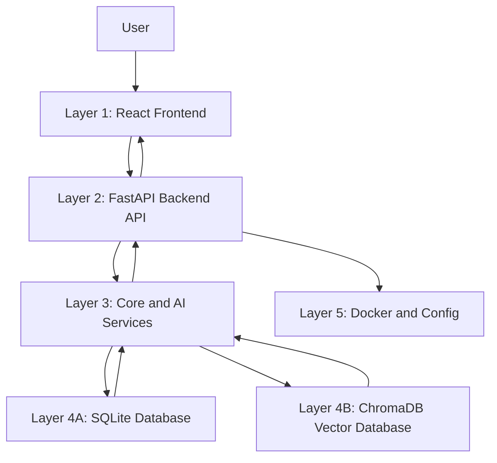
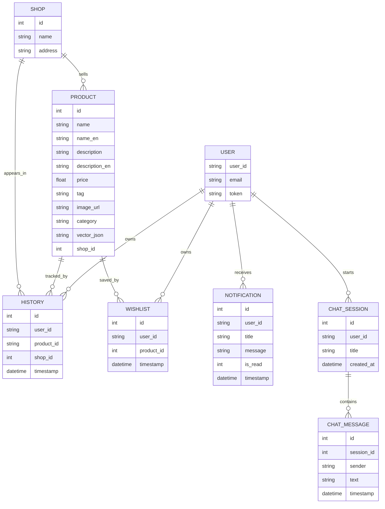
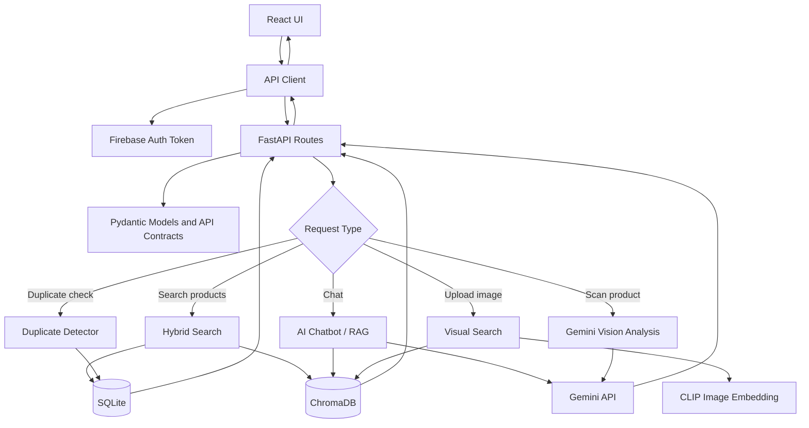
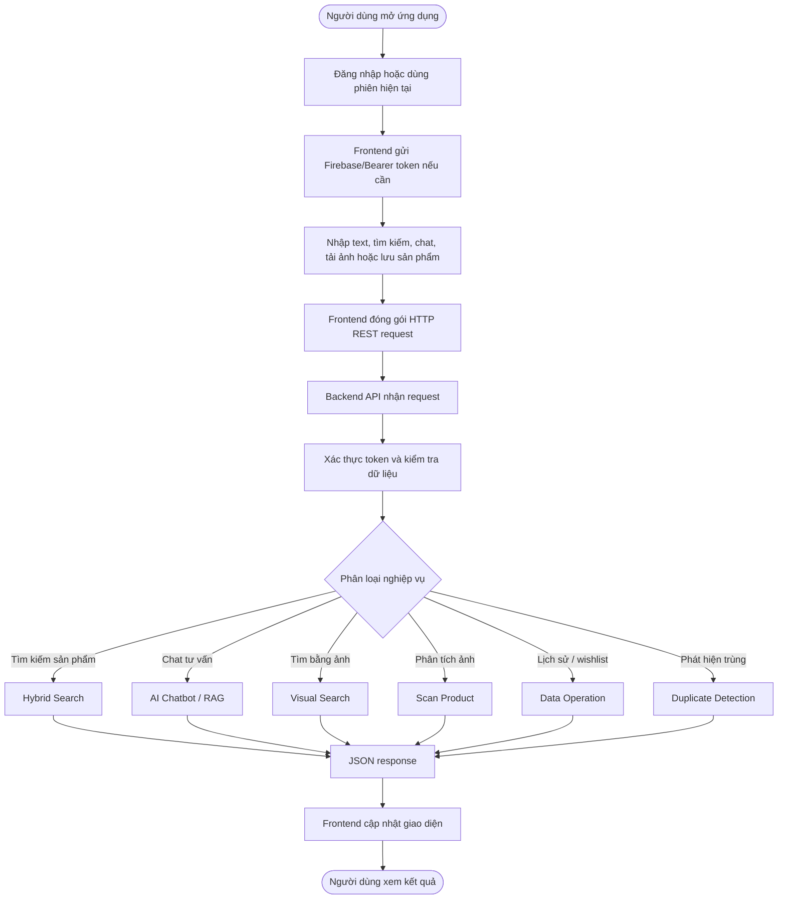
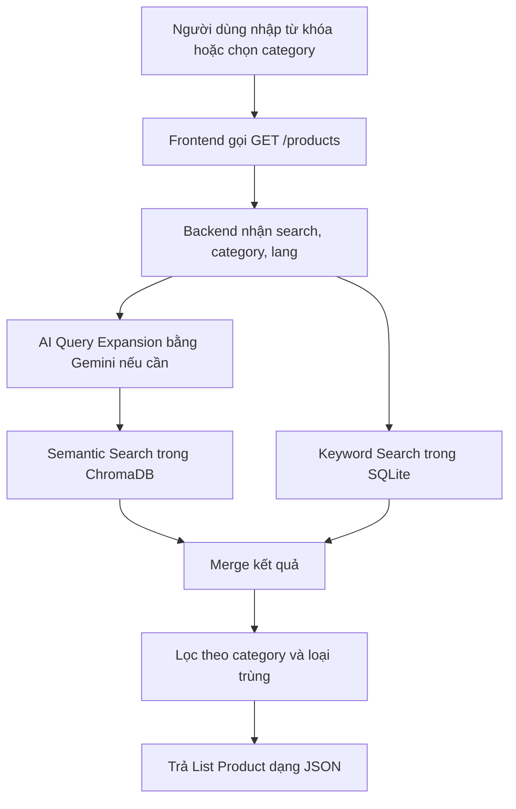
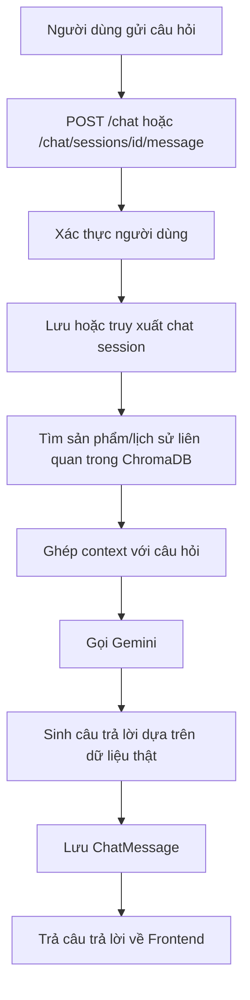
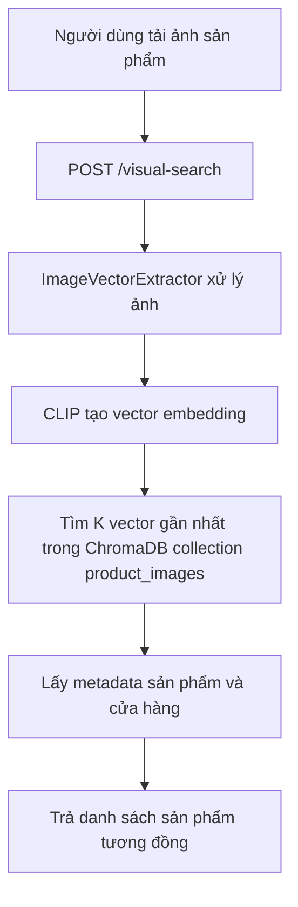
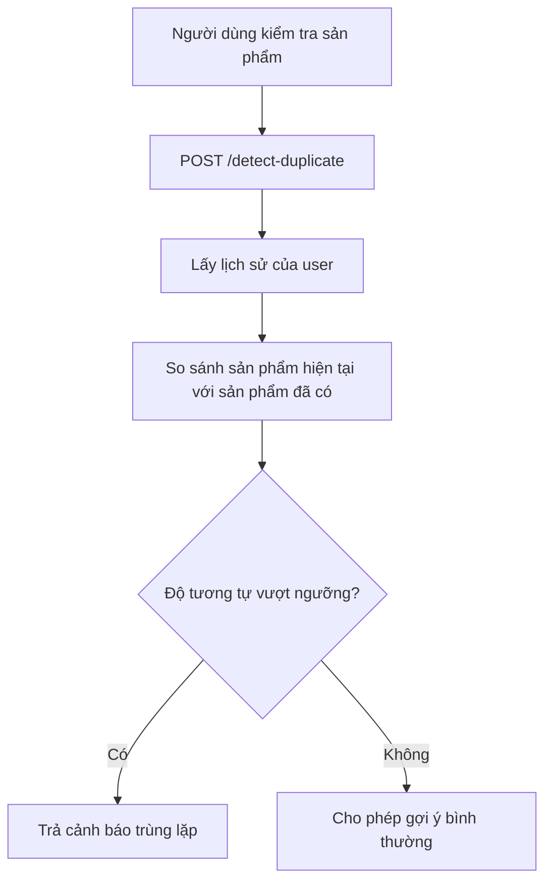

# 4. BIỂU DIỄN BÀI TOÁN (Representation)

> Phần này trình bày cách biểu diễn bài toán của dự án **BuyAI - hệ thống hỗ trợ mua sắm thông minh cho khách du lịch** dưới góc nhìn Tư duy Tính toán. Nội dung được chỉnh theo file kiến trúc `Graph.pdf`, trong đó hệ thống được mô tả như một **Smart Travel System** dùng kiến trúc client-server hiện đại, kết hợp React/TypeScript ở phía người dùng và FastAPI/Python ở phía máy chủ.

---

## [24120245 - Trần Lê Đức Việt] 4.1 Mục tiêu của Representation

Trong Tư duy Tính toán, **Representation** là bước chuyển một vấn đề thực tế thành các mô hình dữ liệu, quan hệ, quy trình, công thức và luật xử lý để con người có thể hiểu, còn máy tính có thể triển khai bằng thuật toán.

Với dự án BuyAI, bài toán thực tế là:

> Khách du lịch khi mua đặc sản, quà lưu niệm hoặc sản phẩm thủ công địa phương thường gặp khó khăn vì rào cản ngôn ngữ, thiếu thông tin về nguồn gốc, giá cả, ý nghĩa văn hóa và khó tìm được sản phẩm phù hợp bằng văn bản hoặc hình ảnh.

Vì vậy, Representation của hệ thống cần trả lời các câu hỏi:

- Dữ liệu về người dùng, sản phẩm, cửa hàng và lịch sử tương tác được biểu diễn như thế nào?
- Luồng xử lý từ Frontend đến Backend, AI Service, Database và Vector DB được mô hình hóa ra sao?
- Các chức năng như AI Chatbot, Visual Search, Hybrid Search và Duplicate Detection được biểu diễn thành thuật toán thế nào?
- Các quyết định của hệ thống được mô tả bằng điểm số, độ tương tự và luật logic nào?

---

## [24120245 - Trần Lê Đức Việt] 4.2 Biểu diễn tổng quát bài toán

Hệ thống chuyển các thành phần ngoài đời thực thành các đối tượng dữ liệu và module xử lý trong phần mềm:

| Thành phần thực tế | Biểu diễn trong hệ thống | Vai trò |
|---|---|---|
| Khách du lịch | `User` / Firebase user / `user_id` | Xác thực, cá nhân hóa lịch sử, wishlist và phiên chat |
| Cửa hàng địa phương | `Shop` | Lưu tên, địa chỉ và liên kết với sản phẩm |
| Sản phẩm địa phương | `Product` | Lưu tên, mô tả, giá, tag, danh mục, ảnh và cửa hàng bán |
| Ảnh sản phẩm | `Image` -> `CLIP embedding` | Tìm sản phẩm tương đồng bằng Visual Search |
| Câu hỏi tự nhiên | `ChatMessage` / `UserQuery` | Đầu vào cho AI Chatbot và RAG |
| Lịch sử xem/mua | `History` | Làm ngữ cảnh cá nhân hóa và phát hiện trùng lặp |
| Danh sách yêu thích | `Wishlist` | Lưu sản phẩm người dùng quan tâm |
| Thông báo | `Notification` | Trả cảnh báo hoặc cập nhật trạng thái cho người dùng |
| Dữ liệu văn bản sản phẩm | `Document embedding` trong ChromaDB | Hỗ trợ Semantic Search và RAG |

Như vậy, các khái niệm mơ hồ như “sản phẩm phù hợp”, “ảnh giống sản phẩm đã có”, “câu trả lời tư vấn tốt” được chuyển thành dữ liệu có cấu trúc, vector embedding, độ tương tự, điểm xếp hạng và phản hồi JSON.

---

## [24120245 - Trần Lê Đức Việt] 4.3 Biểu diễn kiến trúc 5 lớp theo Graph.pdf

Theo file kiến trúc, hệ thống được chia thành 5 lớp rõ ràng. Cách biểu diễn này giúp nhóm nhìn được hệ thống ở mức tổng thể trước khi đi vào từng thuật toán.

| Lớp | Thành phần trong dự án | Trách nhiệm |
|---|---|---|
| 1. Frontend | `frontend/src/app`, `frontend/src/api/index.ts`, React, TypeScript, Vite, Tailwind/Shadcn, Firebase Client | Hiển thị giao diện, nhận thao tác người dùng, gọi API và hiển thị kết quả |
| 2. Backend API | `backend/main.py`, `backend/app.py`, `backend/api_contract.py`, `backend/auth_middleware.py` | Nhận HTTP REST request, xác thực token, kiểm tra dữ liệu đầu vào và định tuyến nghiệp vụ |
| 3. Backend Services | `ai_service.py`, `visual_search.py`, `detector_logic.py`, `translation_utils.py`, `full_scraper.py`, `export_to_csv.py` | Xử lý logic lõi, AI Chatbot, phân tích ảnh, tìm kiếm, dịch thuật và phát hiện trùng lặp |
| 4. Database & Vector DB | `database.py`, SQLite, `vector_db.py`, ChromaDB, `seed_db.py`, `seed_data.json` | Lưu dữ liệu quan hệ, lịch sử, chat, wishlist và embedding phục vụ tìm kiếm ngữ nghĩa/hình ảnh |
| 5. Infrastructure | `Dockerfile`, `docker-compose.yml`, cấu hình môi trường | Đóng gói, triển khai và chạy hệ thống nhất quán trên nhiều môi trường |

Sơ đồ biểu diễn tầng kiến trúc:



---

## [24120245 - Trần Lê Đức Việt] 4.4 Data Representation - Biểu diễn dữ liệu

### 4.1 Các thực thể chính

Các thực thể được biểu diễn trực tiếp trong `backend/database.py` và các interface tương ứng ở `frontend/src/api/index.ts`.

| Thực thể | Thuộc tính chính | Mục đích |
|---|---|---|
| `Shop` | `id`, `name`, `address` | Biểu diễn cửa hàng hoặc nơi bán sản phẩm |
| `Product` | `id`, `name`, `name_en`, `description`, `description_en`, `price`, `tag`, `image_url`, `category`, `vector_json`, `shop_id` | Biểu diễn sản phẩm và metadata phục vụ tìm kiếm |
| `History` | `id`, `user_id`, `product_id`, `shop_id`, `timestamp` | Lưu lịch sử tương tác/mua sản phẩm của người dùng |
| `Wishlist` | `id`, `user_id`, `product_id`, `timestamp` | Lưu sản phẩm yêu thích |
| `Notification` | `id`, `user_id`, `title`, `message`, `is_read`, `timestamp` | Biểu diễn thông báo cho người dùng |
| `ChatSession` | `id`, `user_id`, `title`, `created_at` | Gom nhóm các cuộc hội thoại |
| `ChatMessage` | `id`, `session_id`, `sender`, `text`, `timestamp` | Lưu tin nhắn của người dùng và AI |
| Vector document | `id`, `document`, `metadata`, `embedding` | Biểu diễn sản phẩm/lịch sử dưới dạng vector trong ChromaDB |

### 4.2 Cấu trúc dữ liệu sử dụng

| Nhu cầu xử lý | Cấu trúc biểu diễn | Ứng dụng |
|---|---|---|
| Danh sách sản phẩm | `List<Product>` | Trả kết quả tìm kiếm, related products, wishlist products |
| Tra cứu theo mã | `id`, index trong SQLite, dictionary/map khi xử lý | Lấy nhanh sản phẩm, cửa hàng, phiên chat |
| Lịch sử người dùng | `List<History>` | Cá nhân hóa và phát hiện sản phẩm đã tương tác |
| Văn bản sản phẩm | `Document` + `metadata` | Dùng cho Semantic Search và RAG |
| Ảnh sản phẩm | `vector_json`, `CLIP embedding` | Tìm kiếm ảnh bằng vector tương đồng |
| Kết quả API | JSON response | Giao tiếp giữa Backend và Frontend |
| Token đăng nhập | Firebase token / Bearer token | Xác thực các route cần bảo vệ |

### 4.3 Ví dụ biểu diễn một sản phẩm

```json
{
  "id": 12,
  "name": "Trà Atiso Đà Lạt",
  "name_en": "Da Lat Artichoke Tea",
  "description": "Đặc sản Đà Lạt, thường được dùng làm quà tặng sức khỏe.",
  "price": 120000,
  "tag": "Specialty, Health",
  "category": "Food",
  "image_url": "https://example.com/atiso.jpg",
  "shop_id": 3,
  "vector_json": "[0.012, -0.084, 0.231, ...]"
}
```

### 4.4 Ví dụ biểu diễn tin nhắn chat

```json
{
  "session_id": 5,
  "sender": "user",
  "text": "Tôi muốn mua quà dưới 500k cho mẹ.",
  "timestamp": "2026-06-19T22:30:00"
}
```

---

## [24120245 - Trần Lê Đức Việt] 4.5 Structural Representation - Biểu diễn cấu trúc

### 5.1 Cấu trúc module

```text
BuyAI / Smart Travel System
├── Frontend
│   ├── Screens: Home, Login, Product Detail, Chat, Saved
│   ├── API Client: frontend/src/api/index.ts
│   └── Firebase Client + UI Components
├── Backend API
│   ├── main.py / app.py
│   ├── api_contract.py
│   └── auth_middleware.py
├── Backend Services
│   ├── ai_service.py
│   ├── visual_search.py
│   ├── detector_logic.py
│   ├── translation_utils.py
│   └── full_scraper.py / export_to_csv.py
├── Data Layer
│   ├── database.py / SQLite
│   ├── vector_db.py / ChromaDB
│   └── seed_db.py / seed_data.json
└── Infrastructure
    ├── Dockerfile
    └── docker-compose.yml
```

### 5.2 ERD dữ liệu chính



### 5.3 Quan hệ giữa các lớp xử lý



---

## [24120245 - Trần Lê Đức Việt] 4.6 Process Representation - Biểu diễn quy trình xử lý

### 6.1 Luồng tổng quát từ Graph.pdf

Theo `Graph.pdf`, luồng dữ liệu chính gồm ba giai đoạn: xác thực và tiếp nhận yêu cầu, phân loại và xử lý nghiệp vụ, phản hồi kết quả.



### 6.2 Luồng Hybrid Search



### 6.3 Luồng AI Chatbot / RAG



### 6.4 Luồng Visual Search



### 6.5 Luồng Duplicate Detection



---

## [24120245 - Trần Lê Đức Việt] 4.7 Mathematical Representation - Biểu diễn toán học

### 7.1 Vector embedding cho tìm kiếm ngữ nghĩa

Mỗi sản phẩm được biểu diễn thành một văn bản kết hợp:

```text
document = name + name_en + description + description_en + tag
```

Sau đó hệ thống chuyển `document` thành vector:

```text
v_product = embedding(document)
```

Khi người dùng tìm kiếm:

```text
v_query = embedding(expanded_query)
```

Độ liên quan giữa truy vấn và sản phẩm có thể biểu diễn bằng cosine similarity:

```text
similarity(query, product) = (v_query . v_product) / (||v_query|| * ||v_product||)
```

### 7.2 Vector embedding cho tìm kiếm hình ảnh

Ảnh tải lên được CLIP chuyển thành vector:

```text
v_image = CLIP(image)
```

Sản phẩm phù hợp là các sản phẩm có vector ảnh gần nhất:

```text
top_k_products = KNN(v_image, product_image_vectors, k)
```

### 7.3 Hàm xếp hạng sản phẩm

Hệ thống có thể biểu diễn điểm gợi ý tổng quát như sau:

```text
score = w1 * semantic_similarity
      + w2 * keyword_match
      + w3 * category_match
      + w4 * user_history_relevance
      - w5 * duplicate_penalty
```

Trong đó:

| Thành phần | Ý nghĩa |
|---|---|
| `semantic_similarity` | Mức gần nghĩa giữa truy vấn và sản phẩm |
| `keyword_match` | Mức khớp từ khóa trực tiếp trong SQLite |
| `category_match` | Mức phù hợp với danh mục người dùng chọn |
| `user_history_relevance` | Mức liên quan với lịch sử của người dùng |
| `duplicate_penalty` | Điểm phạt nếu sản phẩm giống món đã lưu/mua |
| `w1..w5` | Trọng số điều chỉnh tầm quan trọng của từng yếu tố |

### 7.4 Mô hình phát hiện trùng lặp

```text
duplicate_score(user, product)
    = max(similarity(product, p))
      for p in History(user)
```

Quy tắc:

```text
IF duplicate_score >= threshold
THEN product is duplicate or near-duplicate
```

Ví dụ diễn giải:

| `duplicate_score` | Kết luận |
|---:|---|
| `0.90` | Sản phẩm rất giống món đã có, nên cảnh báo mạnh |
| `0.70` | Có thể cùng loại, nên cảnh báo nhẹ hoặc gợi ý so sánh |
| `0.30` | Khác biệt, có thể hiển thị bình thường |

---

## [24120245 - Trần Lê Đức Việt] 4.8 Logical Representation - Biểu diễn luật xử lý

### 8.1 Luật xác thực

```text
IF route requires authentication
AND Bearer token is missing or invalid
THEN reject request with authentication error
```

### 8.2 Luật tìm kiếm sản phẩm

```text
IF user provides search text
THEN expand query with AI
AND search in both ChromaDB and SQLite
AND merge results
```

```text
IF category is provided
THEN filter products by category
```

### 8.3 Luật trả lời RAG

```text
IF user asks a shopping or product question
THEN retrieve relevant product context
AND send context plus question to Gemini
AND generate answer based on retrieved data
```

### 8.4 Luật tìm kiếm bằng ảnh

```text
IF user uploads image
THEN extract CLIP embedding
AND run vector search in product_images collection
AND return visually similar products
```

### 8.5 Luật lưu lịch sử và wishlist

```text
IF user views, saves, or buys a product
THEN record user_id, product_id, shop_id, timestamp
```

```text
IF product already exists in wishlist
THEN avoid creating duplicate wishlist record
```

### 8.6 Luật cảnh báo trùng lặp

```text
IF current_product is similar to any product in History(user)
THEN return duplicate warning
ELSE continue normal recommendation
```

---

## [24120245 - Trần Lê Đức Việt] 4.9 Ánh xạ Representation vào API

| Endpoint | Dữ liệu đầu vào | Xử lý biểu diễn | Kết quả |
|---|---|---|---|
| `POST /register`, `POST /login`, `POST /login/firebase` | Email/password hoặc Firebase token | Biểu diễn người dùng và phiên xác thực | `User`, `uid`, token |
| `GET /products` | `search`, `category`, `lang` | Hybrid Search: keyword + semantic vector | `List<Product>` |
| `GET /products/{id}` | `product_id`, `lang` | Tra cứu sản phẩm và dịch nếu cần | `Product` |
| `GET /products/{id}/related` | `product_id` | Tìm sản phẩm cùng ngữ cảnh/danh mục | `List<Product>` |
| `POST /chat` | `message`, `user_id` | RAG với context sản phẩm/lịch sử | Câu trả lời AI |
| `POST /chat/sessions/{id}/message` | `text` | Lưu hội thoại và gọi AI | `ChatMessage` |
| `POST /visual-search` | Ảnh upload | CLIP embedding + KNN trong Vector DB | Sản phẩm tương đồng |
| `POST /scan-product` | Ảnh upload | Gemini Vision phân tích thuộc tính | Mô tả/phân tích sản phẩm |
| `POST /history` | `user_id`, `product_id`, `shop_id` | Lưu lịch sử | `History` |
| `GET /wishlist/{user_id}` | `user_id` | Truy vấn sản phẩm đã lưu | Danh sách ID/sản phẩm |
| `POST /detect-duplicate` | Thông tin sản phẩm/user | So sánh với lịch sử | Cảnh báo trùng hoặc không |
| `POST /sync` | Yêu cầu hệ thống | Đồng bộ SQLite sang ChromaDB | Trạng thái đồng bộ |

---

## [24120245 - Trần Lê Đức Việt] 4.10 Nguyên tắc Representation được áp dụng

### 10.1 Trừu tượng hóa dữ liệu

Hệ thống không lưu mọi chi tiết ngoài đời thực, mà giữ các thuộc tính cần thiết cho thuật toán:

| Giữ lại | Lược bỏ |
|---|---|
| Tên, mô tả, giá, tag, danh mục sản phẩm | Mô tả quảng cáo quá dài hoặc không hỗ trợ tìm kiếm |
| Địa chỉ cửa hàng | Thông tin vận hành nội bộ của cửa hàng |
| Lịch sử và wishlist theo `user_id` | Các thao tác giao diện nhỏ không ảnh hưởng logic |
| Vector văn bản và ảnh | Dữ liệu ảnh thô nếu không cần lưu lâu dài |
| Tin nhắn chat và context liên quan | Nội dung không phục vụ tư vấn hoặc cá nhân hóa |

### 10.2 Mô hình hóa có cấu trúc

Hệ thống được chia thành ba lớp biểu diễn lớn:

| Lớp biểu diễn | Nội dung |
|---|---|
| Dữ liệu | `Product`, `Shop`, `History`, `Wishlist`, `ChatSession`, `ChatMessage` |
| Quan hệ | Shop bán Product, User có History/Wishlist/Chat, Product có vector |
| Quy trình | Search, Chat/RAG, Visual Search, Scan Product, Duplicate Detection |

### 10.3 Nhiều dạng biểu diễn cho cùng một bài toán

| Nhu cầu | Dạng biểu diễn phù hợp |
|---|---|
| Lưu dữ liệu nghiệp vụ | SQLite table / SQLAlchemy model |
| Giao tiếp Frontend-Backend | JSON / REST API |
| Tìm kiếm theo nghĩa | Text embedding trong ChromaDB |
| Tìm kiếm bằng ảnh | CLIP image embedding |
| Tư vấn bằng AI | RAG context + Gemini response |
| Mô tả quan hệ dữ liệu | ERD |
| Mô tả luồng xử lý | Flowchart |
| Ra quyết định | IF-THEN rules |
| Xếp hạng kết quả | Scoring function |

---

## [24120245 - Trần Lê Đức Việt] 4.11 Lợi ích của cách biểu diễn

Cách biểu diễn trên giúp dự án đạt được các lợi ích sau:

- **Dễ hiểu:** Kiến trúc 5 lớp giúp phân biệt rõ Frontend, Backend API, Service, Database và Infrastructure.
- **Dễ triển khai:** Các thực thể dữ liệu ánh xạ trực tiếp sang model SQLite, interface TypeScript và response JSON.
- **Dễ mở rộng:** Có thể thêm sản phẩm, thêm loại tìm kiếm, thêm tiêu chí ranking hoặc thêm nguồn dữ liệu mới mà không phá cấu trúc chính.
- **Dễ kiểm thử:** Mỗi luồng như `/products`, `/chat`, `/visual-search`, `/detect-duplicate` có đầu vào, xử lý và đầu ra rõ ràng.
- **Phù hợp AI:** Vector DB, embedding, RAG và CLIP giúp hệ thống xử lý được dữ liệu văn bản tự nhiên và hình ảnh.

---

## [24120245 - Trần Lê Đức Việt] 4.12 Kết luận

Representation giúp biến bài toán hỗ trợ mua sắm thông minh cho khách du lịch từ một nhu cầu thực tế thành hệ thống có thể lập trình được. Dựa trên `Graph.pdf`, BuyAI được biểu diễn như một hệ thống client-server gồm 5 lớp: Frontend, Backend API, Backend Services, Database/Vector DB và Infrastructure.

Ở mức dữ liệu, hệ thống dùng các thực thể như `Product`, `Shop`, `History`, `Wishlist`, `ChatSession` và `ChatMessage`. Ở mức xử lý, hệ thống biểu diễn các chức năng chính thành các luồng Hybrid Search, AI Chatbot/RAG, Visual Search, Scan Product và Duplicate Detection. Ở mức thuật toán, hệ thống dùng vector embedding, cosine similarity, KNN, scoring function và luật IF-THEN để đưa ra kết quả phù hợp cho người dùng.
